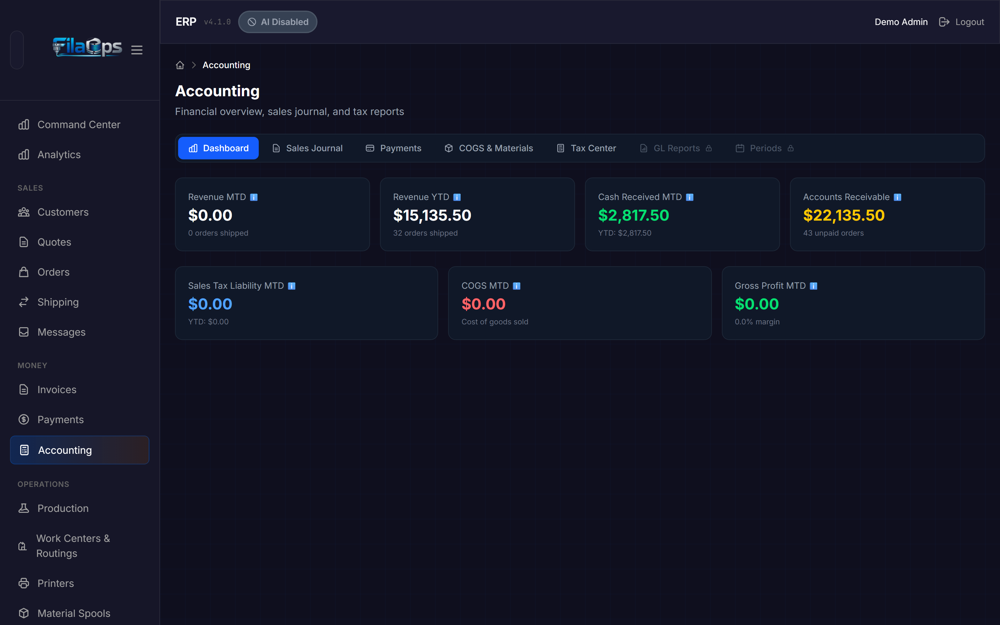
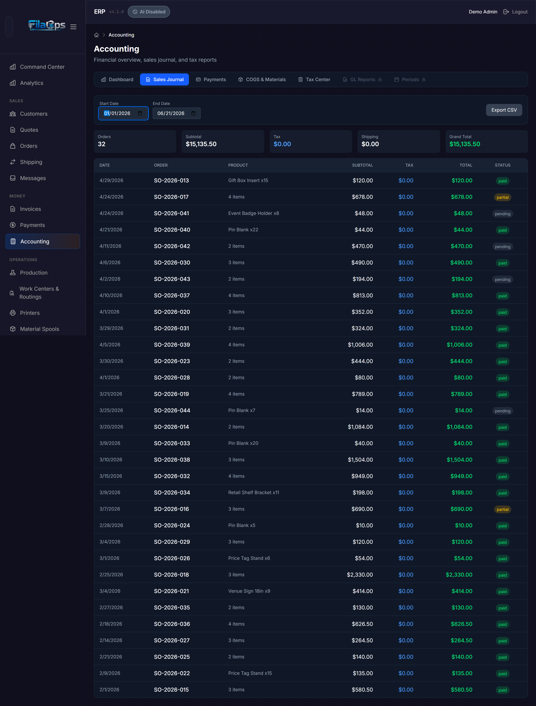
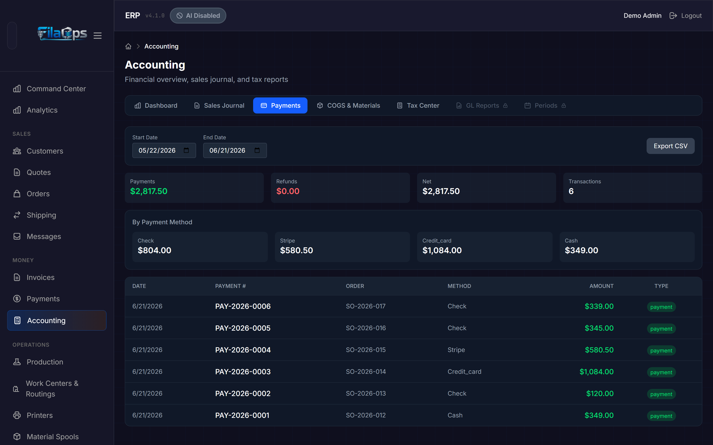
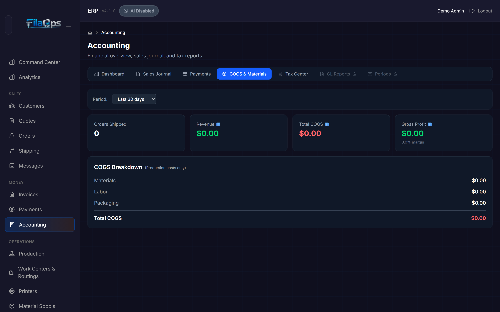
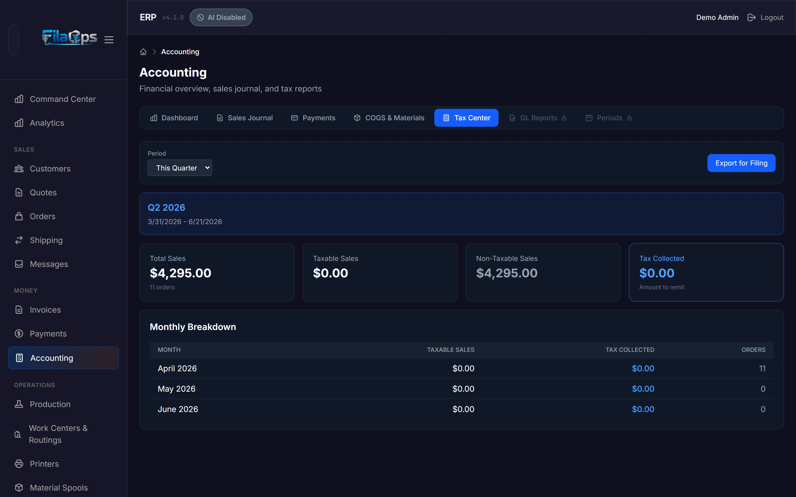
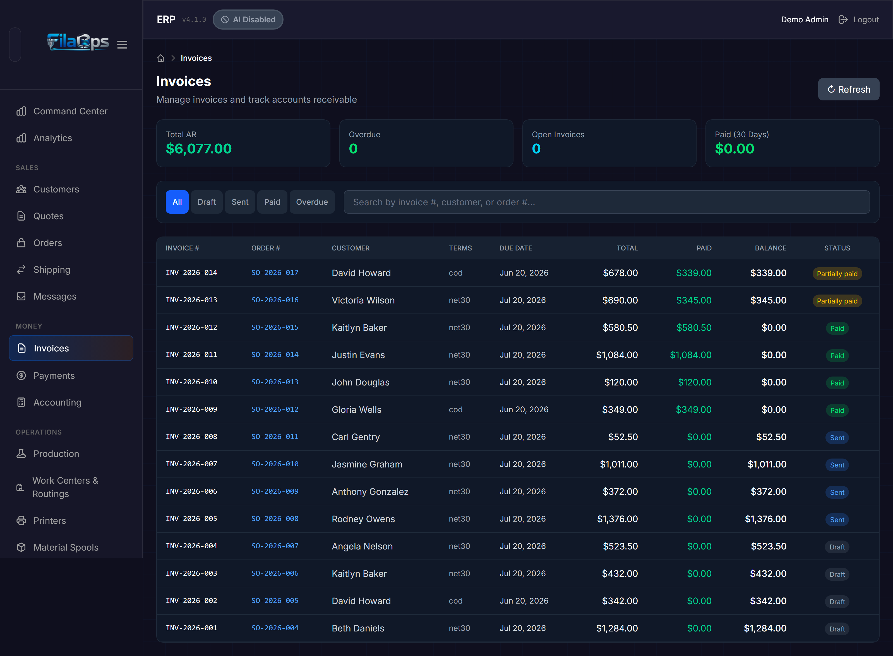
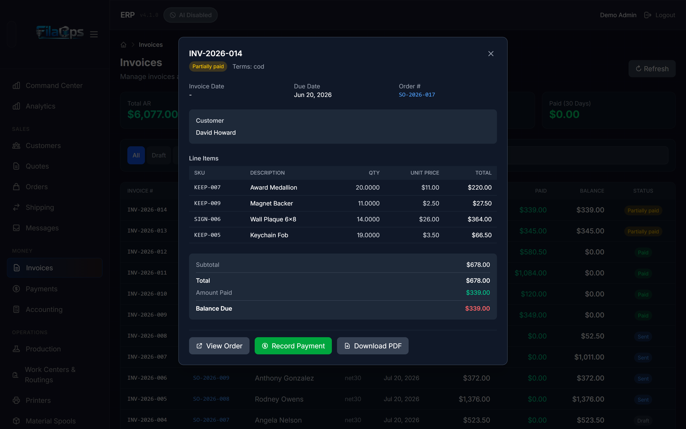
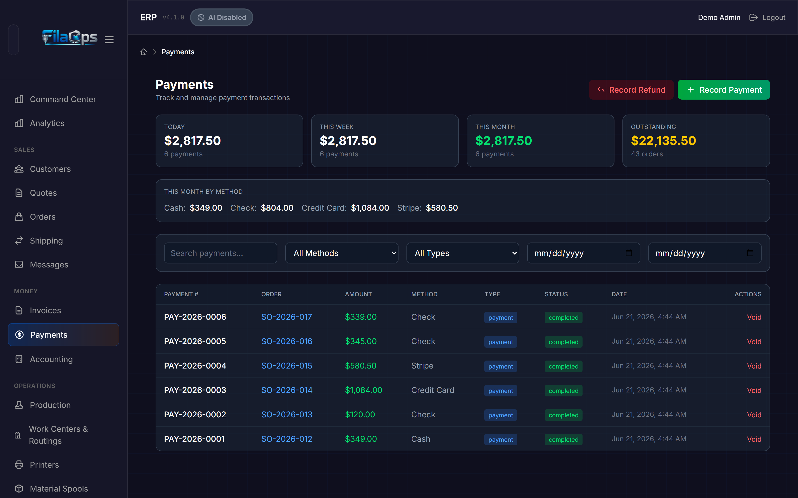

# Accounting

> Track revenue, costs, taxes, and profitability without leaving FilaOps.

## What You'll Learn

- How FilaOps records financial data automatically from your orders and invoices
- How to read the accounting dashboard for a quick financial snapshot
- How to drill into the Sales Journal, Payments, COGS, and Tax Center reports
- How to generate and record payment on invoices
- How to use the Payments page to manage individual transactions
- How to export data for your accountant or tax software

## Prerequisites

- Admin access to FilaOps
- At least a few shipped orders and recorded payments (see [Taking and Fulfilling Orders](orders.md))
- Tax settings configured if you collect sales tax (see [System Settings](system-settings.md))

---

## How Accounting Works in FilaOps

FilaOps uses **accrual-basis accounting** — revenue is recognized when an order ships, not when payment is received. This aligns income with the period when work was actually completed.

You do not need to enter journal entries for day-to-day operations. FilaOps records financial data automatically as you work:

- **Ship an order** → Revenue and COGS are recognized; a GL journal entry is posted
- **Create and send an invoice** → Accounts receivable is posted (DR 1100 AR / CR 4000 Revenue)
- **Record a payment** → Cash and AR are updated (DR 1000 Cash / CR 1100 AR)
- **Collect sales tax** → Tax liability (account 2100) is calculated and tracked

The accounting module lives under the **Money** section of the sidebar and has three separate pages: **Invoices**, **Payments**, and **Accounting**.

---

## The Accounting Page

Navigate to **Accounting** in the **Money** section of the sidebar. The page opens on the **Dashboard** tab and contains seven tabs total. Five tabs are available to all users; two (**GL Reports** and **Periods**) require the PRO tier.

### Tabs Overview

| Tab | Tier | Purpose |
|-----|------|---------|
| **Dashboard** | Core | Revenue, payments, AR, tax, COGS, and profit snapshot |
| **Sales Journal** | Core | Line-by-line record of all shipped orders with export |
| **Payments** | Core | Payments journal with method breakdown and export |
| **COGS & Materials** | Core | Production cost analysis by period |
| **Tax Center** | Core | Tax collection summary and filing export |
| **GL Reports** | PRO | Trial balance, inventory valuation, transaction ledger |
| **Periods** | PRO | Fiscal period management (close/reopen) |

!!! note "PRO tabs visible but locked"
    The **GL Reports** and **Periods** tabs are visible to all users but show a padlock icon and cannot be clicked without a PRO or Enterprise license.

---

## Dashboard Tab

The Dashboard gives you a real-time snapshot split into two rows of cards.

### Revenue and Payments (top row)

| Card | What It Shows |
|------|--------------|
| **Revenue MTD** | Revenue from shipped orders this month (excludes tax), with shipped order count |
| **Revenue YTD** | Revenue from shipped orders year-to-date, with order count |
| **Cash Received MTD** | Payments actually collected this month; YTD total shown below |
| **Accounts Receivable** | Outstanding balance across all open orders; unpaid order count shown below |

### Tax and Profitability (bottom row)

| Card | What It Shows |
|------|--------------|
| **Sales Tax Liability MTD** | Tax collected on behalf of government this month; YTD below |
| **COGS MTD** | Direct material, labor, and packaging cost of shipped goods |
| **Gross Profit MTD** | Revenue minus COGS, with gross margin percentage |

!!! tip "Revenue not appearing?"
    If Revenue MTD shows $0 but you have outstanding orders, look for the blue hint banner. It means you have confirmed orders that have not shipped yet. Revenue is recognized at shipment — mark orders as **Shipped** to see revenue populate.

---

## Sales Journal Tab

Click **Sales Journal** to see a detailed record of every shipped order in a date range.

### Filtering by Date

Use the **Start Date** and **End Date** pickers to narrow the report. The default range is the last 30 days. The table and summary cards update immediately when you change either date.

### Summary Cards

The top of the tab shows five summary cards for the selected period:

| Card | What It Shows |
|------|--------------|
| **Orders** | Number of orders in the period |
| **Subtotal** | Total before tax and shipping |
| **Tax** | Total sales tax collected |
| **Shipping** | Total shipping charges |
| **Grand Total** | Subtotal + tax + shipping |

### Journal Table

| Column | What It Shows |
|--------|--------------|
| **Date** | Date the order was shipped |
| **Order** | Order number |
| **Product** | Product name on the order |
| **Subtotal** | Line amount before tax |
| **Tax** | Tax charged |
| **Total** | Line total including tax |
| **Status** | Payment status — **paid** (green), **partial** (yellow), or **pending** (gray) |

### Exporting

Click **Export CSV** to download a spreadsheet named `sales-journal-{start}-to-{end}.csv` covering the selected date range.

---

## Payments Tab (inside Accounting)

Click **Payments** to see all payment and refund transactions recorded against your orders within a date range.

!!! note "Two payments pages"
    The **Accounting > Payments** tab is a read-only journal export of completed transactions. The standalone **Payments** page (Money > Payments in the sidebar) is where you can record new payments and refunds and manage individual transactions. See [Payments Page](#payments-page) below.

### Filtering by Date

Use the **Start Date** and **End Date** pickers to narrow the journal. Default is the last 30 days.

### Summary Cards

| Card | What It Shows |
|------|--------------|
| **Payments** | Total amount received (green) |
| **Refunds** | Total amount refunded (red) |
| **Net** | Payments minus refunds |
| **Transactions** | Number of payment and refund transactions |

### By Payment Method

Below the summary cards, a grid shows total amounts broken down by payment method (cash, check, credit card, PayPal, Stripe, Venmo, Zelle, wire, other). Use this to reconcile each payment channel.

### Payments Table

| Column | What It Shows |
|--------|--------------|
| **Date** | When the payment was recorded |
| **Payment #** | Unique identifier (format: `PAY-YYYY-NNNN`) |
| **Order** | The order this payment applies to |
| **Method** | Payment method used |
| **Amount** | Amount (green for payments, red for refunds) |
| **Type** | **payment** or **refund** badge |

### Exporting

Click **Export CSV** to download `payments-journal-{start}-to-{end}.csv`.

---

## COGS & Materials Tab

Click **COGS & Materials** to understand your production costs and gross profitability over a rolling time window.

### Selecting a Period

Use the **Period** dropdown to choose a rolling window:

| Option | Days |
|--------|------|
| Last 7 days | 7 |
| Last 30 days | 30 (default) |
| Last 90 days | 90 |
| Last 365 days | 365 |

### Summary Cards

| Card | What It Shows |
|------|--------------|
| **Orders Shipped** | Number of orders that shipped in the period |
| **Revenue** | Total revenue from those orders (excludes tax) |
| **Total COGS** | Combined cost of materials, labor, and packaging |
| **Gross Profit** | Revenue minus COGS, with gross margin percentage |

### COGS Breakdown

The breakdown panel shows each cost component individually:

- **Materials** — Raw material costs calculated from your Bills of Materials
- **Labor** — Labor costs from production routing operations
- **Packaging** — Packaging material costs
- **Total COGS** — Sum of the three lines above (highlighted in red)
- **Shipping Expense** — Carrier costs shown separately below the COGS total, because outbound shipping is an operating expense rather than a production cost

!!! tip "Improving your margin"
    If gross margin is lower than expected, check which cost component is largest. For most print farms, materials dominate. Review your product BOMs to make sure material quantities and standard costs are accurate.

---

## Tax Center Tab

Click **Tax Center** to prepare sales tax information for filing.

### Selecting a Period

Use the **Period** dropdown to choose a reporting window:

| Option | Description |
|--------|-------------|
| This Month | Current calendar month |
| This Quarter | Current calendar quarter (default) |
| This Year | Current fiscal year |

A blue banner below the controls confirms the exact date range being reported.

### Summary Cards

| Card | What It Shows |
|------|--------------|
| **Total Sales** | Gross sales amount with order count |
| **Taxable Sales** | Sales that are subject to tax |
| **Non-Taxable Sales** | Exempt or zero-rate sales |
| **Tax Collected** | Total tax collected — the amount you need to remit (highlighted in blue) |
| **Pending Tax** | Tax on confirmed orders not yet shipped (yellow, appears only when applicable) |

!!! warning "Pending tax"
    If a **Pending Tax** card appears, those are orders that have been confirmed but not yet shipped. The tax is collected but not yet recognized under accrual accounting. This amount moves to **Tax Collected** when the orders ship.

### By Tax Rate

A table breaks down tax collection by rate, useful if you operate under multiple tax jurisdictions:

| Column | What It Shows |
|--------|--------------|
| **Rate** | Tax rate percentage |
| **Taxable Sales** | Sales at this rate |
| **Tax Collected** | Tax collected at this rate |
| **Orders** | Number of orders at this rate |

### Monthly Breakdown

A second table shows month-by-month totals for the selected period, making it easy to fill in monthly or quarterly tax returns:

| Column | What It Shows |
|--------|--------------|
| **Month** | Calendar month |
| **Taxable Sales** | Taxable sales for that month |
| **Tax Collected** | Tax collected that month |
| **Orders** | Order count for that month |

### Exporting

Click **Export for Filing** to download `tax-summary-{period}.csv`. Give this file to your accountant or use it to complete your sales tax return.

---

## Invoices Page

Navigate to **Money > Invoices** in the sidebar to manage your invoices and track accounts receivable.

!!! note "Invoices come from orders"
    Invoices are created from confirmed sales orders, not created from scratch here. Go to an order in the confirmed, in-production, ready-to-ship, shipped, delivered, or completed state and generate the invoice from the order detail page. Each order can have only one invoice.

### Summary Cards

| Card | What It Shows |
|------|--------------|
| **Total AR** | Total open accounts receivable across all open invoices |
| **Overdue** | Count of invoices past their due date (red when > 0) |
| **Open Invoices** | Count of invoices in draft or sent status |
| **Paid (30 Days)** | Amount paid in the last 30 days |

### Filtering and Searching

Use the status tabs to filter by **All**, **Draft**, **Sent**, **Paid**, or **Overdue**. Use the search box to search by invoice number, customer name, or order number.

### Invoices Table

| Column | What It Shows |
|--------|--------------|
| **Invoice #** | Invoice number (format: configurable prefix, e.g. `INV-2026-001`) |
| **Order #** | Linked sales order (click to navigate to the order) |
| **Customer** | Customer name |
| **Terms** | Payment terms (COD, Net 15, Net 30, Net 60, Prepaid) |
| **Due Date** | Invoice due date |
| **Total** | Invoice total |
| **Paid** | Amount already paid (green) |
| **Balance** | Remaining balance due |
| **Status** | Draft, Sent, Paid, Partially Paid, or Overdue |

Click any row to open the invoice detail panel.

### Invoice Detail Panel

Clicking an invoice row opens a detail panel showing customer information, line items, a totals block (subtotal, discount, tax, shipping, total, amount paid, balance due), and action buttons.

#### Invoice Actions

| Button | When Available | What It Does |
|--------|---------------|-------------|
| **View Order** | Always (if linked) | Navigates to the linked sales order |
| **Mark Sent** | Draft invoices only | Transitions status from Draft to Sent and posts AR to the GL |
| **Record Payment** | Non-paid, non-cancelled invoices | Opens the payment modal to record a partial or full payment |
| **Download PDF** | Always | Generates and downloads a branded PDF invoice |

!!! note "Mark Sent does not email the customer"
    Clicking **Mark Sent** updates the invoice status inside FilaOps and posts the accounts receivable GL entry. It does not send an email. Print or download the PDF and deliver it to your customer separately.

### Recording a Payment from the Invoices Page

1. Open an invoice from the list.
2. Click **Record Payment**.
3. Enter the payment amount, method, and an optional reference (transaction ID or check number).
4. Click **Save**. The invoice status updates to **Partially Paid** or **Paid** and GL entries are posted automatically.

---

## Payments Page

Navigate to **Money > Payments** in the sidebar to manage individual payment transactions.

### Dashboard Cards

| Card | What It Shows |
|------|--------------|
| **Today** | Payments collected today with transaction count |
| **This Week** | Payments this week with transaction count |
| **This Month** | Payments this month (green) with transaction count |
| **Outstanding** | Total outstanding balance with order count |

### Payment Method Breakdown

Below the cards, a "This Month by Method" bar shows totals broken down by cash, check, credit card, and other configured methods.

### Recording Payments and Refunds

Two action buttons appear in the top right:

- **Record Payment** — opens the payment modal linked to a specific sales order
- **Record Refund** — opens the same modal pre-filled as a refund (negative amount)

!!! note "Payments can also be recorded from orders and invoices"
    The **Record Payment** button on an order detail page and the **Record Payment** button on the Invoices page both write to the same payment ledger. You do not need to duplicate entries.

### Payments Table

| Column | What It Shows |
|--------|--------------|
| **Payment #** | Unique identifier (`PAY-YYYY-NNNN`) |
| **Order** | Linked order number (click to navigate) |
| **Amount** | Dollar amount (green for payments, red for refunds) |
| **Method** | Cash, Check, Credit Card, PayPal, Stripe, Venmo, Zelle, Wire, Other |
| **Type** | Payment or Refund badge |
| **Status** | Completed or Voided |
| **Date** | Date and time the payment was recorded |
| **Actions** | **Void** button for completed payments |

#### Voiding a Payment

Click **Void** on a completed payment to reverse it. A GL reversal entry is posted automatically. Voided payments remain visible in the table with a voided status badge.

### Filtering

Use the filter row to narrow results by search text, payment method, payment type (payments vs. refunds), and date range.

---

## GL Reports Tab (PRO)

The **GL Reports** tab inside Accounting is available to PRO and Enterprise users. It contains three sub-reports selectable from a tab bar:

- **Trial Balance** — Lists all GL account balances with debit and credit columns. A "Balanced" or "Out of Balance" badge at the top tells you immediately whether debits equal credits. Click any account row to jump to its Transaction Ledger.
- **Inventory Valuation** — Compares physical inventory value (on-hand quantity × standard cost) to the corresponding GL balances for Raw Materials (1200), Finished Goods (1220), and Packaging (1230). A variance card turns green when the books and inventory reconcile within $1 or 0.1%.
- **Transaction Ledger** — Enter a GL account code (e.g., `1200`) and click **Load Ledger** to see every journal entry affecting that account with a running balance. Shows opening balance, each debit and credit, and closing balance.

A **Refresh** button in the top-right corner reloads the active report on demand.

---

## Periods Tab (PRO)

The **Periods** tab is available to PRO and Enterprise users and lets you manage fiscal accounting periods (monthly by default).

A highlighted banner at the top always shows the **Current Period** and its status (open or closed).

### Periods Table

| Column | What It Shows |
|--------|--------------|
| **Period** | Year and month identifier (e.g., `2026-06`) |
| **Date Range** | Start and end dates of the period |
| **Status** | Open (green) or Closed (gray) |
| **Entries** | Count of journal entries in the period |
| **Total DR** | Sum of all debit amounts |
| **Total CR** | Sum of all credit amounts |
| **Actions** | **Close** button for open periods; **Reopen** button for closed periods |

### Closing a Period

1. Find the period you want to close in the table.
2. Click **Close**.
3. Confirm the dialog. FilaOps checks for any unbalanced journal entries before closing. If any exist, the close is blocked and the entry numbers are listed.
4. Once closed, the period status changes to **Closed** and no further entries can be backdated into it.

!!! warning "Reopening a period"
    Clicking **Reopen** on a closed period allows historical data to be modified. Use this only when necessary to correct errors, and close the period again promptly.

---

## Tips and Best Practices

- **Review the dashboard weekly.** A quick glance at Revenue MTD, Accounts Receivable, and Gross Profit MTD keeps you aware of financial health without spending time on bookkeeping.
- **Generate invoices promptly.** AR is only tracked through invoices. Create an invoice as soon as an order is confirmed to get accurate accounts receivable figures.
- **Record payments promptly.** The Accounts Receivable figure on the dashboard is accurate only if payments are recorded when they come in.
- **Ship orders to recognize revenue.** Until an order is marked as shipped, its revenue does not appear in your reports. If your numbers look low, check for unshipped orders.
- **Export at month-end.** At each month's end, export the sales journal, payments journal, and tax summary for your records. These CSV files are your audit trail.
- **COGS depends on BOMs.** Cost of goods sold is calculated from your Bills of Materials. If COGS looks wrong, verify that your product BOMs have accurate material quantities and standard costs.
- **Set up tax correctly first.** Configure your tax rate and tax name in [System Settings](system-settings.md) before creating orders. Tax settings do not retroactively update existing orders.

---

## What's Next?

- [Taking and Fulfilling Orders](orders.md) — where revenue and payments originate
- [Managing Your Product Catalog](product-catalog.md) — maintaining accurate BOMs for COGS
- [System Settings](system-settings.md) — configuring tax rates and invoice prefix
- [Month-End Close](workflows/month-end-close.md) — a checklist for closing your books each month

---

## Quick Reference

| Task | Where to Find It |
|------|-------------------|
| View financial snapshot | **Accounting** > **Dashboard** tab |
| Review shipped order revenue | **Accounting** > **Sales Journal** tab |
| Review payments journal (read-only) | **Accounting** > **Payments** tab |
| Analyze production costs | **Accounting** > **COGS & Materials** tab |
| Prepare tax filing data | **Accounting** > **Tax Center** tab |
| Manage invoices and AR | **Money** > **Invoices** |
| Record a payment | **Money** > **Payments** > **Record Payment** — or open an order or invoice |
| Record a refund | **Money** > **Payments** > **Record Refund** |
| Download an invoice PDF | **Money** > **Invoices** > open invoice > **Download PDF** |
| View trial balance | **Accounting** > **GL Reports** > **Trial Balance** (PRO) |
| Close a fiscal period | **Accounting** > **Periods** (PRO) |
| Export sales journal | **Accounting** > **Sales Journal** > **Export CSV** |
| Export payments journal | **Accounting** > **Payments** > **Export CSV** |
| Export tax summary | **Accounting** > **Tax Center** > **Export for Filing** |
| Configure invoice prefix | **Settings** > **Company Settings** |
| Configure tax rate | **Settings** > **Company Settings** > Tax Settings |
