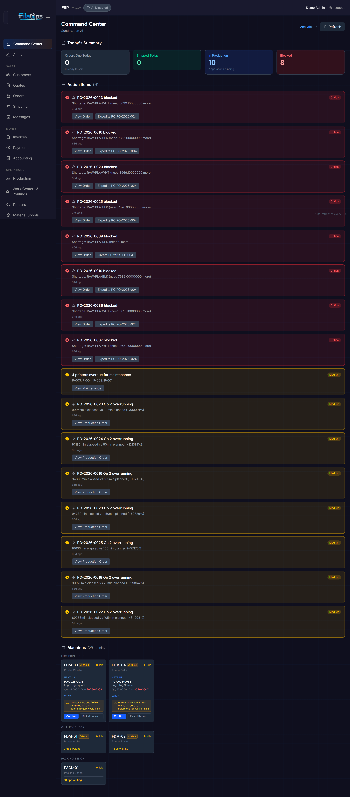
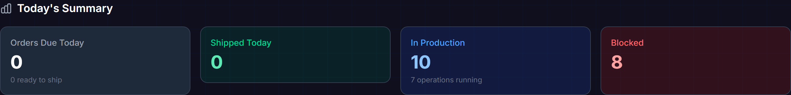
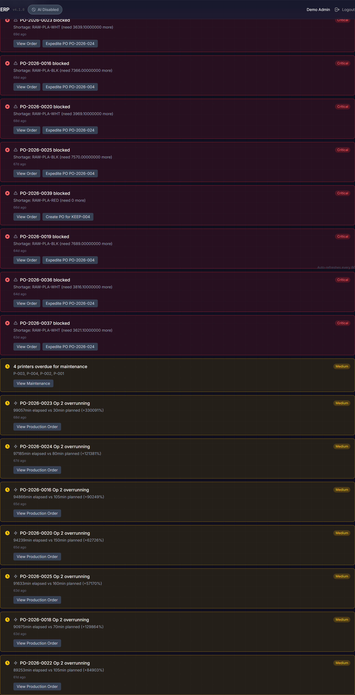
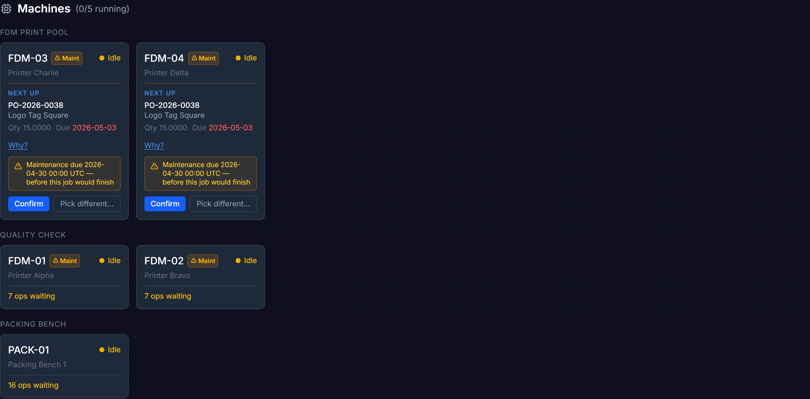
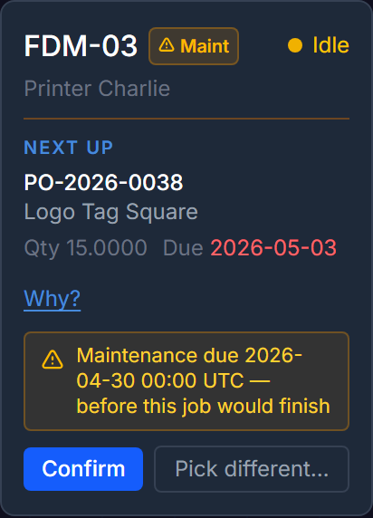

# Command Center

The **Command Center** is your moment-to-moment view of the shop floor — it answers the most important daily question: "What do I need to do right now?" It is the **default landing page** when you open FilaOps.

## What You Will Learn

- How to use the Command Center as your primary day-to-day view
- What each stat card shows and where it links
- How dispatch suggestions work on idle machines
- How to navigate directly from cards and alerts to the relevant pages

---

!!! note "Command Center vs. the dashboard URL"
    The home screen at `/admin` is the **Command Center**. A separate **Analytics** trend page lives at `/admin/dashboard`, but Analytics is a **PRO feature** and is not covered in this Core guide. Do not refer to the Command Center as "the dashboard."

---

## Command Center

Navigate to **Command Center** by opening the app or clicking the top entry in the sidebar (URL: `/admin`).

The page heading reads **Command Center** and shows today's date. Controls appear in the top-right corner:

- **Auto-dispatch ON** badge — visible only when auto-dispatch is enabled in Company Settings (see [Dispatch Suggestions](#dispatch-suggestions) below)
- **Refresh** button — triggers an immediate data reload across all three sections

The page auto-refreshes every 60 seconds. A small indicator at the bottom-right corner of the screen confirms this.

### Today's Summary

Four cards give an instant operational pulse:

| Card | What it shows | Turns warning/danger when… |
| --- | --- | --- |
| **Orders Due Today** | Count of orders whose due date is today; subtitle shows how many are already ready to ship | Fewer are ready than are due (some still in production) |
| **Shipped Today** | Orders shipped so far today | Never — always shown as a positive metric |
| **In Production** | Active production work orders; subtitle counts individual operations currently running | — |
| **Blocked** | Sum of blocked production orders and overdue sales orders; subtitle shows the overdue order count | Any blocked or overdue item exists |

!!! tip "Blocked is your most important number"
    A non-zero Blocked count means something is already past its deadline or stuck in production. Address these before starting new work.

Click **Orders Due Today** to open the Orders page filtered to today's due date. Click **In Production** to open the Production page filtered to in-progress work orders.

### Action Items

Below the summary cards is the **Action Items** section — a prioritized list of issues that need your attention. Items are sorted by priority (Critical first), then by age (oldest first within the same priority level). The section heading shows the total count in parentheses.

Six types of action items can appear:

| Type | Priority | What it means |
| --- | --- | --- |
| **Blocked production order** | Critical (1) | A released or in-progress work order cannot proceed due to a material shortage |
| **Overdue sales order** | Critical (1) | A confirmed, in-production, or ready-to-ship order is past its estimated completion date |
| **Due today** | High (2) | A sales order is due today but has not yet shipped |
| **Overrunning operation** | Medium (3) | A production operation has been running for more than twice its estimated time |
| **Maintenance due** | Medium (3) | A printer has scheduled maintenance due within the next 7 days |
| **Idle resource with work waiting** | Low (4) | A machine is idle but has production operations queued |

Each action item card shows:

- A **priority icon** color-coded by severity (red = Critical, orange = High, yellow = Medium, blue = Low)
- A **type icon** for quick recognition
- A **title** with the order or resource code
- A **description** with specifics (for example: "Shortage: PLA-BLACK need 250g more" or "Due 2 days ago — in_production")
- **Suggested action buttons** that navigate directly to the relevant page (for example: "View Order", "View Production")

!!! note "All Clear"
    When there are no action items, a green **All Clear!** panel replaces the list. No issues require immediate attention.

### Machines

The bottom section is the **Machines** grid. All configured resources (printers) appear here, grouped by work center. The section heading shows a live running count, for example "(3/8 running)".

Each machine card shows:

- **Machine code** (for example `FDM-01`) and a colored status dot
- **Machine name** below the code
- **Status label**: Running (green), Idle (yellow), Maintenance (orange), or Offline (red)

Running machines additionally display:

- The current **production order code**
- The **operation sequence number**
- An **elapsed timer** counting up from when the operation started

Clicking a running machine card navigates to that production order's detail page.

!!! note "No resources configured"
    If you have not set up any resources yet, the grid shows a "No resources configured" message with a link to the Manufacturing page.

#### Maintenance Due-Soon Badge

If a printer has maintenance due within 7 days, a small amber **Maint** badge appears next to its code in the card header. This corresponds to the Medium-priority action item that also appears in the Action Items section above.

#### Dispatch Suggestions

When a machine is idle and the scheduler has identified a suggested next operation for it, a **Next up** chip appears inside that machine card. The chip shows:

- The **production order code** and **product name**
- **Quantity** and **due date** (due date renders in red if it is already past)
- A **Why?** link that expands a list of scoring reasons
- A **maintenance warning** banner (amber) if the printer has a pending maintenance concern

Two action buttons appear at the bottom of the chip:

- **Confirm** — assigns the suggested operation to this printer immediately and refreshes the queue
- **Pick different…** — opens the Operation Scheduler modal so you can manually choose a different operation or time slot

!!! warning "Maintenance warnings block auto-dispatch"
    If a dispatch chip shows a maintenance warning, the **Confirm** button is still available for manual confirmation. However, auto-dispatch will **never** confirm that suggestion automatically — regardless of the auto-dispatch setting. You must review the warning and confirm manually.

##### Auto-Dispatch

When **Auto-dispatch** is enabled in Company Settings, the Command Center automatically confirms the top dispatch suggestion for each idle printer on every 30-second polling cycle — except for any suggestion that carries a maintenance warning.

When auto-dispatch is active, an **Auto-dispatch ON** badge appears in the Command Center header, and a success toast notification appears each time an operation is automatically assigned.

---

## Tips and Best Practices

- **Start with Command Center** — it is the default landing page. Scan the Blocked count and Action Items before doing anything else each shift.
- **Resolve Critical items first** — blocked production orders and overdue sales orders carry Priority 1 (Critical). These directly affect customer delivery promises.
- **Use dispatch chips to keep machines running** — an idle machine with a **Next up** chip is one **Confirm** click away from productive work.
- **All Clear is the daily target** — when the Command Center Action Items section shows All Clear, all known operational issues are handled.

---

## Quick Reference

| Task | Where |
| --- | --- |
| See what needs attention right now | **Command Center** > Action Items |
| Check which machines are running | **Command Center** > Machines |
| Assign an operation to an idle printer | **Command Center** > Machines > dispatch chip > **Confirm** |
| Check how many orders shipped today | **Command Center** > Shipped Today card |
| Refresh Command Center immediately | **Command Center** > **Refresh** button (top-right) |

---

## What is Next?

- [Managing Your Product Catalog](product-catalog.md) — items, materials, and pricing
- [Taking and Fulfilling Orders](orders.md) — the sales workflow from quote to shipment
- [Running Production](production.md) — work orders, operations, and the scheduler
- [Purchasing and MRP](purchasing.md) — purchase orders and material requirements planning
