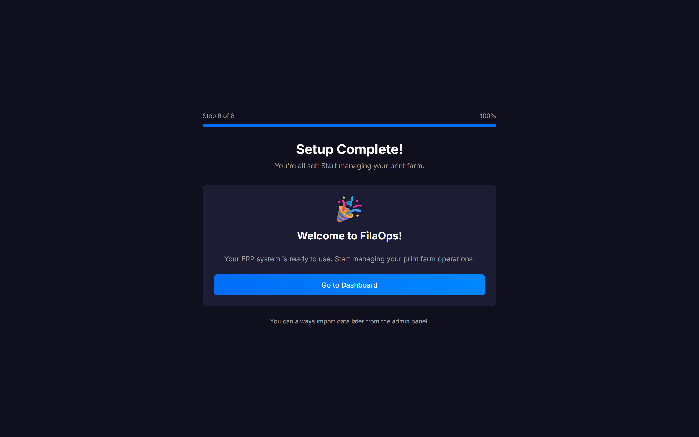
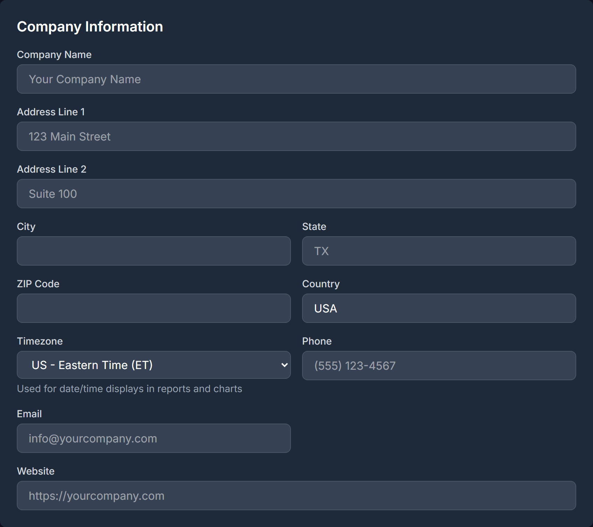
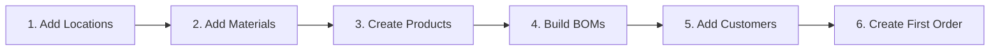

# Your First Day

> Create your admin account, configure your company, and learn your way around FilaOps.

## What You'll Do

- Create the initial admin account in the eight-step setup wizard
- Load Bambu Lab-compatible example materials (optional but recommended)
- Import any existing products, customers, orders, and inventory from CSV
- Register your first printer
- Learn the sidebar navigation map
- Fill in your company settings before taking your first order

---

## The Setup Wizard

When you visit FilaOps for the first time on a brand-new installation, the browser redirects automatically to `/onboarding`. The wizard runs exactly once — it is hidden from existing installations.

A progress bar at the top of the page shows **Step N of 8** and the percentage complete. You can always click **Back** to return to the previous step.

### Step 1 — Create Admin Account

Fill in every field and click **Create Account & Continue**.

| Field | Notes |
|-------|-------|
| **Your Name** | Your full name |
| **Email Address** | Used to log in — must be unique |
| **Password** | See requirements below |
| **Confirm Password** | Must match exactly |
| **Company Name** | Optional here; editable later in **Admin > Settings** |
| **Currency** | Dropdown of common currencies (USD, CAD, EUR, GBP, AUD, NZD, JPY, MXN, BRL, INR). Affects how prices appear on invoices and reports. |
| **Locale** | BCP-47 locale (e.g., `en-US`, `fr-CA`, `de-DE`). Controls decimal separators, thousands separators, and date formats. |

!!! tip "Password requirements"
    Your password must be **at least 8 characters** and contain:

    - At least one uppercase letter (A–Z)
    - At least one lowercase letter (a–z)
    - At least one digit (0–9)
    - At least one special character (e.g., `!@#$%^&*`)

!!! note "Currency and locale can be changed later"
    Both Currency and Locale are saved to your company settings immediately after account creation. You can update them any time from **Admin > Settings > Regional Settings**.

---

### Step 2 — Load Example Data

FilaOps offers to seed your database with a ready-to-use set of Bambu Lab-compatible materials. The checkbox defaults to checked (recommended).

What gets created when you click **Load Example Data**:

- **18 material types** — PLA Basic, PLA Matte, PLA Silk, PETG, ABS, ASA, TPU, PA-CF, PC, and more
- **15 colors** — Black, White, Gray, Red, Blue, Green, Yellow, Orange, Purple, Pink, Brown, Gold, Silver, Clear, and more
- **24 material + color combinations** ready to assign inventory quantities to
- **Example items** in each catalog category (packaging, hardware, finished goods)

Uncheck the box and click **Skip This Step** to start with a completely empty database.

!!! warning "Colors are not pre-built if you skip"
    Without example data, the system has no colors. When you create your first material item you will need to use the **"+ Create new color for this material"** link inside the item form to add colors individually.

---

### Step 3 — Import Products

Upload a CSV of your product catalog, or leave the file picker empty and click **Skip This Step**.

**Expected CSV columns:** SKU, Name, Description, Item Type, Unit, Standard Cost, Selling Price

You can run this import again any time from **Inventory > Items**.

---

### Step 4 — Import Customers

Upload a CSV of your customer list, or skip.

**Expected CSV columns:** Email, First Name, Last Name, Company, Phone, and address fields.

After the wizard, the same import is available from **Sales > Customers**.

---

### Step 5 — Import Orders

Choose your **Order Source** from the dropdown first, then upload a CSV:

| Source option | When to use |
|---------------|-------------|
| Manual / Generic | Internal or spreadsheet orders |
| Squarespace | Squarespace order export |
| WooCommerce | WooCommerce order export |
| Etsy | Etsy orders CSV |
| TikTok Shop | TikTok Shop order export |

**Required columns:** Order ID, Customer Email, Product SKU, Quantity

**Optional columns:** Customer Name, Shipping Address, Unit Price, Shipping Cost, Tax Amount

!!! tip
    When importing orders, FilaOps automatically creates customer records for any email address it has not seen before.

---

### Step 6 — Import Inventory (Optional)

Upload a CSV of opening stock levels, keyed to your storage locations, or skip.

**Expected CSV columns:** SKU, Location, Quantity

!!! warning "Create locations first"
    Inventory quantities must resolve to a named location. If you have not created any locations yet, skip this step and use **Inventory > Cycle Count** after setup to enter opening balances once your locations exist.

---

### Step 7 — Connect Your First Printer (Optional)

Register a printer now so FilaOps can track print jobs and material consumption from day one.

| Field | Notes |
|-------|-------|
| **Printer Name** | A friendly label, e.g., `X1C Bay 1` |
| **Brand** | Bambu Lab or Generic / Other |
| **Model** | For Bambu Lab: X1 Carbon, X1E, P1S, P1P, A1, or A1 mini. For Generic: free-text field. |

The printer code is generated automatically. Connection settings (IP address, API key, MQTT) are configured after setup from **Operations > Printers**.

!!! note "Additional brands require a PRO license"
    Klipper, OctoPrint, Prusa, and Creality are PRO-tier brands and are not listed in this wizard. Add them from **Operations > Printers** once a PRO license is active.

Click **Add Printer** to register, or **Skip** to set up your fleet later.

---

### Step 8 — Setup Complete

Click **Go to Dashboard** to enter FilaOps. The wizard will not appear again.

---

## Finding Your Way Around

After the wizard, you land on the **Command Center** — the `/admin` home screen. This is the operational "what do I need to do right now?" view, showing today's action items, printer and resource status, and dispatch suggestions.

The left sidebar is your main navigation.

### Sidebar Navigation Map

Group headers appear in uppercase. Items marked *(admin only)* are hidden for standard (non-admin) users.

| Group | Item | What It's For |
|-------|------|---------------|
| *(none)* | **Command Center** | Live operational view: today's action items, printer/resource status, dispatch suggestions |
| **SALES** | **Customers** | Customer directory with contact info and order history *(admin only)* |
| | **Quotes** | Prepare price quotes and convert them to orders |
| | **Orders** | Create, track, and fulfill customer orders |
| | **Shipping** | Shipment records and carrier tracking |
| | **Messages** | In-app notification inbox |
| **MONEY** | **Invoices** | Invoice generation and status *(admin only)* |
| | **Payments** | Record and track payments against orders *(admin only)* |
| | **Accounting** | Revenue, COGS, and tax reporting *(admin only)* |
| **OPERATIONS** | **Production** | Production orders, scheduling, and Gantt view |
| | **Work Centers & Routings** | Work center definitions and routing operation templates |
| | **Printers** | Your printer fleet — register, configure, and view maintenance status |
| | **Material Spools** | Track individual filament spools with lot numbers *(admin only)* |
| **INVENTORY** | **Items** | Your full catalog — finished goods, raw materials, and components |
| | **Bill of Materials** | Recipes defining what goes into each product |
| | **Locations** | Warehouses, shelves, and storage bins *(admin only)* |
| | **Transactions** | Full audit trail of every stock movement *(admin only)* |
| | **Cycle Count** | Batch inventory verification and adjustments *(admin only)* |
| **PURCHASING** | **Purchasing** | Purchase orders for restocking materials |
| | **Import Materials** | Bulk-import filament and material data from CSV *(admin only)* |
| **QUALITY** | **Quality Dashboard** | Quality metrics overview |
| | **Material Traceability** | Track materials from receipt through finished product |
| **ADMIN** | **Team Members** | Add and manage user accounts *(admin only)* |
| | **Security Audit** | Review and harden your installation *(admin only)* |
| | **Settings** | Company info, regional settings, tax config, and business hours *(admin only)* |
| | **Integrations** | AI provider (Anthropic, Ollama), Shopify, QuickBooks, and other connectors *(admin only)* |
| | **License** | View and activate your FilaOps license *(admin only)* |
| | **Import Orders** | Bulk-import orders from CSV at any time *(admin only)* |
| | **Scrap Reasons** | Define reasons for material waste *(admin only)* |

!!! note "PRO-only features"
    Some sidebar items require a PRO license and are not covered in this Core guide: **Analytics**, **Intake Studio**, and the **B2B PORTAL** group (Access Requests, Catalogs, Price Levels). A lock icon marks PRO items in the sidebar.

---

## Configure Your Company

Before you start creating orders, fill in your company details. Go to **Admin > Settings**.

The Settings page is organized into sections. Scroll through them, make your changes, and click **Save Settings** at the bottom.

### Company Logo

Click **Upload Logo** (or **Change Logo** if one already exists) to upload a PNG, JPEG, GIF, or WebP image (max 2 MB). The logo appears in the navigation bar and on quote and invoice PDFs.

### Company Information

| Field | What to Enter |
|-------|---------------|
| **Company Name** | Your business name — appears on quotes and invoices |
| **Address Line 1 / Line 2** | Street address and optional suite/unit |
| **City / State / ZIP Code / Country** | Complete address for printed documents |
| **Timezone** | Your local timezone — affects date/time displays in reports and charts |
| **Phone** | Auto-formatted as you type, e.g., `(555) 123-4567` |
| **Email** | Primary contact email |
| **Website** | Your company URL |

### Regional Settings

| Field | What to Enter |
|-------|---------------|
| **Currency** | Full currency list — more options than the wizard |
| **Number & Date Format** | Locale (BCP-47) — controls decimal/thousands separators and date formats |

Changes take effect across the whole application immediately after saving — no page reload needed.

### Tax Settings

If you collect sales tax or VAT:

1. Check **Enable sales tax on quotes**
2. Set **Tax Rate (%)** — e.g., `8.25` for 8.25%
3. Set **Tax Name** — e.g., `Sales Tax` or `VAT`
4. Optionally enter **Tax Registration Number** — printed on quote PDFs

**Named tax rates:** The **Tax Rates** section below the main toggle lets you define multiple named rates (e.g., GST, QST, VAT). When two or more rates are active, quotes show a rate selector dropdown automatically.

### Quote Settings

| Field | Default | What It Does |
|-------|---------|--------------|
| **Default Quote Validity (days)** | 30 | How many days a quote stays valid |
| **Quote Terms & Conditions** | — | Text printed on all quote PDFs |
| **Quote Footer Message** | — | Footer line on quote PDFs |

### Pricing

**Default Target Margin (%)** — used by the "Suggest Prices" tool on the Items page. Example: `71.43` gives a 3.5× markup. Formula: `price = cost / (1 - margin% / 100)`.

### Business Hours (Production Operations)

These hours apply to non-printer work centers in the production scheduler. Printer pools always run 20 hours/day (4 AM–12 AM) regardless of this setting.

| Field | Default | Notes |
|-------|---------|-------|
| **Start Time (Hour)** | 8 | 0–23, e.g., `8` = 8 AM |
| **End Time (Hour)** | 16 | 0–23, e.g., `16` = 4 PM |
| **Days Per Week** | 5 | 1–7 |
| **Work Days** | `0,1,2,3,4` | Comma-separated: 0=Monday … 6=Sunday |

### Dispatch Settings

**Auto-dispatch suggestions** — when enabled, the Command Center automatically confirms the top-ranked production job for each idle printer on every refresh cycle. Jobs flagged with a maintenance warning are **never** auto-dispatched and always require operator review.

Leave this off until you are familiar with how dispatch suggestions work.

### AI Configuration

AI provider settings (Anthropic API key, Ollama endpoint) have moved to **Admin > Integrations**. The Settings page shows a link to that page.

Click **Save Settings** when you are finished.

---

## Recommended First Steps

Once your company info is saved, work through these in order:

1. **Add storage locations** — Go to **Inventory > Locations** and create your warehouse, shelf, or bin. You need at least one location before inventory quantities can be assigned to a place.

2. **Add your materials** — Go to **Purchasing > Import Materials** to bulk-import filament data from CSV, or go to **Inventory > Items** and click **+ New Item** to add materials one at a time. Set the item type to **Raw Material**.

3. **Create your products** — In **Inventory > Items**, click **+ New Item** and choose type **Finished Good**. Add your SKU, description, selling price, and standard cost.

4. **Build Bills of Materials** — Go to **Inventory > Bill of Materials** and create a recipe for each product — which materials and how much of each go into a finished unit.

5. **Add customers** — Go to **Sales > Customers** and add your customer list, or import from CSV.

6. **Create your first order** — Go to **Sales > Orders** and click **+ New Order**. Select a customer, add line items, and save.

!!! tip "Use example data to practice"
    If you loaded example data in the wizard, you already have 24 material SKUs and example items across multiple categories. Try creating a test order using those before entering your real catalog.

---

## Tips & Best Practices

- **The Command Center is your daily home screen** — it shows the operational view of what needs attention right now. Bookmark `/admin`.
- **Locations first** — receiving goods on a purchase order, running cycle counts, and shipping all require at least one location. Create it before anything else.
- **Walk through the full lifecycle early** — Quote → Order → Production → Ship is the fastest way to learn the system. Use example data so mistakes cost nothing.
- **Set up Integrations before going live** — if you use Shopify or QuickBooks, configure connectors in **Admin > Integrations** so data flows automatically from day one.

---

## What's Next?

| If you want to... | Read... |
|-------------------|---------|
| Understand the Command Center | [Using the Command Center](dashboard.md) |
| Set up your product catalog | [Managing Your Product Catalog](product-catalog.md) |
| Start taking orders | [Taking and Fulfilling Orders](orders.md) |
| Connect your printers | [Monitoring Your Printers](printers.md) |
| Configure team access | [Users & Permissions](users-and-permissions.md) |

---

## Quick Reference

| Task | Where to Find It |
|------|-----------------|
| Create admin account | Setup wizard — first run only (`/onboarding`) |
| Load Bambu Lab example materials | Setup wizard Step 2 |
| Import products / customers | Setup wizard Steps 3–4, or anytime via **Inventory > Items** / **Sales > Customers** |
| Import orders (any time) | **Admin > Import Orders** |
| Import materials (any time) | **Purchasing > Import Materials** |
| Company settings | **Admin > Settings** |
| Upload company logo | **Admin > Settings** — Company Logo section |
| Regional settings (currency, locale) | **Admin > Settings** — Regional Settings section |
| Tax configuration | **Admin > Settings** — Tax Settings section |
| AI provider and integrations | **Admin > Integrations** |
| Add team members | **Admin > Team Members** |
| Register additional printers | **Operations > Printers** |
