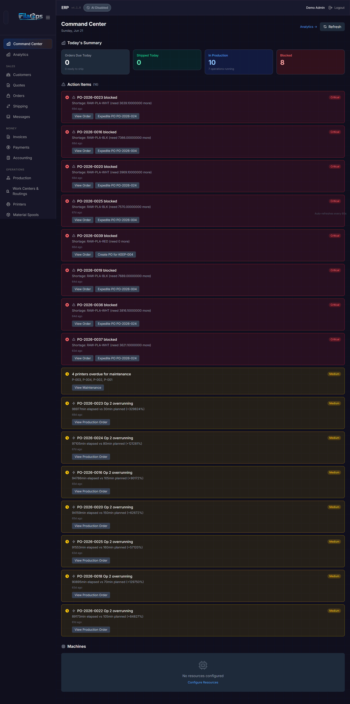
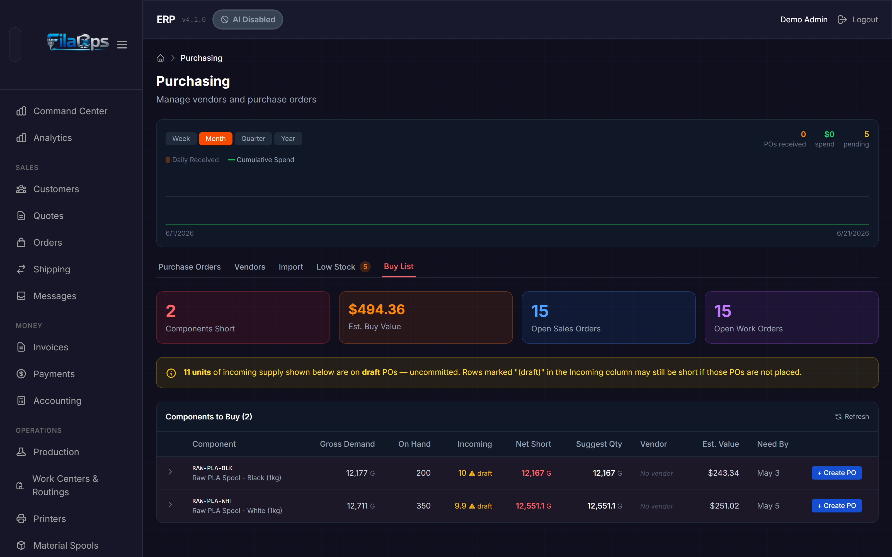
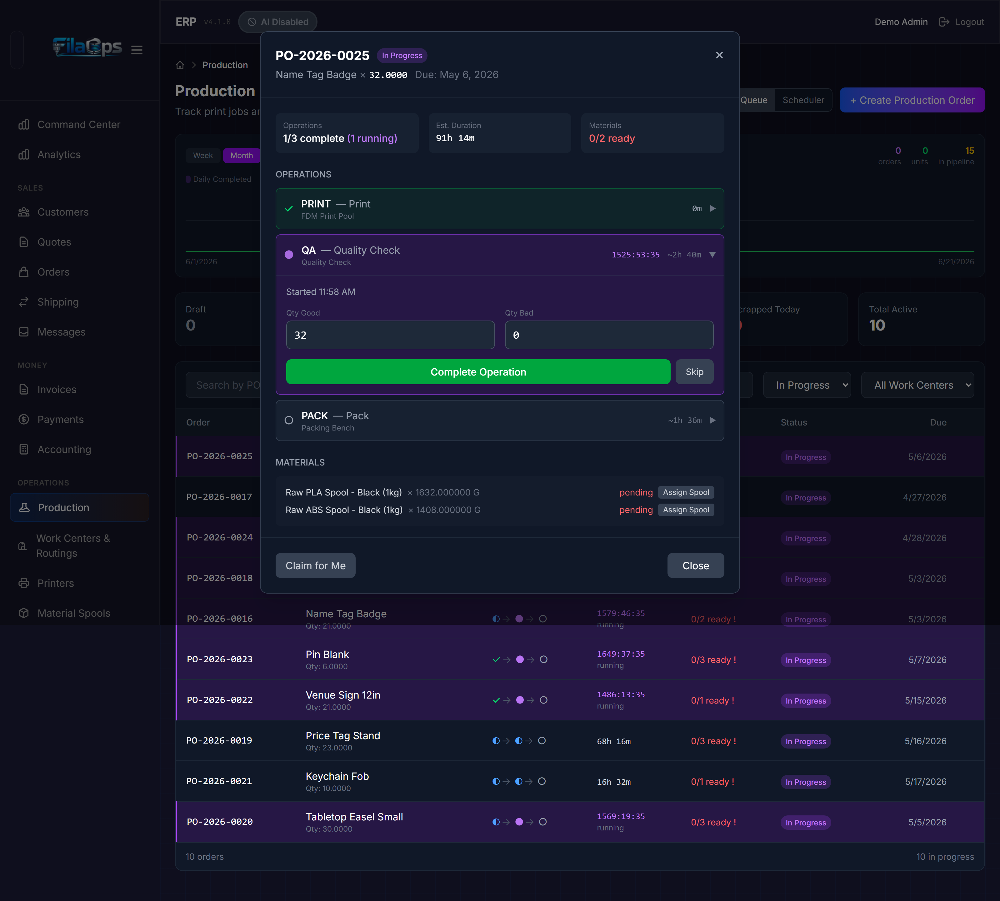
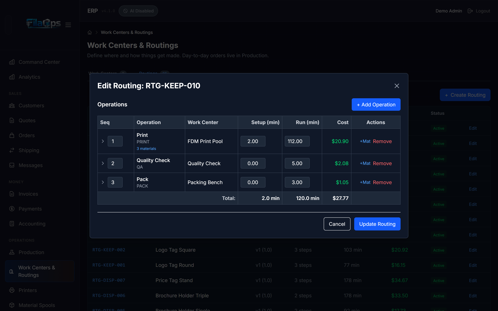
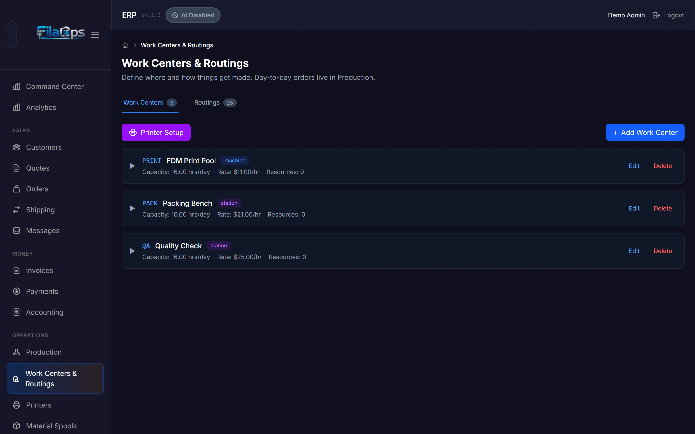

# Glossary

> Key terms used throughout FilaOps and this manual.
> If a term appears in menus, buttons, or status badges, the exact label used in the app is shown **in bold**.

---

## A

### Adjustment
A manual inventory transaction that increases or decreases an item's on-hand quantity. Adjustments are used to correct discrepancies found during a cycle count, record waste, or fix data-entry errors. Every adjustment requires an **Adjustment Reason** and is permanently recorded in the inventory transaction ledger.

!!! note
    Adjustments create a double-entry GL journal entry automatically. They cannot be deleted — only voided if flagged for approval.

### Adjustment Reason
A configurable code that explains why an inventory adjustment was made (for example, "Damaged," "Count Variance," "Sample"). Configured under **Admin > Settings**.

### Allocated Quantity
The portion of on-hand inventory that has been reserved against an open production order or sales order line. The formula is:

```
Available Quantity = On-Hand Quantity − Allocated Quantity
```

FilaOps computes `available_quantity` automatically as a database column. You cannot ship or consume allocated stock without first releasing the reservation.

---

## B

### Bill of Materials (BOM)
A versioned list of components — with quantities and units — required to produce one unit of a finished product. A BOM also specifies:

- **Consume stage** — whether each component is consumed at production completion (`production`) or at shipment (`shipping`, used for packaging materials).
- **Scrap factor** — a percentage added to the planned quantity to account for expected waste.
- **Cost-only lines** — components included in cost calculations but not tracked in inventory (machine time, overhead).

BOMs drive MRP demand calculations and production cost estimates. A product can have multiple BOM versions; only the active version is used by new production orders.


### Buy List
A live, read-only view (**Admin > Purchasing > Buy List**) that shows every component currently short across all open sales orders and open production orders. The buy list nets gross demand against on-hand inventory, allocated stock, incoming purchase orders, and safety stock. It is computed fresh on every page load — there is no stale MRP snapshot. Use it as a daily purchasing checklist.

---

## C

### Chart of Accounts (COA)
The hierarchy of GL accounts used for double-entry bookkeeping. Accounts are classified as **asset**, **liability**, **equity**, **revenue**, or **expense**. FilaOps ships a default COA with Schedule C line mappings for U.S. sole proprietors. Accessible under **Admin > Accounting > Accounts**.

### Close Short
An action that accepts a partially fulfilled sales order or production order as complete, rather than waiting for the remaining quantity. A **Close Short Record** captures before-and-after state for audit purposes. The sales order field `closed_short` is set to `true` and the order moves to `completed` status.

### COGS (Cost of Goods Sold)
The cost of materials and labor consumed to produce items that were shipped and recognized as revenue. FilaOps posts COGS journal entries automatically when a sales order is shipped. COGS data is visible in **Admin > Accounting > COGS**.

### Command Center
A real-time operations dashboard at **Admin > Command Center** that answers "What do I need to do right now?" It surfaces prioritized action items:

1. **Blocked production orders** — orders whose materials are short (highest priority)
2. **Overdue sales orders** — past their due date
3. **Orders due today**
4. **Overrunning operations** — exceeding 2x their estimated time
5. **Idle resources** — machines with work waiting

It also shows a summary of today's output, resource statuses, and machine availability.



### Component
An item used as an input in a BOM — a sub-part, hardware insert, or consumable. In the item catalog (`item_type = 'component'`), components appear separately from finished goods and packaging.

### Consumption
An inventory transaction (`transaction_type = 'consumption'`) that removes material from stock when it is used in a production operation. Consumption quantities are calculated from the BOM line quantities multiplied by the production order quantity. A GL journal entry is created simultaneously.

### Cost Method
Determines how FilaOps values inventory and calculates COGS. Each product can use one of three methods:

| Method | Description |
|--------|-------------|
| `average` | Running weighted average cost. Default for most items. |
| `standard` | Fixed standard cost set manually. Variances are posted to a GL account. |
| `fifo` | First-In, First-Out — lot-level cost tracking. |

### Customer (Record)
A business or individual that appears in **Admin > Customers**, identified by a `CUST-XXXXX` customer number. A Customer record can be linked to one or more portal **Users** for B2B ordering. Customers have payment terms, credit limits, and optional traceability profiles.

### Cycle Count
A physical count of items in a specific location, compared against the system's on-hand quantity. FilaOps guides you through the count at **Admin > Inventory > Cycle Count**, then shows a variance review modal before posting any adjustments. Posting a cycle count stamps a `baseline_timestamp` on the inventory row, starting a new reconciliation epoch.

---

## D

### Dispatch
The act of assigning a specific production order operation to a specific printer or resource so it can start running. **Admin > Production > Dispatch** shows ranked suggestions for each idle printer, including a "why this job" explanation and a maintenance warning if a scheduled maintenance window falls before the job would finish. Dispatching sets the operation status to `queued` and links it to the assigned machine.

### Draft (Order)
A sales order that has been started but not yet confirmed. Draft orders do not generate MRP demand and are not visible in the production queue.

### Draft (Production Order)
A work order (WO) that has been created but not yet **released**. Materials have not been allocated. A draft WO can be edited freely.

---

## E

### ERP
Enterprise Resource Planning. A system that integrates core business processes — inventory, production, purchasing, sales, and accounting — in one place. FilaOps is an ERP designed specifically for 3D print farms.

---

## F

### Finished Good
A product that is ready to sell (`item_type = 'finished_good'`). Finished goods are manufactured from raw materials and components using a BOM and routing, and are tracked in inventory after production closes.

### Firmed (Planned Order)
An MRP-generated planned order that an operator has approved by clicking **Firm**. Firmed orders will not be deleted when the next MRP run occurs. The next step is to **Release** the firmed order, which converts it into an actual purchase order or production order.

### First-Pass Yield
A quality metric visible in **Admin > Production > Quality**. It measures the percentage of production orders that pass QC inspection on the first attempt, without rework or scrap.

### Fleet Management / Printers
The section under **Admin > Printers** that tracks your 3D printers — their brand (Bambu Lab, Klipper, OctoPrint, Prusa, or generic), IP address, MQTT topic, work center assignment, and current status (`idle`, `printing`, `paused`, `error`, `maintenance`, `offline`).

### Fulfillment Status
An internal status on a sales order (and on each sales order line for multi-line orders) that tracks shipping progress independently of the order-level status. Values: `pending`, `ready`, `picking`, `packing`, `shipped`, `delivered`, `short_closed`.

---

## G

### GL Journal Entry
A double-entry bookkeeping record. Every financial event in FilaOps (order shipped, material received, inventory adjusted) auto-posts a GL journal entry with matching debit and credit lines. Journal entries progress from `draft` to `posted`; posted entries are locked. Voided entries are preserved for audit.

### Grand Total
The total amount charged to a customer on a sales order: `total_price + tax_amount + shipping_cost`. Stored in the `grand_total` column.


### Gross Profit
Revenue minus COGS, expressed as a dollar amount.

---

## I

### Invoice
A billing document generated from a sales order, sent to the customer. Invoices follow a `draft → sent → paid` lifecycle (also `overdue` and `cancelled`). Payment terms on the invoice determine the due date. Accessible at **Admin > Invoices**.

### Inventory Location
A named physical place where inventory is stored — a warehouse, shelf, bin, staging area, or QC zone. Locations can be nested (a bin inside a shelf inside a warehouse). Each `(product, location)` pair maintains its own on-hand and allocated quantities. Managed at **Admin > Inventory > Locations**.

### Inventory Reconciliation
A report at **Admin > Inventory > Reconciliation** that compares each item's stored `on_hand_quantity` to the sum of all inventory transactions since the last physical count (baseline). Items where the two figures differ are flagged as drift. Post a physical count from this screen to resolve drift and reset the epoch.

### Inventory Transaction
Any event that changes an item's on-hand quantity. Types include:

| Type | Triggered by |
|------|-------------|
| `receipt` | Purchase order received |
| `consumption` | Production operation completes |
| `shipment` | Sales order shipped |
| `adjustment` | Manual cycle count or correction |
| `transfer` | Move between locations |
| `scrap` | Material or part scrapped |

All transactions are immutable; they can be voided but not deleted.

### Item
The generic term for anything tracked in FilaOps. Items fall into types set by the `item_type` field on the product:

| Type | Used for |
|------|---------|
| `finished_good` | Products sold to customers |
| `component` | Sub-parts used in BOMs |
| `packaging` | Boxes, mailers, labels |
| `supply` | General consumables |
| `service` | Non-physical items (machine time, labor) |

Materials (filament) are typically typed as `supply` or `component` with `is_raw_material = true`.

---

## L

### Lead Time
The number of days between placing a purchase order with a vendor and receiving the materials (`lead_time_days` on a product). MRP uses lead time to calculate when to place a planned order so materials arrive before they are needed.

### Location
See **Inventory Location**.

### Lot
A batch identifier assigned to a group of materials received together from a vendor, or produced together in one production run. Lots are created as **Material Lots** when a purchase order is received. Lot tracking enables recall traceability: "Which finished goods used material lot PLA-BLK-2026-0042?"

---

## M

### Make-to-Order (MTO)
A production strategy where a work order is produced for a specific sales order. When the WO closes, the finished good ships directly rather than going to shelf stock. Set via `order_type = 'MAKE_TO_ORDER'` on the production order.

### Make-to-Stock (MTS)
A production strategy where a work order produces inventory that sits on the shelf until ordered. Set via `order_type = 'MAKE_TO_STOCK'`.

### Maintenance Log
A record of maintenance activity performed on a printer — routine cleaning, repair, calibration, or nozzle change. Includes downtime minutes for efficiency tracking. Accessible under **Admin > Printers > [Printer] > Maintenance**.

### Maintenance Window
A planned block of time during which a printer or resource is unavailable for production. The scheduling engine treats maintenance windows as busy time. When a window becomes active, the printer's status changes to `maintenance` automatically. Completing a window writes a Maintenance Log. Managed at **Admin > Printers**.

### Material Lot
See **Lot**.

### Material Substitution
When a production order cannot use the material specified in the BOM (wrong color available, out of stock), an operator can record a substitution override that specifies an alternate material. The override captures the original BOM item, the substitute, the quantities, and the reason — ensuring correct inventory consumption and COGS accuracy.

### MRP (Material Requirements Planning)
A planning engine accessible at **Admin > MRP** that calculates what components need to be ordered or manufactured, in what quantities, and when. MRP reads:

- Confirmed sales orders as demand
- Current on-hand inventory
- Active BOMs for each finished good
- Lead times and safety stock from the product catalog

Each MRP run produces a set of **Planned Orders** and records an audit trail (`MRPRun`) including how many orders were processed, how many shortages were found, and how many planned orders were created. MRP does not write purchase orders or work orders directly — it creates suggestions that operators review and firm.



---

## N

### Net Shortage
The quantity of a component that is required but not available after accounting for on-hand inventory, incoming purchase orders, and safety stock. A positive net shortage triggers a Planned Order in MRP.

---

## O

### Operation
A single step in a routing (for example, "Print," "Remove Supports," "QC Inspect," "Pack"). Each operation has:

- A **work center** assignment
- Planned **setup time** and **run time** in minutes (plus optional wait and move times)
- Optional **materials** consumed at that step (per unit, per batch, or per order)
- A **sequence** number that determines execution order
- Optional predecessor operation for dependency chaining

When a production order is released, routing operations are copied onto the WO as **Production Order Operations** with their own status (`pending`, `queued`, `running`, `complete`, `skipped`).

### OctoPrint
Open-source 3D printer management software. FilaOps can connect to printers running OctoPrint by entering the printer's IP address and API key in **Admin > Printers**.

### Operator
A user role (`account_type = 'operator'`) with permissions focused on day-to-day production tasks. Operators can update operation status, record consumption, and dispatch jobs, but cannot change system settings or manage other users.

---

## P

### Payment
A payment record against a sales order (`PAY-YYYY-XXXX`). Payments support multiple payment methods (cash, check, credit card, PayPal, Venmo, Zelle, wire, or other), partial payments, and refunds (negative amounts). All payments are recorded in **Admin > Accounting > Payments**.

### Payment Terms
The agreed schedule for when a customer pays an invoice. Core supports: `cod` (cash on delivery), `prepay`, `net15`, `net30`, `net60`, and `card_on_file`. Payment terms are set on the Customer record and can be overridden per invoice.

### Planning Horizon
The number of days ahead that an MRP run looks when calculating material requirements. A 30-day horizon plans one month of demand. Configured per MRP run at **Admin > MRP**.

### Planned Order
An MRP-generated suggestion to purchase or manufacture materials. Planned orders are proposals only — they must be **Firmed** by an operator before they persist across MRP runs, then **Released** to become actual purchase orders or work orders.

Planned order statuses: `planned → firmed → released → cancelled`.

### Print Job
A record that links a specific printer to a production order operation while it is running. Print jobs capture the Bambu task ID or slicer file path, the assigned printer, and start/end times for run-time tracking. Visible in the production order detail view.

### Procurement Type
Determines how FilaOps sources a product:

| Type | Meaning |
|------|---------|
| `buy` | Purchased from a vendor |
| `make` | Manufactured in-house using a BOM |
| `make_or_buy` | Either — chosen per production run |

### Production Order (Work Order, WO)
The core manufacturing document. A production order (also called a **work order** or **WO** in the UI) tracks manufacturing a specific quantity of a product. Key fields:

- **Code** — e.g., `WO-2026-001`
- **Quantity ordered / completed / scrapped**
- **Status** — `draft → released → scheduled → in_progress → completed → qc_hold → closed`
  (alternate paths: `scrapped`, `cancelled`, `on_hold`)
- **QC status** — `not_required`, `pending`, `in_progress`, `passed`, `failed`, `waived`
- **Priority** — 1 (highest) to 5 (lowest)
- **Make-to-Order or Make-to-Stock** flag
- **BOM and routing** used at the time of release

Production orders can be split (one parent WO into multiple child WOs) or linked as a remake of a failed WO.



### Purchase Order (PO)
A formal request to a vendor to supply materials at a specified price and quantity (`PO-YYYY-XXX`). PO lifecycle: `draft → ordered → shipped → received → closed`. When a PO is received, inventory transactions and GL journal entries are posted automatically. Accessible at **Admin > Purchasing**.

---

## Q

### QC Hold
A production order status indicating that the job finished but failed quality inspection. A WO in `qc_hold` is awaiting a decision: scrap it, rework it, or waive the failure with a documented reason.

### QC Status
The quality control stage for a production order. Values:

| Status | Meaning |
|--------|---------|
| `not_required` | Auto-passes; trusted product type |
| `pending` | Awaiting assignment to an inspector |
| `in_progress` | Inspector is reviewing parts |
| `passed` | Parts accepted; WO can close |
| `failed` | Parts rejected; WO moves to `qc_hold` |
| `waived` | Failed but accepted anyway (reason required in notes) |

### Quote
A price estimate prepared for a customer before they commit to an order. Quotes can be created manually by an admin or submitted by a customer through the portal. Quote statuses: `pending → approved → accepted → converted` (or `rejected`, `expired`, `cancelled`). Once a customer accepts a quote, it converts to a **Sales Order**. Quote numbers follow the format `Q-YYYY-NNN`.

---

## R

### Raw Material
An input material used in production — filament, screws, packaging, etc. In the product catalog, raw materials are typically typed as `supply` or `component` with `is_raw_material = true`. Raw materials appear in BOMs and are consumed during production.

### Receipt
An inventory transaction (`transaction_type = 'receipt'`) that adds materials to stock when a purchase order delivery arrives. Receipts update on-hand quantities, calculate average or FIFO cost, allocate landed costs (shipping and tax), and post a GL journal entry.

### Reconciliation
See **Inventory Reconciliation**.

### Remake
A production order created to replace a scrapped WO. A remake WO is linked to the original failed WO via the `remake_of_id` field, creating a traceable chain for failure analysis.

### Reorder Point
The minimum on-hand quantity below which an item appears in the **Low Stock** list in **Admin > Purchasing**. Set per product in the item catalog (`reorder_point` field).

### Resource
An individual machine within a work center — for example, the Bambu X1C printer named "Leonardo" inside the "FDM Pool" work center. Resources have a status (`available`, `busy`, `maintenance`, `offline`) and can be assigned to specific routing operations during scheduling. Resources support Bambu Lab integration via a device ID and IP address.

### Routing
A versioned template that defines how a product is manufactured — the ordered sequence of **operations**, with work center assignments, estimated times, and per-operation material requirements. A product can have multiple routing versions; only the active one is used for new production orders.

Routings can also be defined as templates (no product assigned) that are later applied to multiple products. A routing's total cost is the sum of its operations' time-based costs plus per-operation material costs.



### Rush Level
A priority classification on a sales order or quote that affects scheduling priority. Values: `standard`, `rush`, `super_rush`, `urgent`. Rush level feeds into the dispatch suggestion ranking.

---

## S

### Safety Stock
Extra inventory kept on hand as a buffer against unexpected demand or supply delays. MRP considers safety stock when calculating net shortages — it suggests ordering enough to keep on-hand above the safety stock level. Set per product in the item catalog (`safety_stock` field).

### Sales Order
A confirmed commitment from a customer to purchase products at agreed prices (`SO-YYYY-XXX`). Sales orders have two parallel status tracks:

**Order status** (customer-facing):
`draft → pending_payment → confirmed → in_production → ready_to_ship → shipped → delivered → completed`
(alternate paths: `payment_failed`, `partially_shipped`, `on_hold`, `cancelled`)

**Fulfillment status** (internal logistics):
`pending → ready → picking → packing → shipped → delivered`

Confirmed sales orders with `payment_status = paid` (or `partial`) can trigger production order creation. Accessible at **Admin > Orders**.

!!! tip
    The order status and fulfillment status are deliberately separate. An order can be `in_production` while fulfillment is still `pending`, and can be `shipped` (fulfillment) while still showing `ready_to_ship` on the customer-facing track until you mark delivery confirmed.

### Scrap
A production outcome where a manufactured item or material fails quality standards and cannot be sold or reworked. Scrapped production orders record a **Scrap Reason**, the quantity scrapped, unit cost at time of scrap, and links to the inventory transaction and GL journal entry for full auditability.

### Scrap Factor
A percentage added to a BOM line quantity or routing operation material quantity to account for expected waste during production. Example: a BOM line specifying 100g of filament with a 5% scrap factor will plan 105g for consumption.

### Scrap Reason
A configurable code that explains why a production order or operation was scrapped — for example, `layer_shift`, `adhesion`, `spaghetti`, or `wrong_material`. Scrap reasons are configured at **Admin > Settings > Scrap Reasons** and appear as a dropdown when marking a WO as scrapped.

### Scheduler / Gantt
The visual scheduling board at **Admin > Production > Scheduler** that displays machine lanes (Resources and Printers) with operations plotted as Gantt bars across a configurable time window. From the board, operators can assign operations to machines and time slots, and see maintenance windows blocking capacity.

### Serial Number
A unique identifier (`BLB-YYYYMMDD-XXXX`) assigned to an individual finished product when a production order closes. Enables warranty tracking, returns management, and full material traceability at the unit level. Only generated for products with `track_serials = true`.

### SKU (Stock Keeping Unit)
A unique code that identifies a specific product in the FilaOps catalog. SKUs are used for barcode scanning, sales channel integration (WooCommerce, Squarespace), and as the primary display identifier across lists and reports.

### Spool
A physical roll of 3D printing filament tracked individually in FilaOps at **Admin > Spools**. Each spool record includes a `spool_number`, the linked material product, `initial_weight_kg`, `current_weight_kg` (estimated remaining), status (`active`, `empty`, `expired`, `damaged`), and an optional supplier lot number for traceability. Spools used in a production order are linked in the production order detail.

### Stocking Policy
Controls how FilaOps manages a product's inventory:

| Policy | Behavior |
|--------|---------|
| `stocked` | Keep minimum on hand; reorder when quantity drops to the reorder point |
| `on_demand` | Only order when MRP shows active demand |

---

## T

### Tax Rate
A named tax rate (for example, "TX Sales Tax — 8.25%") configured at **Admin > Settings > Tax Rates**. Tax rates are snapshotted onto quotes and orders at the time they are created so that rate changes do not affect historical records.

### Tax Center
The tab at **Admin > Accounting > Tax Center** that summarizes tax collected on shipped orders, broken down by tax rate and time period.

### Traceability
The ability to track materials and finished goods forward and backward through the supply chain. FilaOps supports four traceability levels, configurable per customer profile:

| Level | What is tracked |
|-------|----------------|
| `none` | No tracking (default for B2C) |
| `lot` | Which material batch (lot) was used in each production order |
| `serial` | Individual serial number per finished unit |
| `full` | Lot + serial + Certificate of Conformance |

---

## U

### UOM (Unit of Measure)
The unit used to track an item's quantity. FilaOps uses a three-field system per product to handle items bought in bulk but consumed in smaller units:

| Field | Description | Filament example |
|-------|-------------|-----------------|
| `unit` | Storage and consumption unit | `G` (grams) |
| `purchase_uom` | The unit you buy in | `KG` (kilograms) |
| `purchase_factor` | 1 purchase unit = X storage units | `1000` |

This means filament purchased as "3 KG @ $20/KG" is stored as 3,000 grams at $0.02/g. BOM quantities, consumption records, and inventory all use the storage unit. Purchase orders use the purchase unit. Costs are stored per purchase unit and divided by `purchase_factor` to get per-storage-unit costs.

---

## V

### Vendor
A supplier that provides raw materials, components, or packaging. Vendors are linked to purchase orders and to products (as the `preferred_vendor_id`). Vendor records store contact information, payment terms, and lead times. Accessible at **Admin > Purchasing > Vendors**.

---

## W

### Work Center
A logical production area or department that groups one or more **Resources**. Examples: "FDM Pool" (contains multiple FDM printers), "Post-Processing," "QC Station," "Shipping." Work centers have:

- Capacity settings (hours per day, units per hour)
- Hourly rates (machine, labor, overhead) used for job costing
- A bottleneck flag for scheduling priority
- A scheduling priority score (1 = highest, 10 = lowest)

Routing operations are assigned to a work center; the scheduling engine then dispatches them to a specific resource within that center.



### Work Order (WO)
See **Production Order**.
