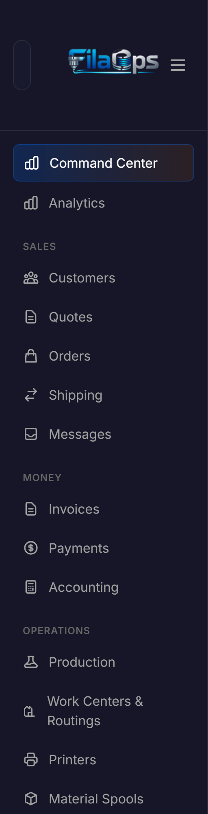
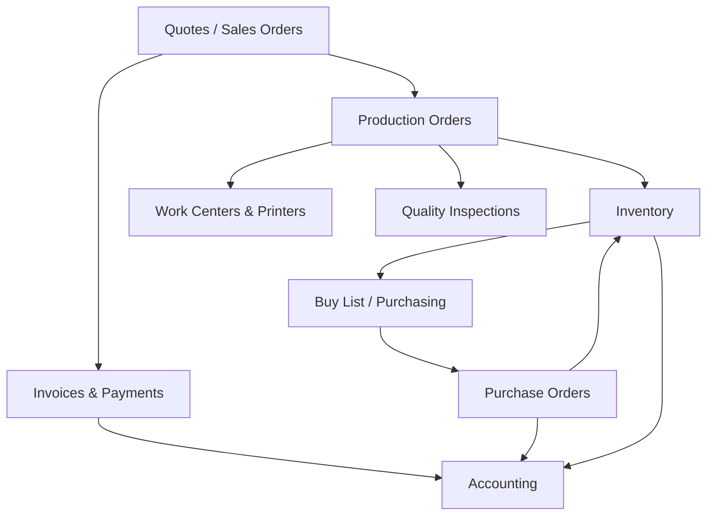
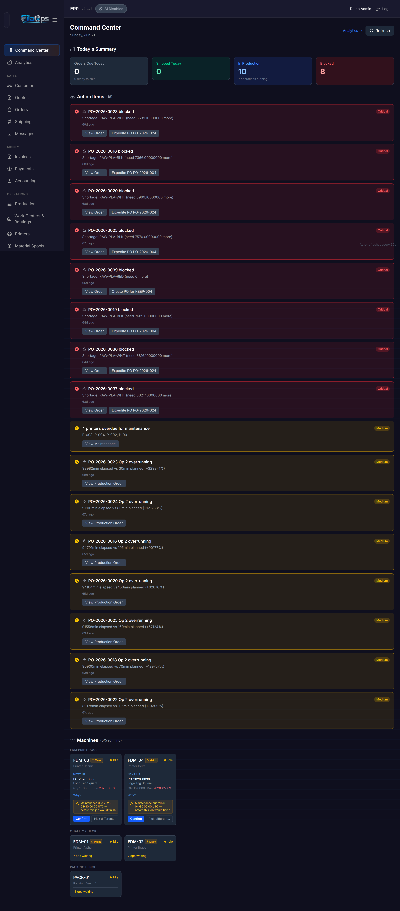
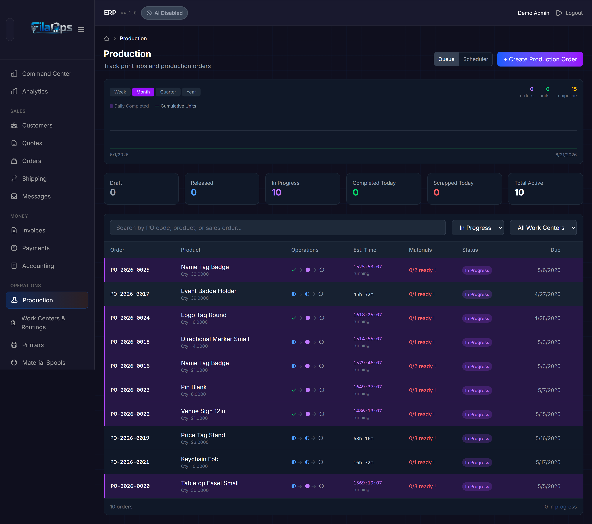

# FilaOps User Guide

Welcome to the FilaOps user guide. FilaOps is an open-source ERP for 3D-print farms —
it ties together your sales pipeline, production floor, inventory, purchasing, and
accounting in one system built specifically for additive manufacturing.

This page is your map. Pick a starting point below, or jump straight to the module you need.

!!! note "Core vs PRO"
    This guide covers **FilaOps Core** only (open-source, BSL license). PRO-only features —
    B2B Portal, Bambuddy (Bambu Lab integration), Price Levels, Analytics, and Intake Studio —
    are excluded from this guide. If you see a lock icon next to a sidebar item, that feature
    requires a PRO license.

---

## Where to Start

=== "New installation"

    Follow these steps in order:

    1. [Installation & Setup](installation.md) — get FilaOps running on your machine or server
    2. Complete the **First-Run Wizard** at `http://localhost/onboarding` — creates your admin
       account, sets your currency and locale, and optionally loads sample data or imports
       existing products, customers, and orders via CSV
    3. [Your First Day](first-day.md) — create your first item, take a quote, and push it to production

=== "Already running"

    Jump to any section in the nav below, or use the tables in this page to find the right guide.

!!! note "Admin vs. Staff access"
    Some menu sections — **Money**, **Customers**, and all **Admin** items — are visible only to
    users with the **Admin** account type. Staff users see a narrower sidebar focused on
    day-to-day operations (orders, production, inventory, purchasing, and quality).

---

## The App at a Glance

After signing in you land on the **Command Center** (`/admin`). The collapsible left sidebar
groups all pages into sections. Here is what each section contains and who can see it:

| Sidebar section | Pages inside | Admin only? | Purpose |
|---|---|---|---|
| *(top, no heading)* | Command Center | No | Real-time situational awareness |
| **SALES** | Quotes, Orders, Shipping, Messages | No | Day-to-day customer-facing workflow |
| **SALES** | Customers | Yes | Customer records and contact management |
| **MONEY** | Invoices, Payments, Accounting | Yes | Billing, payment tracking, and financial reporting |
| **OPERATIONS** | Production, Work Centers & Routings, Printers | No | Shop-floor execution |
| **OPERATIONS** | Material Spools | Yes | Filament spool tracking |
| **INVENTORY** | Items, Bill of Materials | No | Product catalog and BOM management |
| **INVENTORY** | Locations, Transactions, Cycle Count | Yes | Multi-location stock management |
| **PURCHASING** | Purchasing | No | Vendor management, purchase orders, and Buy List |
| **PURCHASING** | Import Materials | Yes | Bulk filament catalog import via CSV |
| **QUALITY** | Quality Dashboard, Material Traceability | No | QC inspections and spool genealogy |
| **ADMIN** | Team Members, Security Audit, Settings, Integrations, Scrap Reasons, Import Orders, License | Yes | User management, configuration, and system tools |

The sidebar can be collapsed to icon-only width by clicking the hamburger button at the top.
On mobile, the sidebar slides in as an overlay.

---

## Daily Operations

These guides cover the tasks you perform most often.

| Guide | What you will learn |
|---|---|
| [Taking and Fulfilling Orders](orders.md) | Quotes, sales orders, order status lifecycle, discounts, payment terms, and shipping |
| [Running Production](production.md) | Production orders (draft → released → in progress → complete), the operation scheduler, QC inspections, and scrap recording |
| [Tracking Inventory](inventory.md) | Multi-location stock, inventory transactions, cycle counts, and low-stock alerts |
| [Ordering Supplies](purchasing.md) | Vendors, purchase orders, receiving, the Low Stock tab, and the Buy List |
| [Monitoring Your Printers](printers.md) | Add printers, record and schedule maintenance, and view fleet status |

---

## Product Catalog & Manufacturing Setup

Set these up once and update only when you add new products or change your shop
configuration.

| Guide | What you will learn |
|---|---|
| [Managing Your Product Catalog](product-catalog.md) | Create finished goods, components, materials, and supplies; set reorder points; duplicate items; use the Variant Matrix to bulk-create color or material variants from a template |
| [Bills of Materials](product-catalog.md#bills-of-materials-boms) | Build multi-level BOMs, view the cost rollup, copy a BOM to another product, and launch a production order directly from a BOM |
| [Work Centers & Routings](production.md#work-centers) | Define work centers, assign printer resources, and create routings with per-operation materials |
| [Material Spools](inventory.md#material-spools) | Track filament spools by weight, link to inventory items, and record consumption per print *(admin only)* |

---

## Planning & Finance

| Guide | What you will learn |
|---|---|
| [Buy List & Material Shortages](purchasing.md#the-buy-list-tab) | The Buy List in Purchasing consolidates demand across all open orders and shows what to buy, how much, and by when — with a one-click "Create PO" shortcut |
| [Invoices & Payments](accounting.md) | Generate invoices from sales orders, record customer payments, and track outstanding balances *(admin only)* |
| [Accounting](accounting.md) | Sales journal, COGS & materials report, and tax center *(admin only)* |

---

## Quality

| Guide | What you will learn |
|---|---|
| [Quality Dashboard](production.md#quality) | First-pass yield, pending inspections, scrap rate, and the inspection queue |
| [Material Traceability](inventory.md#spool-usage-and-traceability) | Trace a filament spool from receipt through every production order it contributed to |

---

## Administration

!!! note
    All pages in this section require the Admin account type.

| Guide | What you will learn |
|---|---|
| [Users & Permissions](users-and-permissions.md) | Add team members, assign Admin or Staff roles, and review the security audit log |
| [System Settings](system-settings.md) | Company profile, address, timezone, currency, locale, tax rates, quote terms, business hours, default margin, and the auto-dispatch toggle |
| [Integrations](system-settings.md#integrations) | Configure SMTP email and other system integrations |
| [Scrap Reasons](system-settings.md#scrap-reasons) | Maintain the list of scrap reason codes used in production and quality inspections |
| [Import Orders](system-settings.md#import-orders) | Bulk-import sales orders from a CSV file |

---

## Workflows & Recipes

End-to-end guides that show how multiple modules work together.

| Workflow | Scenario |
|---|---|
| [Quote to Cash](workflows/quote-to-cash.md) | From customer inquiry through production to payment |
| [New Product Launch](workflows/new-product-launch.md) | Setting up a new item with BOM, routing, pricing, and initial stock |
| [Weekly Planning Cycle](workflows/weekly-planning.md) | Reviewing the Buy List, confirming shortages, and creating purchase orders |
| [Month-End Close](workflows/month-end-close.md) | Reviewing COGS, reconciling inventory, and closing an accounting period |
| [Onboarding a Printer](workflows/onboarding-a-printer.md) | Adding a new printer to your fleet with maintenance scheduling |

---

## How the Modules Connect

A confirmed sales order can spawn a production order. The production order pulls components
from inventory and routes operations through work centers (printers). The Buy List in
Purchasing detects demand shortfalls across all open orders and pre-fills purchase orders
for review. As orders ship and invoices are paid, accounting records revenue, COGS, and tax.

---

## Key Pages Explained

### Command Center

**Route:** `/admin` (the home screen after sign-in)

The Command Center answers "what do I need to do right now?" It shows:

- **Summary cards** — counts of orders awaiting action, production orders in progress, and
  low-stock alerts
- **Prioritized action items** — time-sensitive tasks sorted by urgency
- **Machine status grid** — one card per printer; idle printer cards display a dispatch
  suggestion you can confirm with a single click

!!! tip "Auto-dispatch"
    Go to **Settings** and enable **Auto Dispatch** to have FilaOps automatically confirm the
    top dispatch suggestion for each idle printer on every refresh cycle. Printers with an
    active maintenance window are never auto-dispatched.

---

### Production

**Route:** `/admin/production`

Production orders move through a four-stage lifecycle:

1. **Draft** — created but not yet committed
2. **Released** — committed; materials are reserved
3. **In Progress** — actively being manufactured
4. **Complete** — finished and ready to fulfill

Each production order has a detail page where you record operation completions, log QC
inspections (pass / fail / conditional), and record scrap with a reason code. The
**Operation Scheduler** modal opens a scheduling board for assigning operations across
work centers.

---

### Items

**Route:** `/admin/items`

The item catalog supports four item types: **Finished Good**, **Component**, **Material**,
and **Supply**. From the Items page you can:

- Create or edit items individually or in bulk
- Use **Suggest Prices** to recalculate selling prices from cost plus a target margin
- Use **Duplicate Item** to copy an item (and optionally its BOM) as a starting point for a new product
- Use **Variant Matrix** to generate a batch of color or material variants from a template
  item in a single operation
- Filter by type, active status, category, or stock status (shortage items shown first by default)

---

### Bill of Materials

**Route:** `/admin/bom`

Each BOM is linked to a finished good or component. From the BOM detail view you can add
components, specify quantities and unit of measure, view the cost rollup, and use
**Copy BOM** to clone the structure to another product. A **Create Production Order** button
on any BOM lets you launch production directly from the catalog.

---

### Purchasing

**Route:** `/admin/purchasing`

The Purchasing page has four tabs:

- **Orders** — create and manage purchase orders; receive against an open PO
- **Vendors** — vendor contact records and purchase history
- **Low Stock** — items below their reorder point, with a one-click "Create PO" shortcut
- **Buy List** — consolidated material requirements across all open demand, with per-row
  "Create PO" shortcuts that pre-fill vendor and suggested quantity

---

### Accounting

**Route:** `/admin/accounting` (admin only)

The Accounting page contains:

- **Sales Journal** — one row per invoice, with customer, amount, and status
- **COGS & Materials** — cost of goods sold breakdown by item and period
- **Tax Center** — tax collected by rate, period, and customer

Invoices are managed at `/admin/invoices` and payments at `/admin/payments`.

---

### Quality

**Route:** `/admin/quality`

Shows first-pass yield, pending inspection count, scrap rate, and total inspections for
the past 30 days. The inspection queue lists production orders awaiting QC; click any row
to open the QC inspection modal. Recent inspections and scrap-by-reason summaries appear
below.

**Route:** `/admin/quality/traceability`

Given a spool ID or lot number, traces that material through every production order it
contributed to and links through to the associated sales orders.

---

### Settings

**Route:** `/admin/settings` (admin only)

Key fields available in Settings:

- **Company** — name, address, phone, email, website
- **Regional** — timezone, currency code, locale (affects number and date formatting)
- **Tax** — enable/disable tax, default tax rate, tax name, and registration number
- **Quotes** — default validity period, terms text, and footer text
- **Business Hours** — start/end hour, days per week, and work days (used by the scheduler)
- **Default Margin %** — applied by the Suggest Prices tool
- **Auto Dispatch** — enable automatic dispatch suggestions for idle printers

---

## Reference

| Page | Contents |
|---|---|
| [First-Run Setup & Password Reset](../FIRST-RUN-SETUP.md) | Onboarding wizard details, SMTP password reset flow, and development recovery options |
| [Troubleshooting](troubleshooting.md) | Common problems and how to fix them |
| [Glossary](glossary.md) | Definitions for terms used throughout FilaOps |

---

## Getting Help

- **Issues and feature requests:** [GitHub Issues](https://github.com/BLB3DPrinting/filaops/issues)
- **API documentation:** [Developer Reference](../reference/index.md)
- **Contributing:** See `CONTRIBUTING.md` in the repository root

---

*FilaOps Core | open-source (BSL) | [changelog](https://github.com/BLB3DPrinting/filaops/blob/main/CHANGELOG.md)*
