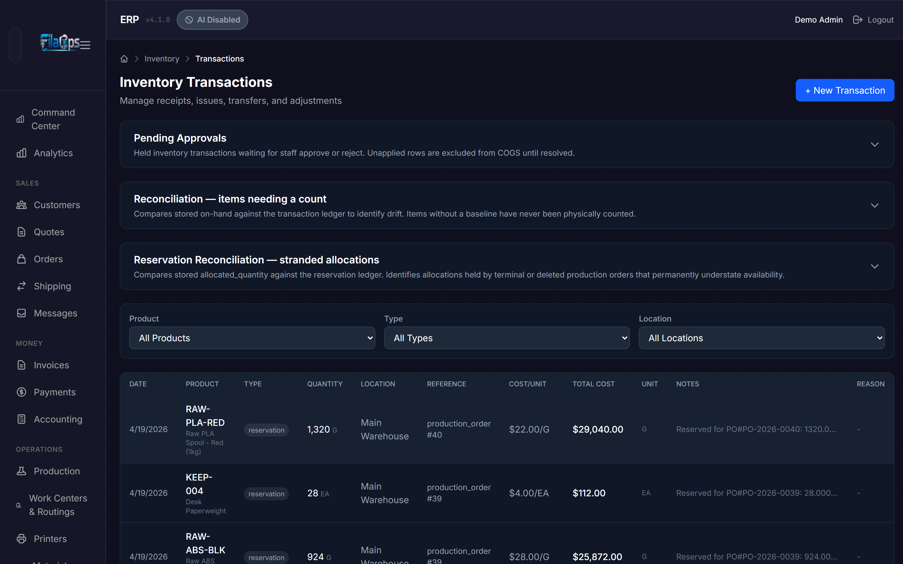
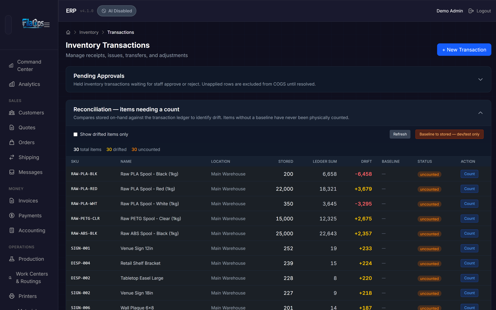
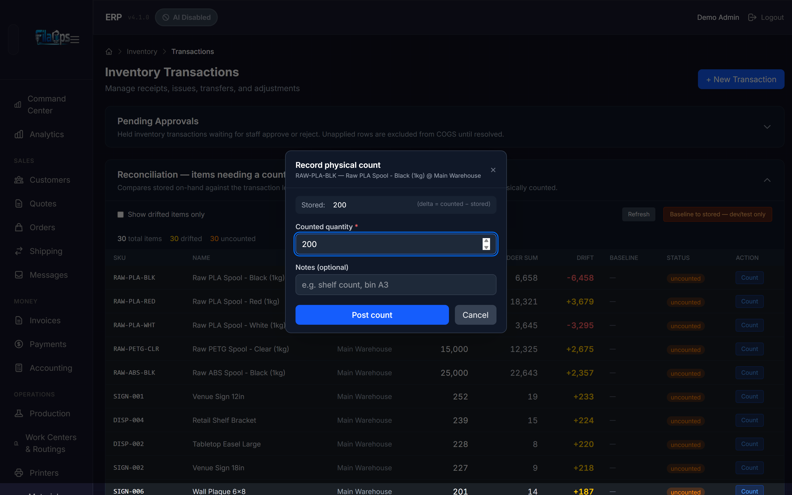
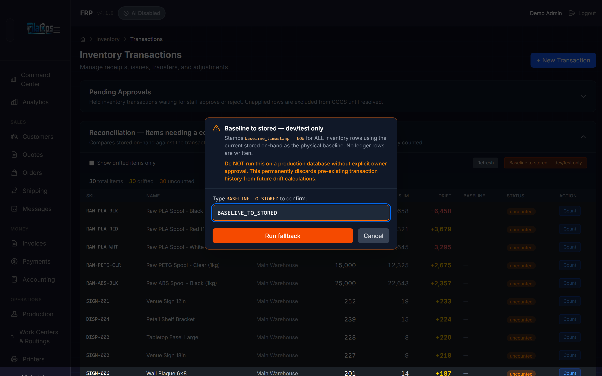

# Inventory Reconciliation

> Keep your system numbers trustworthy — find drift, count the shelf, and anchor the ledger to reality.

## What You'll Learn

- What "drift" and "uncounted" mean in FilaOps
- How to use the Reconciliation report as your counting work queue
- How to record a physical count for a single item
- What "Baseline to stored" does, and when (and when not) to use it
- How reconciliation counts relate to your regular cycle counts

## Prerequisites

- Staff (admin) access — the Reconciliation section is staff-only
- At least one inventory location configured
- Products entered in your catalog

---

## How FilaOps Keeps Inventory Numbers

FilaOps inventory is **ledger-first**: every receipt, consumption, shipment,
adjustment, and count posts a signed transaction to the inventory ledger. The
on-hand number you see on the Items page is the running total of those
transactions — it is always backed by history you can scroll through.

Think of it this way: there is a **sticky note on the shelf** (the on-hand
balance you see on screen) and a **notebook by the door** (the transaction
ledger). Every time stock moves, an entry goes in the notebook and someone
updates the sticky note. The system keeps both, and they are supposed to agree.
The **Reconciliation report** is the process of checking that they still do.

---

## The Reconciliation Report

Navigate to **Inventory > Transactions** in the left sidebar. The page shows
three collapsible sections above the transaction list. Click the
**"Reconciliation — items needing a count"** section header to expand it.



Once expanded, the report loads a summary bar and a table with one row per
inventory item.



### Summary Bar

At the top of the expanded section, three counts are shown:

| Badge | What It Shows |
|-------|---------------|
| **N total items** | Total inventory rows with a linked product |
| **N drifted** (yellow when > 0) | Items where stored on-hand differs from the ledger sum |
| **N uncounted** (orange when > 0) | Items with no physical count baseline ever recorded |

### Report Columns

| Column | What It Shows |
|--------|---------------|
| **SKU** | Product SKU |
| **Name** | Product name |
| **Location** | Inventory location name (or "—" if unassigned) |
| **Stored** | The on-hand balance currently stored in FilaOps |
| **Ledger Sum** | What the transaction history adds up to for this item's epoch |
| **Drift** | `Stored − Ledger Sum` — yellow for positive, red for negative, gray for zero |
| **Baseline** | Date of the last physical count (or "—" if never counted) |
| **Status** | **clean** / **drifted** / **uncounted** badge |
| **Action** | **Count** button — shown only for drifted or uncounted items |

### Row Sort Order

Rows are sorted by **absolute drift magnitude, largest first**. Within the same
drift magnitude, uncounted items appear before counted items. This puts your
worst-offending inventory at the very top so you can act on it immediately.

### What "Drift" Means

Drift is the gap between what the ledger says you should have and what the
system actually shows on-hand:

```
drift = stored_on_hand − ledger_sum
```

For a **counted item** (has a baseline), the ledger sum is:

```
ledger_sum = baseline_on_hand + sum(all transactions strictly after the baseline timestamp)
```

For an **uncounted item** (no baseline), the ledger sum is the sum of every
transaction ever recorded for that item from the beginning of time.

A non-zero drift means some inventory movement happened outside the normal
transaction flow. Common causes:

- A spool was scrapped and remade but the scrap was never recorded
- A last-minute slicing change added or removed material but the BOM was not updated
- A manual on-hand edit was made directly, bypassing the ledger
- Data was imported from a previous system using a different sign convention

Drift direction matters:

- **Positive drift (yellow)** — stored is higher than the ledger says; you
  think you have more than the history supports (phantom stock)
- **Negative drift (red)** — stored is lower; material was consumed or lost
  but not fully recorded

### Status Badges

| Badge | Meaning |
|-------|---------|
| **clean** (green) | Item has been counted and stored matches the ledger — no action needed |
| **drifted** (yellow) | Item has been counted but the stored balance has since diverged from the ledger |
| **uncounted** (orange) | Item has never had a physical count recorded — treat as high priority |

### What "Uncounted" Means

An item is **uncounted** when it has never had a physical count recorded in
FilaOps. Without a count baseline, the report sums all transactions from the
beginning of time. For items that predate FilaOps or were imported from another
system, that history may use mixed sign conventions — so the ledger sum is not
fully trustworthy until you count once.

!!! tip "Focus your counting queue"
    Check **Show drifted items only** in the controls bar to hide clean items.
    The table reloads showing only rows with a non-zero drift, giving you a
    focused work queue.

---

## Counting an Item

When you see a row with status **drifted** or **uncounted**, click the **Count**
button on that row to record what is physically on the shelf.

!!! note "When the Count button is absent"
    The **Count** button only appears on drifted or uncounted rows. A clean row
    has no button because the balance is already confirmed. To re-verify a clean
    item, use the [Cycle Count](inventory.md#cycle-counts) page instead.

### How to Record a Count

1. Find the item in the Reconciliation table and click **Count**.

2. A dialog opens titled "Record physical count." It shows the item's SKU,
   name, and location, along with the current **Stored** quantity for
   reference. The **Counted quantity** field is pre-filled with the stored
   value as a starting point.

   

3. Walk to the shelf. Count the physical stock. Enter the number you actually
   counted in the **Counted quantity** field (must be ≥ 0).

4. Optionally enter a value in the **Notes** field (up to 500 characters,
   e.g., "bin A3 shelf count 2026-06-10").

5. Click **Post count**.

### What Happens After You Count

FilaOps does the following atomically when you post a count:

1. **Locks the inventory row** — acquires a row-level lock so the read of the
   stored quantity and the ledger write are serialised. No concurrent operation
   can change the quantity between the read and the write.

2. **Computes the delta** — `delta = counted − stored_at_lock_time`. If your
   count matches the locked value exactly, delta is zero.

3. **Posts a ledger transaction** — if delta is non-zero, a `reconciliation`
   transaction with reason code `reconciliation_baseline` is written to the
   inventory ledger. This is visible in the full transaction history just like
   any receipt or adjustment. If delta is zero, no ledger row is written (the
   ledger rejects zero-quantity rows), but the baseline is still stamped.

4. **Stamps `baseline_on_hand` and `baseline_timestamp`** in the same database
   flush — `baseline_on_hand` records the physically counted quantity as the
   opening balance of the new epoch; `baseline_timestamp` records the exact
   moment of the count. From this point forward, the Reconciliation report only
   considers transactions strictly **after** this timestamp for the drift
   calculation. Pre-count history is preserved read-only in the ledger and is
   never deleted.

After a successful count the item's row shows drift = 0, a baseline date of
today, and status **clean**.

!!! note "Accounting impact"
    Counts with a non-zero delta post a journal entry using cycle-count variance
    semantics:

    | Scenario | Debit | Credit |
    |----------|-------|--------|
    | Overage (counted > stored) | Inventory | Inventory Adjustment (5030) |
    | Shortage (counted < stored) | Inventory Adjustment (5030) | Inventory |

    The inventory account depends on the product's item type: account **1200**
    for raw material (default), **1220** for finished goods, **1230** for
    packaging. The dollar amount is `|delta| × unit cost`. FilaOps uses the
    product's **standard cost** first, falls back to **average cost** if
    standard cost is not set, and falls back to zero if neither is set. If the
    computed cost is zero, the GL entry is skipped — the baseline timestamp is
    still stamped, but no dollar amount posts to your books. Set a standard cost
    on the product if you need the variance to flow through your accounts.

---

## "Baseline to Stored" — The Escape Hatch

In the controls bar of the Reconciliation section there is an orange button
labeled **"Baseline to stored — dev/test only"**. Here is exactly what it does
and when to use it.

### What It Does

"Baseline to stored" stamps the **current system on-hand as the starting point**
for every inventory row — without you physically counting anything. It accepts
the numbers already in the system as correct and starts measuring drift from
this moment forward.

Specifically, it sets `baseline_timestamp = NOW` and
`baseline_on_hand = current stored on-hand` for every inventory row simultaneously.
**No adjustment transaction is written.** Nothing changes in the ledger or your
books — only the baseline anchor is set.

### Why the Confirmation is Required

The button opens a dialog that requires you to type `BASELINE_TO_STORED` exactly
before the **Run fallback** button becomes enabled. That is not bureaucracy — it
is a deliberate speed bump. This action:

- Applies to **every inventory row at once**
- Cannot be undone by clicking anything — you would need to re-count affected
  items to restore meaningful baselines
- Silently discards the diagnostic value of pre-existing transaction history for
  future drift calculations

If you run it by mistake, nothing harmful happens to your stock quantities or
your books — the stored values do not change. But items that had real drift will
now appear clean, and you will have missed the opportunity to find and fix the
root cause.

### When to Use It

| Situation | Use it? |
|-----------|---------|
| Fresh FilaOps install, data imported from a spreadsheet, you trust the imported numbers | **Yes** |
| Dev or test database, resetting demo data | **Yes** |
| You want to skip counting and just make the report look clean | **No — count instead** |
| Some items show drift after a system upgrade due to old sign-convention data | **No — count the drifted items** |
| Production database with live orders running | **No — count instead** |

The clearest rule: **if you care whether the numbers are actually right, count
the items instead.** "Baseline to stored" is for accepting numbers wholesale
when you already know they are correct (or when correctness does not matter, as
in a dev or test environment).

!!! warning "Production databases"
    Do not use "Baseline to stored" on a production database unless you have
    verified the stored quantities are accurate. Running it will make drifted
    items appear clean without fixing the underlying variance, masking problems
    that will eventually surface in your books.

### Step by Step

If you have decided "Baseline to stored" is appropriate:

1. Click **Baseline to stored — dev/test only** in the controls bar.

2. Read the warning in the dialog carefully.

3. Type `BASELINE_TO_STORED` exactly in the confirmation field. The
   **Run fallback** button is disabled until the text matches exactly.

   

4. Click **Run fallback**.

5. A success banner appears inside the section showing how many rows were
   stamped. The table reloads with all items showing status **clean** and
   drift = 0.

---

## Reconciliation Counts vs. Cycle Counts

FilaOps has two ways to physically count inventory. They post the same kind of
ledger transaction and the same GL entry — they are triggered from different
places and are suited to different workflows.

| | Cycle Count | Reconciliation Count |
|---|---|---|
| **Where** | Inventory > Cycle Count | Inventory > Transactions > Reconciliation section |
| **Scope** | Batch — many items at once | Single item — targeted correction |
| **Trigger** | Scheduled audit (weekly/monthly) | When a specific item's number looks wrong |
| **GL entry** | DR Inventory / CR Inventory Adjustment | DR Inventory / CR Inventory Adjustment (same) |
| **Sets reconciliation baseline** | No | Yes |
| **Best for** | Routine periodic audits | Investigating and fixing drift on one item |

**Rule of thumb:** run cycle counts on a schedule to keep quantities healthy
overall. Use the Reconciliation report and its Count action when a specific
item's number looks wrong and you want to investigate and correct just that item.

Both approaches anchor your books to physical reality the same way.

---

## Frequently Asked Questions

### Why does an item show large drift right after a system upgrade?

Before the HARD-4a/4b/4c changes, different parts of FilaOps used different
sign conventions when writing inventory transactions — some recorded positive
magnitudes for both stock-in and stock-out. The Reconciliation report assumes
the modern signed convention (positive = stock in, negative = stock out). An
item whose history was written under the old convention may show misleading
drift numbers.

**Fix:** count the item (or use "Baseline to stored" for dev/test data). Once
a baseline is set, the Ledger Sum only includes transactions strictly after that
timestamp. The old history is preserved in the ledger but no longer contributes
to the drift calculation.

### Does counting change my books?

Yes, if the counted quantity differs from what is stored. A count with a
non-zero delta posts a journal entry to account **5030 Inventory Adjustment** —
the same account used by cycle-count variances. If you count 152 when the
system shows 140, the variance (12 × unit cost) is debited to Inventory and
credited to Inventory Adjustment. Zero-delta counts (where counted = stored)
write no journal entry, but the baseline timestamp is still stamped.

### Can I undo a baseline?

There is no "undo baseline" button. If you set a baseline incorrectly, the
remedy is to **count the item again** — the most recent count always wins. The
previous baseline timestamp is replaced by the new one, and the report starts
measuring drift from the new count forward.

### What does the Ledger Sum column show for an uncounted item?

For an uncounted item (no baseline timestamp), the Ledger Sum is the sum of all
transactions ever recorded for that item. If those transactions used mixed sign
conventions, the number may look wrong. Count the item once to anchor the
history — after that the Ledger Sum only reflects post-baseline transactions on
top of the physically counted opening balance.

### I see an item with drift = 0 but it is still marked "uncounted" — is that a problem?

No, it is fine. It means the full transaction history happens to sum to the
stored value even without a formal count. The "uncounted" badge is informational
— it means FilaOps has never had a human physically verify the number. You can
leave it or count it; either is fine depending on how much you trust the
transaction history for that item.

### The Count button is missing on a row — why?

The **Count** button only appears for rows with status **drifted** or
**uncounted**. A row showing status **clean** is already balanced and does not
need a count action. To re-verify a clean item, use the Cycle Count page.

---

## What's Next?

- [Tracking Inventory](inventory.md) — transaction types, transfers, and the
  full Transactions page
- [Cycle Counts](inventory.md#cycle-counts) — batch physical audits on a
  schedule
- [Material Planning (MRP)](mrp.md) — accurate on-hand numbers are the
  foundation of reliable MRP calculations

## Quick Reference

| Task | Where |
|------|-------|
| Open the reconciliation report | **Inventory > Transactions** → expand "Reconciliation — items needing a count" |
| Filter to drifted items only | Check **Show drifted items only** in the controls bar |
| Refresh the report | Click **Refresh** in the controls bar |
| Count a single item | Click **Count** on any drifted or uncounted row |
| Accept all current balances as baseline (dev/test only) | Click **Baseline to stored — dev/test only**, type `BASELINE_TO_STORED`, click **Run fallback** |
| Run a batch cycle count | **Inventory > Cycle Count** |
