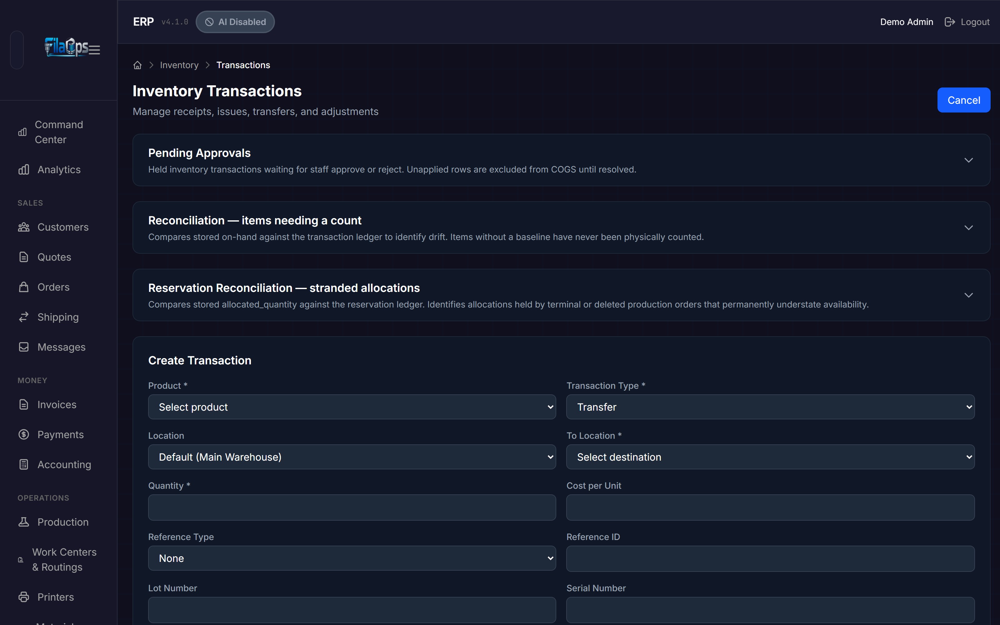
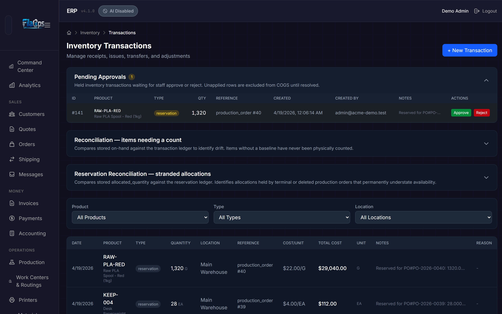
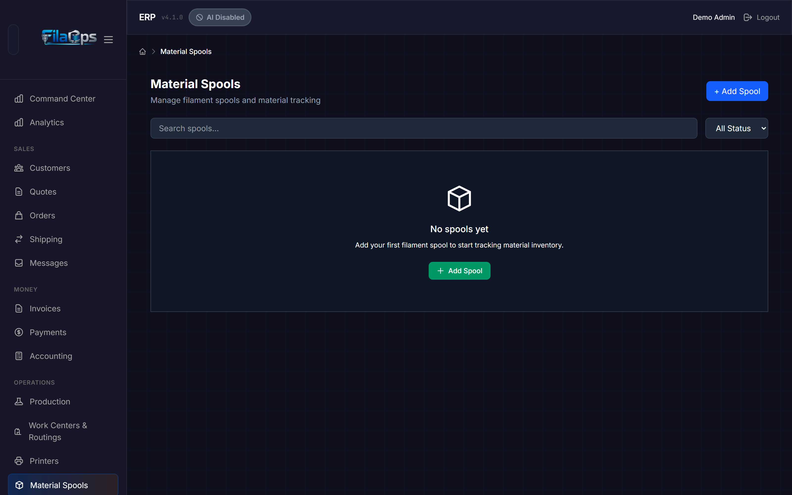
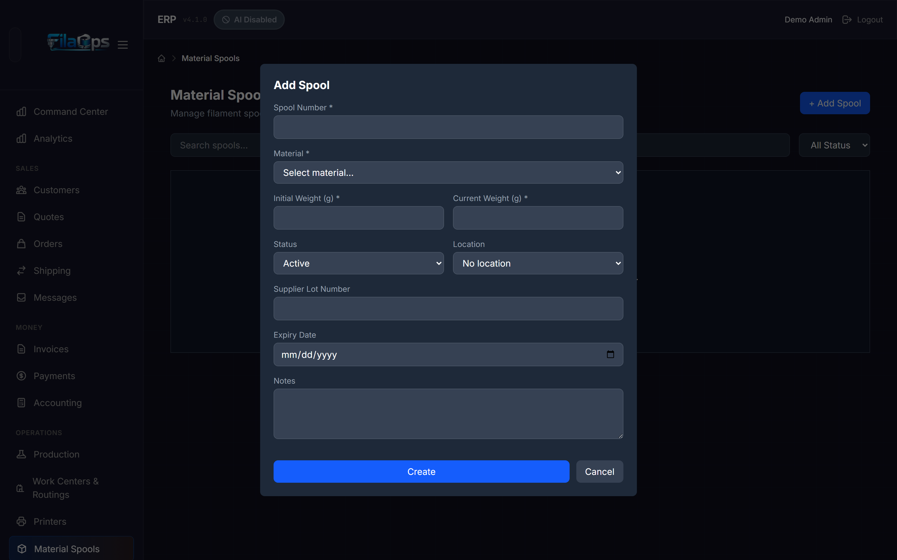
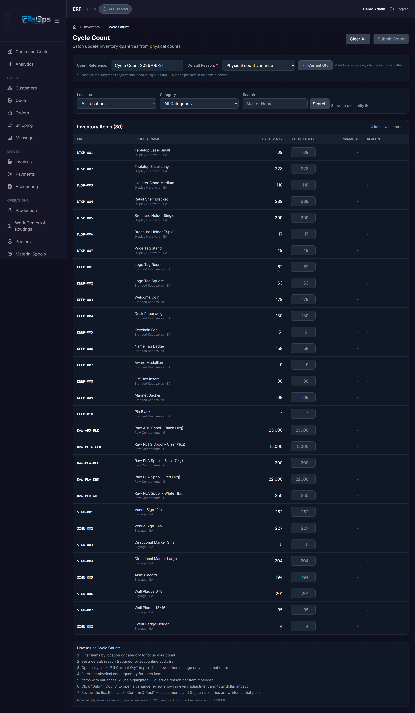
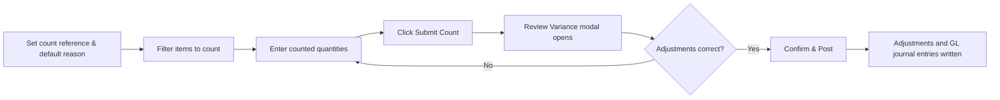
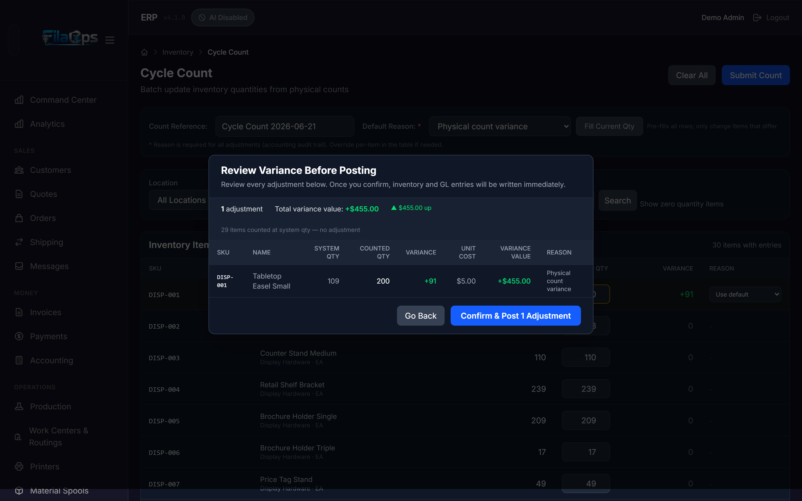

# Tracking Inventory

> Know exactly what you have, where it is, and where it went — every receipt, issue, transfer, and adjustment in one place.

## What You'll Learn

- How to record inventory transactions (receipts, issues, transfers, adjustments, and more)
- How to track filament spools by individual spool weight
- How to run cycle counts to reconcile physical stock with system records
- How to use the reconciliation report to detect ledger drift on a per-item basis
- How to review and action held transactions that require approval

## Prerequisites

- Staff access to FilaOps
- At least one product in your catalog (see [Managing Your Product Catalog](product-catalog.md))
- At least one location set up (see [System Settings](system-settings.md))

---

## Understanding Transaction Types

Every inventory movement in FilaOps is recorded as a transaction. The system supports these types, each appearing as a color-coded badge throughout the interface:

| Type | Badge color | What it records |
|------|-------------|-----------------|
| **Receipt** | Green | Stock coming in — supplier deliveries, production output, returns |
| **Issue** | Red | Stock going out — fulfilled shipments, manual issues |
| **Transfer** | Blue | Stock moving between locations |
| **Adjustment** | Yellow | Signed corrections — fixing miscounts, reconciling physical vs. system quantity |
| **Consumption** | Orange | Materials consumed during production or shipping |
| **Scrap** | Gray | Stock written off as damaged, defective, or expired |

The system also records internal types you will see in the transaction history but cannot manually create: `reservation` (materials allocated to a production order), `reservation_release` (allocation reversed), `shipment` (automatic issue when a sales order ships), and `reconciliation_baseline` (physical count posted through the reconciliation tool).

!!! note "Quantities and units"
    FilaOps stores the quantity for each transaction in the product's inventory unit (for example, grams for filament). Cost per unit is stored per inventory unit as well — this prevents calculation errors when your purchase unit (KG) differs from your storage unit (G).

---

## The Inventory Transactions Page

Navigate to **Inventory > Transactions** in the sidebar. This page is your main ledger for recording and reviewing all inventory movements.

### Recording a Transaction

1. Click **+ New Transaction**.

2. Fill in the required fields:

    - **Product** — Select the item (required). Choose from the dropdown, which lists products by SKU and name.
    - **Transaction Type** — Choose from Receipt, Issue, Transfer, Adjustment, Consumption, or Scrap. Defaults to Receipt.
    - **Location** — Where this transaction occurs. If left blank, defaults to your primary warehouse (Main Warehouse).
    - **Quantity** — The amount in the product's inventory unit (supports decimals).
    - **Cost per Unit** — Optional. The unit cost for this transaction; used for COGS and costing reports.

3. Add optional details:

    - **Reference Type** — Link the transaction to a source document: Purchase Order, Production Order, Sales Order, or Adjustment.
    - **Reference ID** — The numeric ID of the linked document.
    - **Lot Number** — For lot-tracked materials; enables traceability back to a supplier batch.
    - **Serial Number** — For serialized items.
    - **Notes** — Free-text notes explaining why this transaction happened.

4. Click **Create Transaction**.

!!! note "Transfer transactions"
    When you select **Transfer** as the transaction type, a **To Location** field appears. This is required — you must specify both the source location and the destination location.

!!! note "Adjustment transactions"
    When you select **Adjustment**, an **Adjustment Reason** dropdown appears below the Notes field. Selecting a reason is recommended for the accounting audit trail. The reason list is loaded from your configured adjustment reasons.

### Filtering Transactions

Use the three filter dropdowns above the transaction table to narrow the list:

- **Product** — Show transactions for a specific item.
- **Type** — Show only receipts, issues, transfers, etc.
- **Location** — Show transactions at a specific location.

The table reloads automatically when you change a filter.

### Reading the Transaction Table

| Column | What it shows |
|--------|--------------|
| **Date** | When the transaction was recorded (`created_at`) |
| **Product** | Item SKU (bold) and name |
| **Type** | Color-coded badge; transfer rows also show the destination location below the badge |
| **Quantity** | Amount with the stored unit alongside (e.g., `1250.5 G`) |
| **Location** | Where the transaction was posted |
| **Reference** | Linked document type and ID (e.g., `purchase_order #42`) |
| **Cost/Unit** | Unit cost at time of transaction, denominated per inventory unit |
| **Total Cost** | Pre-calculated total stored on the transaction row — not recalculated in the browser |
| **Unit** | The inventory unit the quantity and cost are expressed in |
| **Notes** | Free-text notes |
| **Reason** | Adjustment reason code, if set |

---

## Pending Approvals

When a transaction would drive available stock negative (on-hand minus already-allocated), FilaOps holds it for review rather than rejecting it outright. Held transactions are excluded from COGS calculations until a staff member resolves them.

The **Pending Approvals** panel appears at the top of the Inventory Transactions page. It is collapsed by default — click the header to expand it and see the count of transactions waiting for action.

### Reviewing a Held Transaction

Each held transaction row shows the product SKU and name, transaction type, quantity, linked reference, the user who created it, and any notes. You have two options:

- **Approve** — A browser prompt asks for a reason. After you enter a reason, the transaction is applied to the on-hand quantity immediately.
- **Reject** — A modal asks for a void reason. The transaction row is kept for audit purposes but on-hand is never changed. Rejected (voided) transactions are excluded from all future calculations.

!!! warning "Approval is permanent"
    Once you approve a held transaction, the on-hand quantity changes immediately. Confirm the product, quantity, and reason carefully before approving.

---

## Reconciliation — Items Needing a Count

The **Reconciliation** panel (on the Inventory Transactions page, below Pending Approvals) compares each item's stored on-hand quantity against the running sum of its transaction ledger since the last physical baseline. Items where stored on-hand differs from the ledger sum are flagged as **drifted**. Items that have never had a physical count posted are flagged as **uncounted**.

### Reconciliation Table Columns

| Column | What it shows |
|--------|--------------|
| **SKU** | Item part number |
| **Name** | Item name |
| **Location** | Inventory location |
| **Stored** | The `on_hand_quantity` currently in the inventory record |
| **Ledger Sum** | Sum of transaction quantities since the last baseline |
| **Drift** | Stored minus ledger sum; yellow = positive, red = negative |
| **Baseline** | Date of the last physical count; `—` means the item has never been counted |
| **Status** | `clean` (no drift), `drifted` (mismatch found), or `uncounted` (no baseline yet) |

Toggle **Show drifted items only** to hide clean rows. Click **Refresh** to reload the data.

### Posting a Physical Count for One Item

For drifted or uncounted items, click **Count** to open a count entry dialog:

1. The dialog shows the item's SKU, name, and current stored quantity.
2. Enter your **Counted quantity** — the number you physically found on the shelf.
3. Optionally enter **Notes** (for example, `shelf count, bin A3`).
4. Click **Post count**.

FilaOps posts a `reconciliation_baseline` transaction, stamps the item's baseline timestamp and baseline on-hand, and refreshes the report. Future drift calculations start from this new baseline.

!!! tip "Use the Reconciliation panel for spot-checks"
    The Reconciliation panel is ideal for investigating a single SKU that looks wrong. For a full warehouse count across many items, use **Inventory > Cycle Count** (see below) instead.

---

## Material Spools

If you work with filament or other spool-based materials, FilaOps tracks individual spools so you can see exactly how much material is left on each one and trace material usage back to specific production orders.

Navigate to **Inventory > Spools** in the sidebar.

### The Spools Table

Each row shows:

- **Spool Number** — Your unique identifier for this physical spool
- **Material** — The material name and SKU
- **Weight** — Current weight and initial weight in grams (e.g., `750.3g / 1000.0g`), with a color-coded progress bar
- **Status** — Active, Empty, Expired, or Damaged
- **Location** — Where the spool is stored

#### Weight Progress Bar Colors

| Color | Threshold | Meaning |
|-------|-----------|---------|
| Green | > 20% remaining | Plenty of material left |
| Yellow | 10–20% remaining | Getting low — plan a replacement |
| Red | < 10% remaining | Nearly empty — swap soon |

FilaOps automatically marks a spool as **Empty** when its weight drops below 50 g.

### Filtering Spools

- **Search field** — Find spools by spool number, material SKU, or material name
- **Status dropdown** — Show only Active, Empty, Expired, or Damaged spools

### Adding a Spool

1. Click **+ Add Spool**.

2. Fill in the spool details:

    - **Spool Number** — A unique identifier (required). Cannot be changed after creation.
    - **Material** — Which material product this spool contains (required). The dropdown shows material-type products from your catalog.
    - **Initial Weight (g)** — The starting weight in grams (required). For a standard 1 kg spool, enter `1000`.
    - **Current Weight (g)** — How much material is currently on the spool in grams. Defaults to the initial weight for a brand-new spool.
    - **Location** — Where the spool is stored. Recommended — spools without a location cannot update the inventory record when weight changes.
    - **Supplier Lot Number** — The manufacturer's lot or batch number; used for traceability.
    - **Expiry Date** — When the material expires (useful for hygroscopic materials such as nylon or TPU).
    - **Notes** — Any additional details about the spool's condition.

3. Click **Add Spool** (or **Save** in the modal).

!!! warning "Spool Number and Material cannot be changed after creation"
    Once a spool is saved, its spool number and material assignment are fixed. If you made a mistake, delete the spool and create a new one.

### Editing a Spool

Click **Edit** on the spool row to open the edit modal. From there you can update:

- **Status** — Active, Empty, Expired, or Damaged
- **Location** — Change or clear the storage location (sending an explicit empty value clears the location)
- **Notes** — Update or clear condition notes

!!! warning "Weight updates require a reason and use a separate flow"
    The edit modal rejects weight changes because updating weight creates an inventory adjustment transaction that requires a reason for accounting compliance. To adjust spool weight, use the dedicated weight-adjustment patch (or record a manual adjustment transaction via **Inventory > Transactions**).

### Spool Usage and Traceability

Each spool maintains a complete history of the production orders that consumed material from it:

- From a spool, you can see every production order that used it and the grams consumed per order.
- From a production order, you can see which spool(s) supplied the material.

This bidirectional traceability is useful for quality investigations — if a finished part is defective, you can trace back to the exact supplier lot number and identify all other production orders that used the same material.

!!! tip "Weigh spools regularly"
    The most common complaint about spool tracking is stale weight data. Make it a habit to weigh active spools at the start of each print run. Accurate weights prevent mid-print runouts and improve MRP material planning accuracy.

---

## Cycle Counts

A cycle count is a physical inventory audit — you count what is actually on the shelf, enter those numbers, and FilaOps calculates the variances and posts adjustment transactions. This keeps your system quantities aligned with reality.

Navigate to **Inventory > Cycle Count** in the sidebar.

### How Cycle Counts Work

### Step 1: Set Up the Count

At the top of the page, configure your count session before entering any quantities:

- **Count Reference** — Auto-generated as `Cycle Count YYYY-MM-DD`. Edit this to add specifics, for example `Cycle Count 2026-06-20 — Shelf A`.

- **Default Reason** — Required for accounting compliance. Applies to all variances unless you override it per item in the table. Options are:
    - Physical count variance
    - Damaged/defective - scrapped
    - Found in alternate location
    - Data entry error correction
    - Theft/loss suspected
    - Received but not recorded
    - Shipped but not recorded
    - Sample/testing usage
    - Other - see notes

- **Fill Current Qty** — Prefills every Counted Qty field with the current system quantity. Click this first, then only change the items that differ. Located next to the Default Reason to prevent accidental fat-finger clicks near Submit Count.

### Step 2: Filter What to Count

Use the four filters to narrow which items appear in the table:

- **Location** — Count only items at a specific location, or leave blank to include all locations.
- **Category** — Filter by product category (for example, count only filament, or only finished goods).
- **Search** — Find specific items by SKU or name; press Enter or click **Search**.
- **Show zero quantity items** — Toggle on to include items with zero system quantity; useful for finding stock that is physically present but not yet recorded.

### Step 3: Enter Counted Quantities

The inventory table shows every item matching your filters:

| Column | What it shows |
|--------|--------------|
| **SKU** | Item part number |
| **Product Name** | Item name; category and unit of measure shown below in smaller text |
| **System Qty** | What FilaOps currently has recorded |
| **Counted Qty** | The input field where you enter your physical count |
| **Variance** | Counted minus system — green if positive, red if negative |
| **Reason** | Per-item reason override dropdown; only appears when a variance exists for that row |

Rows with a variance get a yellow-tinted background. The Counted Qty input border turns yellow when the entered value differs from System Qty, making it easy to scan for in-progress entries.

!!! tip "Use Fill Current Qty to speed up large counts"
    Click **Fill Current Qty** first, then walk the shelves and change only the items where your physical count differs. This is far faster than typing every quantity from scratch.

### Step 4: Submit and Review

When you finish entering quantities, click **Submit Count**. The button is disabled until at least one item has a non-zero variance. FilaOps opens the **Review Variance Before Posting** modal — nothing is written until you confirm.

The modal shows:

- A summary: number of adjustments, total variance value in dollars, and separate up/down dollar amounts.
- Items counted at system quantity (zero variance) are collapsed to a single note — they require no adjustment.
- A scrollable per-item table showing every adjustment that *will* be posted:

| Column | What it shows |
|--------|--------------|
| **SKU** | Item part number |
| **Name** | Item name |
| **System Qty** | Quantity the system had recorded |
| **Counted Qty** | What you entered |
| **Variance** | The difference — green = found more, red = found less |
| **Unit Cost** | The effective cost used to calculate dollar impact |
| **Variance Value** | `variance × unit cost` |
| **Reason** | The reason that will be recorded on the adjustment transaction |

From this modal you have two choices:

- **Go Back** — Dismiss the modal and return to your count entries. Nothing has been written; all entries are preserved.
- **Confirm & Post** — Post all adjustments immediately. Inventory on-hand quantities and GL journal entries are written at this point.

### Step 5: Read the Results

After a successful post, the page shows a results summary panel:

- **Total Items** — Number of items submitted (only items with a non-zero variance are posted as adjustment transactions)
- **Successful** (green) — Items processed without errors
- **Failed** (red) — Items that could not be processed

The results table shows only rows with a non-zero variance or a failure so you can quickly spot any problems. The inventory table refreshes with the new on-hand values.

!!! note "Accounting impact"
    Non-zero cost variances create a GL journal entry. Positive variances (found more than expected) debit Inventory and credit the Inventory Adjustment expense account. Negative variances reverse this. All adjustments are posted to GL account 5030 (Inventory Adjustment expense). Items with zero cost (no cost method or cost not yet assigned) do not generate GL entries.

### Cycle Count Best Practices

- **Count by area, not all at once** — Use Location and Category filters to count one section at a time. This is faster and reduces the chance of double-counting or missing items.
- **Count high-value items more often** — Finished goods and expensive materials deserve weekly or monthly counts. Low-value consumables can be counted quarterly.
- **Investigate large variances** — A variance of 1–2 units is usually a counting error. A variance of 50 units points to a process problem such as unrecorded shipments, theft, or a systemic data entry gap.
- **Use specific reasons** — "Physical count variance" is a catch-all. Reasons like "Shipped but not recorded" or "Received but not recorded" help you trace and fix the upstream process gap.
- **Count during quiet times** — Avoid counting while production is running or orders are being picked and packed. Activity during the count leads to incorrect results.

---

## Tips & Best Practices

- **Record transactions in real time** — Do not batch a week's worth of receipts and enter them on Friday. Real-time recording keeps your available quantities accurate for MRP and order fulfillment.
- **Always link to a reference** — When recording a receipt, link it to the purchase order. When recording an issue, link it to the sales order. This creates a complete audit trail.
- **Use lot numbers for traceability** — If a customer reports a quality issue, lot numbers let you trace the problem back to a specific supplier batch and identify all other affected production orders.
- **Assign locations to spools** — A spool without a location can be tracked for weight, but weight adjustments to a location-less spool do not update the inventory on-hand record. Assign a location to every spool for accurate totals.
- **Weigh spools, do not estimate** — A kitchen scale is your best tool for spool tracking. Guessing leads to mid-print failures.
- **Run cycle counts regularly** — At minimum, count your top 20% of items (by value) every month. This catches variances before they compound into bigger problems.
- **Check the Reconciliation panel periodically** — After automated events (production completion, shipments), open the Reconciliation panel to verify there is no unexpected drift between stored on-hand and the transaction ledger.

---

## What's Next?

With inventory tracking in place, you can automate replenishment and plan ahead:

- [Ordering Supplies](purchasing.md) — Create purchase orders when stock runs low
- [Material Planning (MRP)](mrp.md) — Let FilaOps calculate material requirements automatically
- [Running Production](production.md) — Track material consumption during manufacturing

---

## Quick Reference

| Task | Where to find it |
|------|-----------------|
| Record a receipt | **Inventory > Transactions** > **+ New Transaction** > Type: Receipt |
| Record a transfer | **Inventory > Transactions** > **+ New Transaction** > Type: Transfer |
| Record an adjustment | **Inventory > Transactions** > **+ New Transaction** > Type: Adjustment |
| Approve or reject a held transaction | **Inventory > Transactions** > expand **Pending Approvals** |
| Check for ledger drift on a specific item | **Inventory > Transactions** > expand **Reconciliation** |
| Post a physical count for one item | Reconciliation panel > click **Count** on the item row |
| Add a new spool | **Inventory > Spools** > **+ Add Spool** |
| Edit spool status or location | **Inventory > Spools** > **Edit** on the spool row |
| Run a cycle count | **Inventory > Cycle Count** > set reason > enter quantities > **Submit Count** > review > **Confirm & Post** |
| Filter transactions by location | Use the Location dropdown on the Transactions page |
| Check stock levels | **Inventory > Items** — look at stock status indicators |
