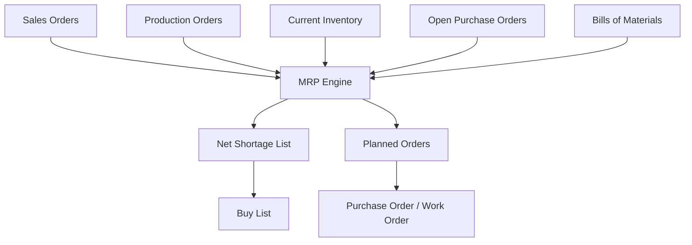
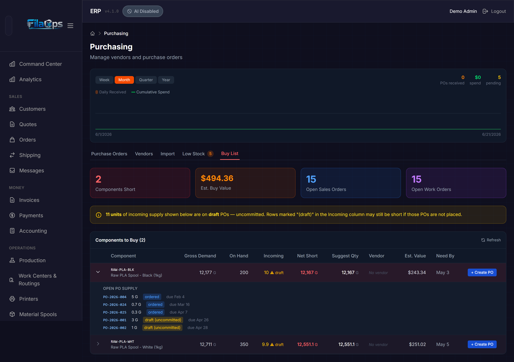
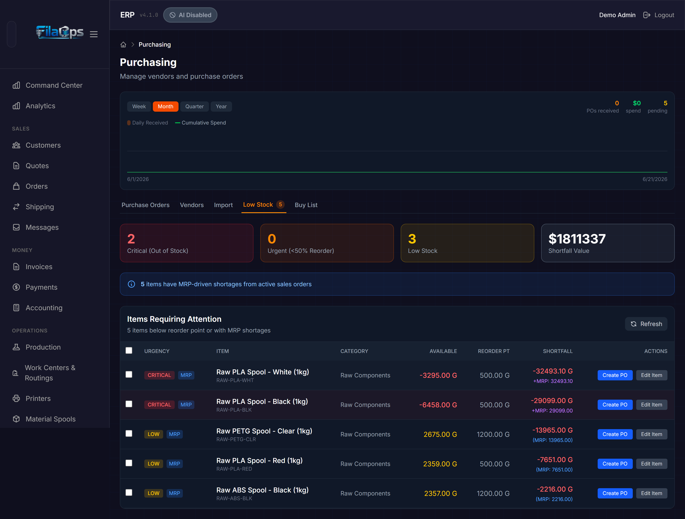
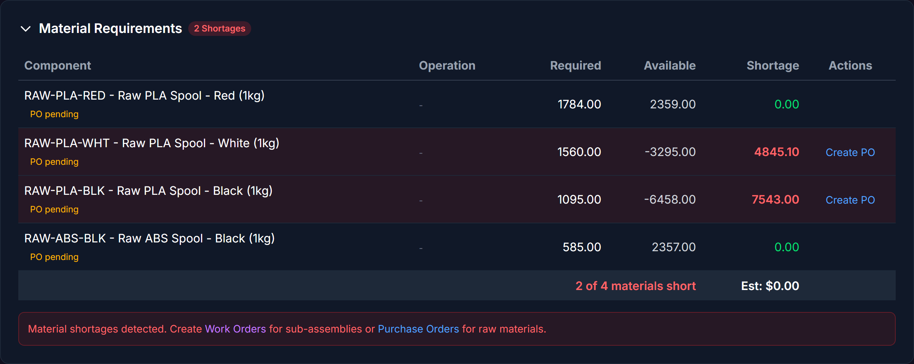

# Material Planning (MRP)

> Stop guessing what to buy — let FilaOps calculate material requirements from your open orders and current inventory.

## What You'll Learn

- How FilaOps MRP works and what demand sources it considers
- How to read the Buy List and Low Stock views
- How to turn MRP suggestions into purchase orders
- How planned orders work (their lifecycle and how to act on them)
- Where MRP results surface across the app

## Prerequisites

- Staff access to FilaOps
- Products with Bills of Materials defined (see [Managing Your Product Catalog](product-catalog.md))
- Open sales orders or production orders that create demand
- Reorder points and lead times set on your materials (see [Managing Your Product Catalog](product-catalog.md))

---

## What Is MRP?

MRP (Material Requirements Planning) answers three questions:

1. **What do I need?** — Which materials and components are required to fill your open orders
2. **How much?** — The exact quantities, accounting for what is already in stock and what is already on order
3. **When?** — Timing based on lead times and order due dates

Without MRP, you are either over-ordering (tying up cash in excess inventory) or under-ordering (stopping production because you ran out of a critical material). MRP finds the balance.

### How FilaOps MRP Works



When you run MRP, FilaOps:

1. **Collects open demand** — Gathers all open sales orders and open production orders within your planning horizon
2. **Explodes BOMs** — Recursively walks through each product's Bill of Materials (and routing operation materials where applicable) to calculate the total raw material required
3. **Checks current stock** — Reads on-hand inventory across all locations
4. **Checks incoming supply** — Subtracts quantities already on open purchase orders (draft, ordered, or partially received)
5. **Calculates net requirements** — Applies the standard MRP netting formula:

    ```
    Net Shortage = Gross Demand − On Hand − Incoming Supply + Safety Stock
    ```

6. **Generates planned orders** — Creates suggested purchase orders (for bought materials) and production orders (for manufactured sub-assemblies) to fill those gaps

!!! note "Sales orders and production orders"
    FilaOps includes **both** open sales orders and open production orders as demand sources. Sales orders that already have linked production orders are excluded from direct sales-order processing to avoid double-counting — their demand is captured through the production order instead.

!!! note "Routing materials take precedence"
    If a product has materials defined on routing operations, MRP uses those routing-operation materials instead of the standalone BOM lines. The BOM editor warns you when this applies.

---

## The Buy List

The Buy List is the fastest way to see what you need to order right now. It is a **live, computed-on-demand view** — it never needs a separate "run MRP" step.

Navigate to **Purchasing > Buy List**.


### What the Buy List Shows

The summary cards at the top give you an at-a-glance status:

| Card | What It Shows |
|------|--------------|
| **Components Short** | Number of distinct components with a net shortage |
| **Est. Buy Value** | Estimated cost of all suggested purchases (quantity × last cost) |
| **Open Sales Orders** | Count of sales orders included as demand |
| **Open Work Orders** | Count of production orders included as demand |

!!! tip "Draft PO warning"
    If any incoming supply is on **draft** purchase orders, the Buy List shows a yellow notice with the total uncommitted quantity. If those POs are not placed, those rows may still be short after you receive other orders.

### Reading the Buy List Table

Each row represents one component with a shortage. Expand any row to see which open orders are driving the demand.

| Column | What It Shows |
|--------|--------------|
| **Component** | SKU and name of the material or sub-assembly |
| **Gross Demand** | Total quantity needed across all open orders, after BOM explosion |
| **On Hand** | Current inventory quantity (summed across all locations) |
| **Incoming** | Quantity on open purchase orders not yet received |
| **Net Short** | Gross Demand minus On Hand minus Incoming, plus Safety Stock |
| **Suggest Qty** | Recommended order quantity — at least the net shortage, rounded up to the item's minimum order quantity |
| **Vendor** | Preferred vendor set on the item |
| **Est. Value** | Suggested Qty × last cost |
| **Need By** | Earliest due date among the open orders consuming this component |

### Creating a Purchase Order from the Buy List

**Step 1.** Find the component row you want to order.

**Step 2.** Click **Create PO** on that row.

FilaOps navigates to **Purchasing** and opens the new purchase order form with the vendor and suggested quantity pre-filled.

**Step 3.** Confirm the vendor, adjust quantities if needed, and save the PO.



!!! tip "Expand rows to see demand sources"
    Click the arrow on any row to expand it and see exactly which sales orders and work orders are driving the shortage. This helps you decide whether to order now or wait for more information.

---

## Low Stock Tab

The Low Stock tab combines reorder-point alerts with MRP-driven shortages into one prioritized list.

Navigate to **Purchasing > Low Stock**.



### Urgency Levels

Each item is assigned an urgency badge:

| Badge | Condition |
|-------|-----------|
| **CRITICAL** (red) | Available quantity is zero or below |
| **URGENT** (orange) | Available quantity is below 50% of the reorder point |
| **LOW** (yellow) | Available quantity is below the reorder point |
| **MRP** (blue) | MRP calculation shows a future shortage from open orders |

An item can show both a standard urgency badge and the **MRP** badge at the same time. The Shortfall column then shows both figures.

### Shortage Source Values

The Shortfall column shows how the shortage was identified:

| Display | Meaning |
|---------|---------|
| `-qty unit` | Shortage from reorder point breach |
| `(MRP: qty)` | Shortage is MRP-only, driven by open order demand |
| `+MRP: qty` | Shortage from both the reorder point and MRP |

### Creating Purchase Orders from Low Stock

**Single item:**

1. Click **Create PO** on any row to open the new PO form pre-filled for that item.

**Multiple items (bulk by vendor):**

1. Check the boxes next to the items you want to order.
2. Click **Create PO (n)** in the toolbar.
3. Choose a vendor group from the dropdown — items are grouped by their preferred vendor.

!!! warning "Items without a preferred vendor cannot be bulk-ordered"
    The bulk workflow requires a preferred vendor set on each item. Items with no preferred vendor are listed separately and must be ordered individually. Set preferred vendors in **Items** > edit item > Preferred Vendor.

---

## Running Full MRP

The Buy List computes automatically. When you need a formal review-and-approve workflow — including **planned orders** — you run the MRP engine explicitly.

!!! note "API-only in the current release"
    The full MRP run (with planned order generation) is invoked via the staff API (`POST /api/v1/mrp/run`). A UI for this workflow is planned for a future release. The Buy List and Low Stock views handle the majority of daily purchasing decisions without a manual MRP run.

### MRP Run Parameters

| Parameter | Default | What It Controls |
|-----------|---------|-----------------|
| `planning_horizon_days` | 30 | How far into the future to look for demand (1–365 days) |
| `include_draft_orders` | `true` | Whether to include production orders in `draft` status alongside `released` and `in_progress` orders |
| `regenerate_planned` | `true` | When `true`, all unfirmed planned orders are deleted and recreated fresh. Set to `false` to keep planned orders you have already reviewed |

!!! warning "Regenerate clears unfirmed planned orders"
    With `regenerate_planned: true` (the default), every planned order that has not been firmed will be deleted and recreated. Firm any planned orders you want to preserve before re-running MRP.

### What a Run Produces

After a successful run the MRP engine records:

- Orders processed (sales orders + production orders)
- Components analyzed
- Shortages found
- Planned orders created

---

## Planned Orders

When you run the full MRP engine, it generates **planned orders** — suggestions you review and approve before they become real purchase orders or work orders.

### Types of Planned Orders

| Type | When Created | What It Becomes |
|------|-------------|----------------|
| **Planned Purchase Order** (`purchase`) | When a bought material (no BOM) has a net shortage | A real purchase order in **Purchasing** |
| **Planned Production Order** (`production`) | When a manufactured sub-assembly (has its own BOM) has a net shortage | A real work order in **Production** |

FilaOps determines the type automatically: items with a BOM become production orders; items without a BOM become purchase orders.

### Planned Order Lifecycle

```
Planned  →  Firmed  →  Released
   │           │
   └─────── Cancelled ◄──┘
```

| Status | Meaning |
|--------|---------|
| **Planned** | MRP's suggestion. Automatically deleted or replaced when you re-run MRP with `regenerate_planned: true`. |
| **Firmed** | You reviewed and locked this order. MRP will not modify or delete firmed orders on subsequent runs. |
| **Released** | Converted into an actual purchase order or production order. The planned order is closed. |
| **Cancelled** | No longer needed. Released orders cannot be cancelled — cancel the underlying PO or work order instead. |

### Working with Planned Orders

#### Firming a Planned Order

When you have reviewed a planned order and agree with the suggestion:

1. Select the planned order.
2. POST to `/api/v1/mrp/planned-orders/{id}/firm` (optionally include a `notes` string).

Firming locks the order so the next MRP run will not change or delete it. Firm orders when you are confident in the quantity but are not yet ready to release.

#### Releasing a Planned Order

When you are ready to convert a planned order into a real order:

1. POST to `/api/v1/mrp/planned-orders/{id}/release`.
2. For **purchase** planned orders, include `vendor_id` in the request body (required).
3. For **production** planned orders, no vendor is needed — FilaOps creates the work order automatically using the product's active BOM.

FilaOps creates the actual purchase order (visible in **Purchasing**) or production order (visible in **Production**) and marks the planned order as `released`.

#### Cancelling a Planned Order

If a planned order is no longer needed:

1. DELETE `/api/v1/mrp/planned-orders/{id}`.

Only `planned` or `firmed` orders can be cancelled. Released orders cannot be cancelled.

---

## MRP Across the App

MRP results appear in several places beyond the Purchasing page.

### Order Detail — Material Requirements

When viewing a sales order, the Material Requirements section shows a BOM explosion for that specific order and nets the quantities against available inventory. This lets you see at a glance whether materials are covered before you schedule production.



### Dashboard

The main dashboard surfaces two MRP-related cards:

- **Low Stock Items** — items below their reorder point or with an MRP shortage. Clicking takes you directly to **Purchasing > Low Stock**.
- **Orders Needing Materials** — count of open sales orders in scope for MRP planning.

### Stocking Policy per Item

Each item in your catalog has a **Stocking Policy** that controls how it interacts with purchasing alerts:

| Policy | Behaviour |
|--------|-----------|
| **Stocked** (reorder point) | Item triggers a Low Stock alert when quantity drops below its reorder point, regardless of open orders |
| **On-Demand** (MRP-driven) | Item is only flagged when MRP shows active demand from an open order; no reorder-point alert |

Set the stocking policy in **Items** > edit item > Stocking Policy.

---

## Tips and Best Practices

- **Use the Buy List for daily purchasing decisions** — It is always current without a manual run. Reserve the full MRP engine with planned orders for formal review-and-approve workflows.
- **Set accurate lead times** — MRP timing is only as good as your lead time data. Update lead times when a vendor consistently delivers faster or slower than expected.
- **Keep safety stock configured** — `safety_stock` on an item raises the net shortage floor. MRP suggests enough quantity to cover demand plus your safety stock buffer.
- **Set preferred vendors on all purchased items** — The Buy List and bulk PO creation both group by preferred vendor. Items without a preferred vendor must be ordered individually.
- **Firm planned orders before re-running MRP** — If you have reviewed planned orders and want to keep them, firm them before running MRP again with `regenerate_planned: true`.
- **Check the BOM when quantities look wrong** — If MRP is suggesting unexpected quantities, review the product's BOM. The most common cause is a wrong quantity-per-assembly on a BOM line. Check whether routing-operation materials are overriding BOM lines (the BOM editor will warn you if so).
- **Use "Include Draft Orders" for early planning** — Set `include_draft_orders: true` (the default) so that draft production orders — not yet formally released — are included in demand. This gives you advance warning before orders are confirmed.

---

## What's Next?

- [Ordering Supplies](purchasing.md) — create and manage purchase orders
- [Running Production](production.md) — release work orders to the shop floor
- [Tracking Inventory](inventory.md) — keep stock levels accurate so MRP has good data
- [Managing Your Product Catalog](product-catalog.md) — maintain accurate BOMs and lead times

---

## Quick Reference

| Task | Where to Find It |
|------|--------------------|
| View live buy list | **Purchasing > Buy List** tab |
| View low stock and MRP shortage alerts | **Purchasing > Low Stock** tab |
| Create a PO from a shortage | **Purchasing > Buy List** > **Create PO** on any row |
| Bulk-create POs by vendor from Low Stock | **Purchasing > Low Stock** > check items > **Create PO (n)** |
| View material requirements for an order | Open the order > Material Requirements section |
| Run full MRP (generates planned orders) | POST `/api/v1/mrp/run` |
| List recent MRP runs | GET `/api/v1/mrp/runs` |
| List planned orders | GET `/api/v1/mrp/planned-orders` |
| Firm a planned order | POST `/api/v1/mrp/planned-orders/{id}/firm` |
| Release a planned order to a PO or WO | POST `/api/v1/mrp/planned-orders/{id}/release` |
| Cancel a planned order | DELETE `/api/v1/mrp/planned-orders/{id}` |
| View supply/demand timeline for an item | GET `/api/v1/mrp/supply-demand/{product_id}` |
| Explode a BOM to see all components | GET `/api/v1/mrp/explode-bom/{product_id}` |
| Set stocking policy on an item | **Items** > edit item > Stocking Policy |
