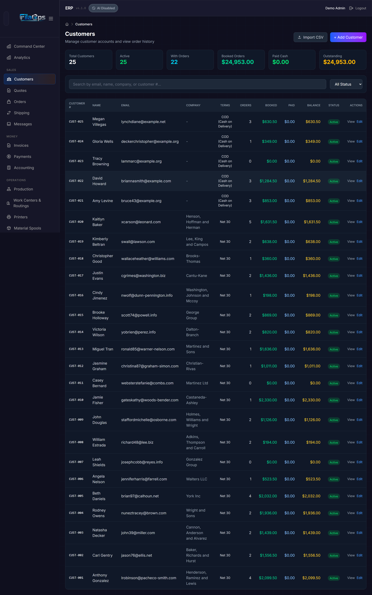
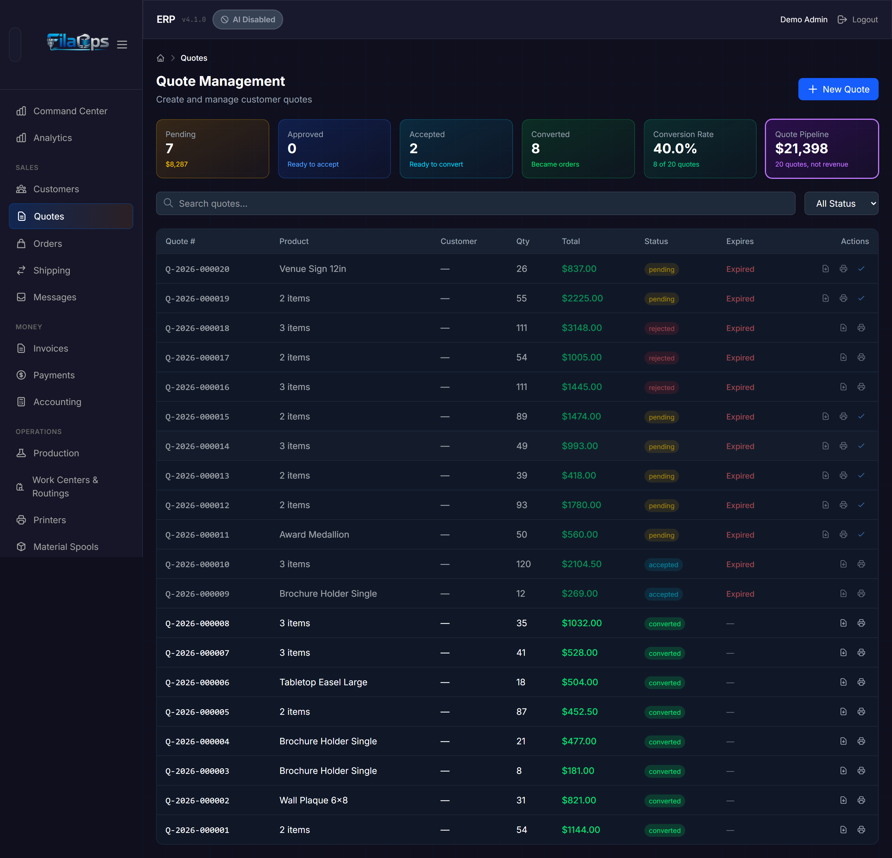
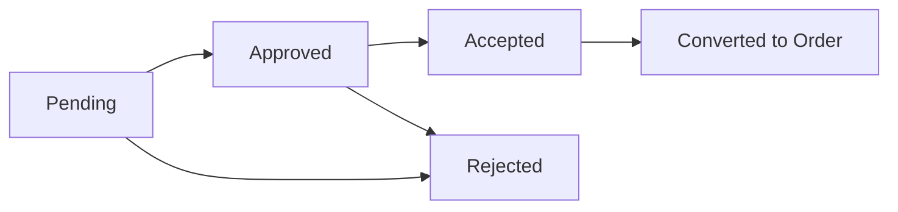
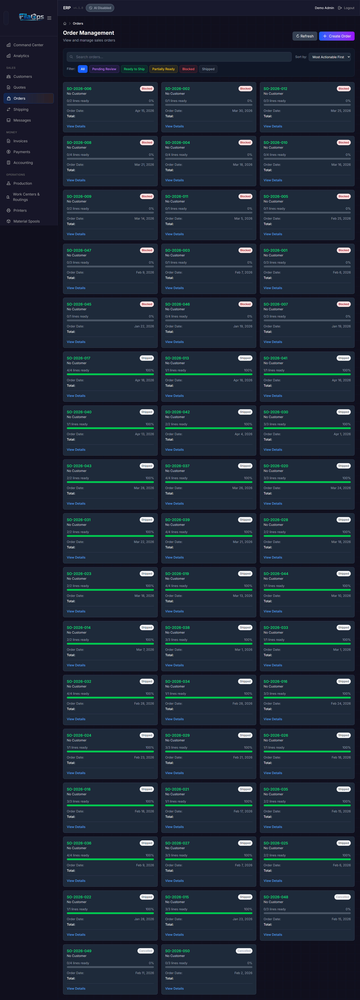
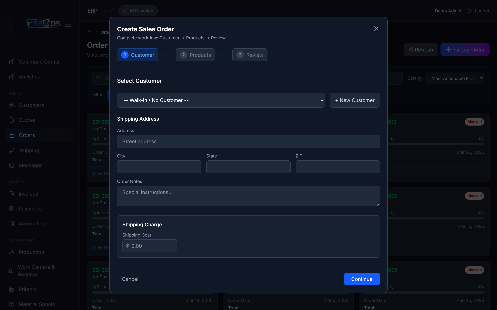
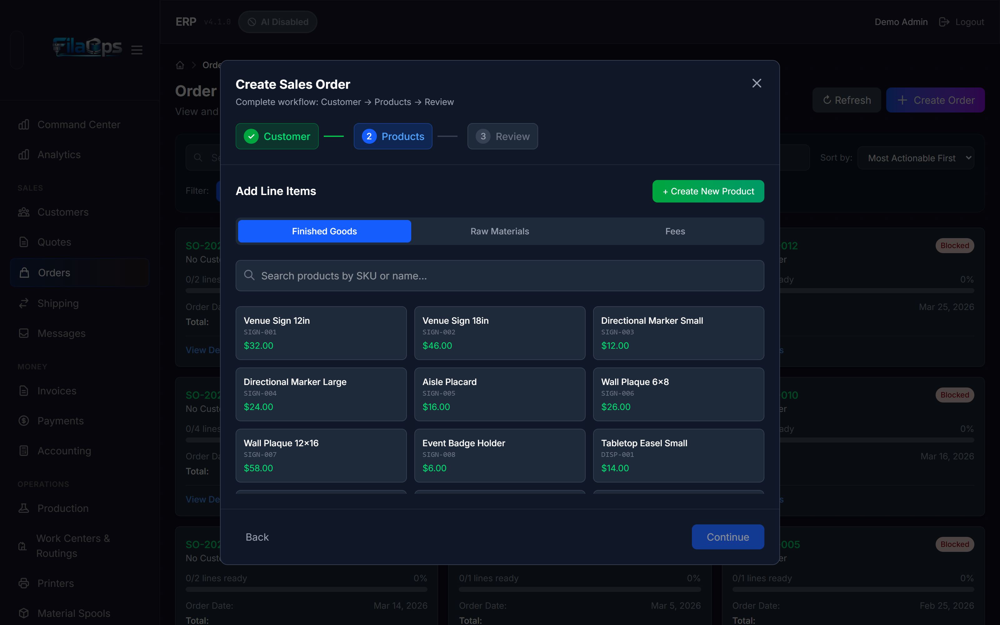
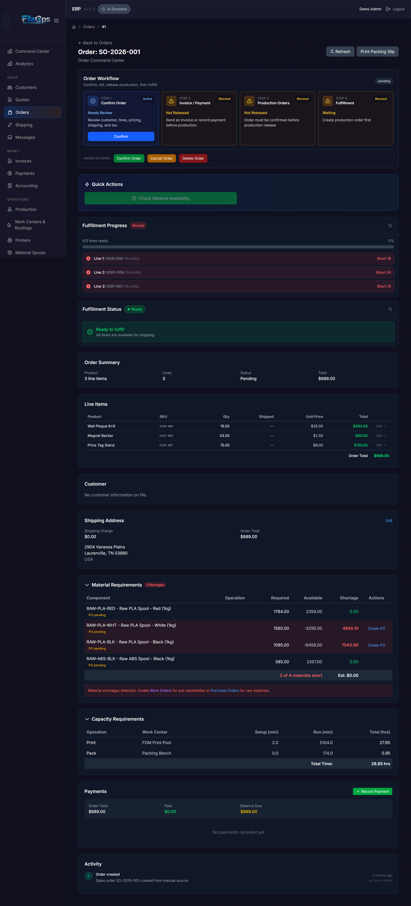
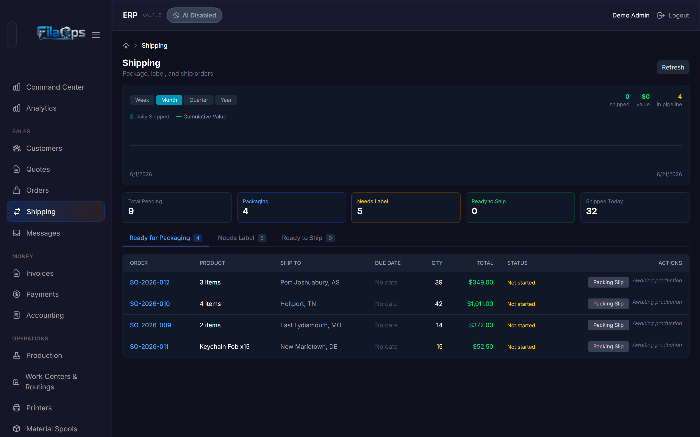
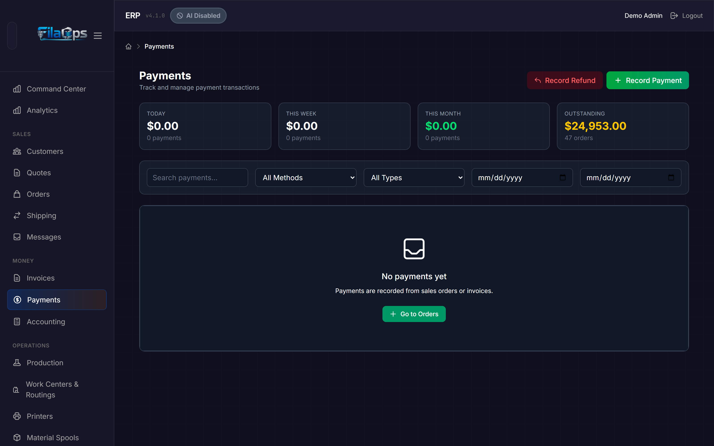
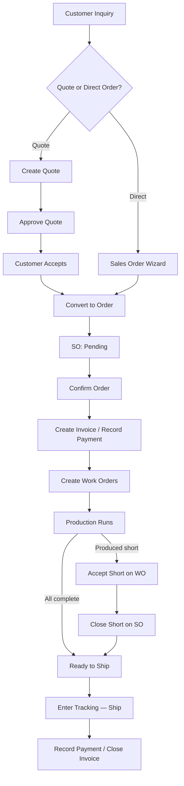

# Taking and Fulfilling Orders

> From first contact to final delivery — manage your entire sales pipeline in one place.

## What You'll Learn

- How to manage customers and import them from CSV
- How to create quotes and convert them into sales orders
- How to create sales orders directly using the three-step order wizard
- How to track the four-step order workflow (confirm, bill, produce, ship)
- How to ship orders and record payments

## Prerequisites

- Admin access to FilaOps
- At least one active product in your catalog (see [Managing Your Product Catalog](product-catalog.md))
- At least one inventory location set up (see [System Settings](system-settings.md))

---

## Managing Customers

Before you can take orders, you need customers. Navigate to **Admin > Customers** in the sidebar.



### The Customers Page

Six stat cards at the top give you a live snapshot:

| Stat | What It Shows |
|------|--------------|
| **Total Customers** | Total number of customer records |
| **Active** | Customers with active status |
| **With Orders** | Customers who have placed at least one order |
| **Booked Orders** | Sum of all order values across all customers |
| **Paid Cash** | Total amount actually collected |
| **Outstanding** | Total unpaid balances |

Below the stats, a search bar and a status dropdown let you filter the customer table.

### Creating a Customer

1. Click **+ Add Customer**.
2. Fill in the customer details:

    - **Email** — Required. Used for communication and as a unique identifier.
    - **First Name / Last Name** — The customer's name.
    - **Company Name** — Optional, for business customers.
    - **Customer Number** — Your internal customer ID (optional but recommended).
    - **Phone** — Contact phone number.
    - **Address** — Shipping and billing address fields.
    - **Status** — Active, Inactive, or Suspended.

3. Click **Save**.

!!! tip "Quick customer creation during order entry"
    If you are in the middle of creating an order and the customer does not exist yet, the order wizard saves your progress and redirects you to the Customers page with the new customer form pre-opened. After saving, navigating back to **Sales > Orders** re-opens the wizard with the new customer already selected and your previous line items restored.

### Importing Customers from CSV

If you have an existing customer list in a spreadsheet, use bulk import:

1. Click **Import CSV**.
2. Upload your CSV file.
3. Map your CSV columns to FilaOps fields and review the preview.
4. Click **Import** to create all customer records at once.

### Searching and Filtering

Use the **search bar** to find customers by email, name, company name, or customer number. Use the **status dropdown** to show only active, inactive, or suspended customers.

### Viewing and Editing Customer Details

Click **View** on any customer row to see their full profile, including contact information, order history, and a financial summary (booked, paid, outstanding). Click **Edit** to modify a customer's details.

---

## Creating and Managing Quotes

Quotes let you propose pricing to a customer before committing to a sales order. Navigate to **Sales > Quotes** in the sidebar.



### The Quotes Page

Six stat cards give you a snapshot of quoting activity. Five of them act as **click-to-filter** buttons:

| Stat Card | Filter Applied |
|-----------|----------------|
| **Pending** | Quotes awaiting your review (shows total dollar value) |
| **Approved** | Quotes you have approved — ready for the customer |
| **Accepted** | Quotes the customer has accepted — ready to convert |
| **Converted** | Quotes that have become sales orders |
| **Quote Pipeline** | Clears the status filter; shows all quotes with total pipeline value |
| **Conversion Rate** | Display only — not a filter |

### Quote Lifecycle



| Status | Meaning |
|--------|---------|
| **Pending** | Created and awaiting your internal review |
| **Approved** | You have approved the pricing; the customer can now accept it |
| **Accepted** | The customer has accepted the quote |
| **Converted** | A sales order has been created from this quote |
| **Rejected** | Declined by you or the customer |

### Creating a Quote

1. Click **New Quote**.
2. Fill in the quote details:

    - **Customer name / email** — The recipient of this quote.
    - **Product** — The item or service being quoted.
    - **Quantity** — How many units.
    - **Unit Price** — Your proposed price per unit.
    - **Valid Days** — How many days until the quote expires (defaults to 30).
    - **Customer Notes** — Any special terms or conditions visible to the customer.
    - **Admin Notes** — Internal notes for your team.

3. Click **Save**.

### Quote Expiry

FilaOps tracks quote expiration and displays visual indicators in the quote table:

| Indicator | Meaning |
|-----------|---------|
| Red badge | The quote has already expired |
| Yellow badge | Expires within the next 7 days |
| Normal date display | More than 7 days remaining |

!!! warning "Expired quotes cannot be converted"
    Once a quote expires, FilaOps refuses to convert it to a sales order. Duplicate the quote with a new validity period if the customer still wants to proceed.

### Quote Actions

From the quotes table, actions available depend on status:

| Action | When Available |
|--------|---------------|
| **View** | Any status |
| **Edit** | Pending |
| **Approve** | Pending |
| **Download PDF** | Any status |
| **Print** | Any status |
| **Duplicate** | Any status |
| **Copy Quote Link** | Any status |
| **Delete** | Any status (requires confirmation) |
| **Convert to Order** | Accepted status only |

### Converting a Quote to a Sales Order

When a customer accepts a quote:

1. Find the quote in the list (click the **Accepted** stat card to filter).
2. Open the quote and click **Convert to Order**.
3. FilaOps creates a new sales order from the quote details, navigates you directly to it, and automatically creates a linked production order if the product has an active BOM.

### Duplicating a Quote

Click **Duplicate** to create a copy of any quote. The duplicate starts in Pending status with a fresh validity period and an admin note referencing the original quote number. This is the correct way to renew expired quotes or create pricing variations.

---

## Creating Sales Orders

Sales orders are the core of your fulfillment workflow. Navigate to **Sales > Orders** in the sidebar.



### The Orders Page

Orders display in a **card grid** layout — not a table. Each card shows the order number, customer, product summary, total value, date, and fulfillment status at a glance.

The **OrderFilters** panel at the top has three controls:

- **Search** — Find orders by order number, product name, customer name, or email (client-side filter).
- **Sort by** dropdown — Controls the card sort order.
- **Filter** row — Color-coded quick-filter buttons by fulfillment state.

### Fulfillment Filter Buttons

| Filter | Color | What It Shows |
|--------|-------|--------------|
| **All** | Blue (default) | Every order |
| **Pending Review** | Purple | Orders in `pending_confirmation` status awaiting admin review |
| **Ready to Ship** | Green | Orders where all production is complete |
| **Partially Ready** | Yellow | Some items ready, others still in progress |
| **Blocked** | Red | Cannot be fulfilled — missing inventory or production issues |
| **Shipped** | Gray | Already shipped to the customer |

### Sort Options

| Sort | What It Does |
|------|-------------|
| **Most Actionable First** | Orders you can act on right now appear first (default) |
| **Newest First** | Sort by order date, newest first |
| **Oldest First** | Sort by order date, oldest first |
| **Most Complete First** | Highest fulfillment percentage first |
| **Least Complete First** | Lowest fulfillment percentage first |
| **Customer A-Z** | Alphabetical by customer name |
| **Highest Value First** | Largest dollar orders first |

### Creating an Order with the Wizard

Click **Create Order** to open the Sales Order Wizard.

#### Step 1: Customer

Choose an existing customer from the dropdown. If the customer does not exist yet, the wizard saves your progress and takes you to customer creation; after saving, return to **Sales > Orders** and the wizard re-opens with the new customer selected and your previous entries restored.



#### Step 2: Products

Add one or more line items. Three line types are supported:

| Line Type | What It Is |
|-----------|-----------|
| **Product** | A catalog item (Finished Good, Component, Supply, or Service product). Unit price defaults to the catalog selling price but can be overridden. |
| **Material** | A raw-material spool from inventory. Unit price defaults to cost per kg but can be overridden. |
| **Service** | A one-time non-inventory charge. Description and unit price are required. |

If a product does not exist yet, an inline **item wizard** (three sub-steps: basic details, BOM, pricing) lets you create it without leaving the order wizard. You can also create sub-components and filament materials inline during item creation.

The Products step also collects shipping address fields and a shipping cost charge.



#### Step 3: Review and Submit

Review the full order: customer, line items, shipping charge, tax (applied automatically if a default tax rate is configured), and grand total. Add customer-visible notes if needed.

Click **Submit Order** to create the sales order. FilaOps generates an order number in the format `SO-YYYY-NNN` (e.g. `SO-2026-042`).

---

## The Four-Step Order Workflow

Every order detail page opens with an **Order Workflow** panel showing four sequential steps. Each step is color-coded by state:

| Color | State | Meaning |
|-------|-------|---------|
| Green | Done | Step is complete |
| Blue | Active | This is the current step — an action button is shown |
| Amber | Blocked | A prerequisite is unmet |
| Gray | Waiting | Not yet reached |



### Step 1: Confirm Order

New manually created orders start in **Pending** status. Orders received from external sources arrive as **Pending Confirmation**.

- **Pending orders**: click **Confirm** in the workflow panel to move to **Confirmed** status.
- **Pending Confirmation orders**: click **Confirm Order** to accept, or **Reject Order** (available in the secondary actions row) to cancel with a reason.

Once confirmed, the order is ready for billing and production release.

### Step 2: Invoice / Payment

Before production can be released, the billing requirement must be satisfied. Any one of the following satisfies it:

- Create an invoice and mark it Sent.
- Record a direct payment on the order.

The workflow step shows the current invoice number and status, and offers the most relevant action for your current state:

| Button | When It Appears |
|--------|----------------|
| **Create Invoice** | Order confirmed, no invoice exists yet |
| **Mark Sent** | Invoice exists in Draft status |
| **Record Payment** | Invoice exists but billing not yet satisfied |
| **Open Invoice** | Invoice is already sent or paid |

### Step 3: Production Orders

After billing is satisfied, the **Create Work Orders** button becomes active. Click it to generate production orders for every product line that has a BOM. FilaOps creates one work order per qualifying line and immediately opens the **Release & Schedule Wizard** so you can assign work to a machine and set a schedule.

!!! note "Service-only orders skip this step"
    If an order contains only service lines (no product or material lines requiring production), the Production Orders step is automatically satisfied and shows "No product line."

Click **Open Work Order** to navigate directly to a linked production order. The **View in Production** quick action below the workflow panel also takes you to the production order detail.

### Step 4: Fulfillment

When all production orders are complete and material shortages are cleared, a **Ship Order** button appears. Clicking it navigates you to **Sales > Shipping** with this order pre-selected.

!!! tip "Check material availability before releasing"
    The **Check Material Availability** quick action (below the workflow panel) runs a live inventory check for all production orders linked to this order. Use it to catch material shortages before they delay production.

---

## Order Statuses

| Status | Meaning |
|--------|---------|
| `pending` | Created manually, awaiting admin confirmation |
| `pending_confirmation` | Received from an external channel, awaiting review |
| `confirmed` | Accepted — ready for billing and production |
| `on_hold` | Paused; can be resumed to any allowed status |
| `in_production` | Work orders are active on the shop floor |
| `ready_to_ship` | Production complete; awaiting shipment |
| `shipped` | Order has left the building |
| `delivered` | Delivery confirmed |
| `completed` | Fully closed |
| `cancelled` | Cancelled with a recorded reason |

---

## Editing Order Lines

Admins can edit line quantities and unit prices, and remove lines on orders in `pending`, `confirmed`, `in_production`, or `on_hold` status.

### Changing a Quantity or Price

1. Open the order detail view.
2. In the **Line Items** table, click **Edit** on the target line.
3. Enter the new quantity and/or unit price.

    - Quantity cannot go below the amount already shipped for that line.
    - Unit price must be ≥ 0.

4. Enter a reason — this is recorded in the order activity timeline.
5. Click the save button to confirm.

The subtotal, tax, and grand total recalculate automatically.

### Removing a Line

A remove button appears next to a line when all of the following are true:

- The order has more than one line (you cannot remove the last line — cancel the order instead).
- The line has no shipped quantity yet.
- No non-cancelled production orders are linked to this line.

Click the remove button, confirm the prompt, and the line is deleted. Totals recalculate automatically.

!!! warning "Cancel linked production orders first"
    If a production order exists for a line — including completed or closed ones — you must cancel it before the line can be removed.

---

## Close-Short Workflow

Close-short lets you accept partial fulfillment when the full ordered quantity cannot be completed. This closes the order at whatever quantity was actually produced rather than leaving it open indefinitely.

### When to Use

- A production order completed with fewer units than ordered (scrap, material shortage).
- The customer agreed to accept partial shipment.
- You want to finalize an order rather than keep it open.

### Prerequisites

All linked production orders must be resolved (complete, closed, or cancelled) before Close-Short is available. If a production order ended short, use **Accept Short** on that production order first to lock in the completed quantity.

### How It Works

1. Open the order detail view. The **Close Short** button appears in the secondary actions row of the Order Workflow panel when the order is in `confirmed`, `in_production`, or `ready_to_ship` status and has not already been closed short.
2. Click **Close Short**. FilaOps loads a preview modal showing the achievable quantity per line, calculated from completed production quantities (with fallback to available finished-goods inventory if no linked production order exists).
3. Review the per-line breakdown. Lines that cannot be fully fulfilled show the reason (e.g., "Limited by PO WO-2026-001: produced 8 of 10").
4. Enter a reason for closing short.
5. Confirm. FilaOps adjusts each line quantity to what was achievable, recalculates the grand total, transitions the order to **Ready to Ship**, and writes an audit record.

After Close-Short, ship the order through the normal shipping workflow.

!!! tip "The order total adjusts automatically"
    Close-Short lowers line quantities and recalculates the grand total. If an invoice exists, its balance will reflect the adjusted amount.

---

## Shipping Orders

Once production is complete and items are ready, navigate to **Sales > Shipping** to manage the shipping workflow.



### Shipping Dashboard

At the top of the page, a **shipping trend chart** shows your activity over a selectable period:

| Button | Period |
|--------|--------|
| **Week** | Week to date |
| **Month** | Month to date |
| **Quarter** | Quarter to date |
| **Year** | Year to date |

The chart displays daily shipped counts as bars and cumulative order value as a green line. Summary figures to the right show total shipped, total value shipped, and orders still in the pipeline.

Below the chart, five compact metric cards show:

| Card | What It Shows |
|------|--------------|
| **Total Pending** | All open orders in the shipping queue |
| **Packaging** | Production not yet complete |
| **Needs Label** | Production complete, no tracking entered |
| **Ready to Ship** | Tracking entered, awaiting dispatch |
| **Shipped Today** | Orders shipped today |

### The Three-Tab Workflow

```
Ready for Packaging  →  Needs Label  →  Ready to Ship
```

All tabs sort orders by due date, most urgent first. Click an order number to open its full detail page.

#### Tab 1: Ready for Packaging

Orders where production is **not yet complete**. These are in your pipeline but cannot be packed yet. Monitor this tab to anticipate incoming work.

#### Tab 2: Needs Label

Orders where production is **complete** but no tracking number has been entered.

**To enter tracking and ship:**

1. Click the order row to expand it.
2. Select the **Carrier** (defaults to USPS).
3. Enter the **Tracking Number**.
4. Click **Save Tracking**.

FilaOps marks the order as Shipped, processes inventory deductions, posts a COGS journal entry, and removes the order from the queue.

!!! note "A shipping address is required"
    FilaOps will block the ship action if the order has no shipping address. Edit the address on the order detail page first.

#### Tab 3: Ready to Ship

Orders that have a tracking number recorded and are ready to go out the door. This tab shows what has been labeled but not yet physically dispatched — use it as a dispatch checklist.

### Due Date Urgency

Each order row shows a color-coded due date:

| Color | Meaning |
|-------|---------|
| Red | Overdue (days late shown) |
| Yellow | Due today |
| Orange | Due within the next 2 days |
| Gray | Normal — more time remaining |
| Dim gray | No due date set |

### Packing Slips

Open any order's detail page and click **Packing Slip** to generate a printable PDF in a new browser tab.

---

## Invoices

FilaOps can generate a PDF invoice directly from a sales order. From any confirmed (or later-status) order detail page:

1. In the **Invoice / Payment** workflow step, click **Create Invoice**.
2. FilaOps creates the invoice, assigns an invoice number, and links it to the order.
3. Click **Mark Sent** to record that the invoice was delivered to the customer.
4. Use **Open Invoice** to view it in **Sales > Invoices**, or **Download PDF** to save a copy.

The invoice number and status appear in both the Order Workflow panel and the **Quick Actions** section of the order detail page once an invoice exists.

---

## Recording Payments

Track payments against sales orders. Navigate to **Sales > Payments** in the sidebar.



### Payment Dashboard

Four KPI cards at the top show:

| Card | What It Shows |
|------|--------------|
| **Today** | Amount collected today and payment count |
| **This Week** | Amount collected this week |
| **This Month** | Amount collected this month |
| **Outstanding** | Total balance due across all open orders |

A **This Month by Method** breakdown below the cards shows totals per payment method for quick reconciliation.

### Recording a Payment

Payments can be recorded from two places:

- **Sales > Payments** page — click **Record Payment**.
- **Order detail page** — click **Record Payment** in the Order Workflow panel or the Payments section.

Fill in the payment details:

- **Order** — Which sales order this payment applies to.
- **Amount** — How much was received.
- **Payment Method** — Cash, Check, Credit Card, PayPal, Stripe, Venmo, Zelle, Wire Transfer, or Other.
- **Reference Number** — Check number, transaction ID, etc.
- **Notes** — Any additional details.

Click **Save**.

### Recording a Refund

From the **Sales > Payments** header, click **Record Refund** (a separate button from Record Payment). Refunds appear in payment history with a Refund type and reduce the amount collected against the order.

### Filtering Payment History

| Filter | What It Does |
|--------|-------------|
| **Search** | Find by order number, customer, or reference |
| **All Methods** | Filter by a specific payment method |
| **All Types** | Toggle between payments only or refunds only |
| **From / To** | Date range picker |

---

## The Full Order Lifecycle

Here is how all the pieces fit together, from first contact to cash in hand:



For a detailed walkthrough of this end-to-end process, see the [Quote to Cash](workflows/quote-to-cash.md) workflow guide.

---

## Canceling and Deleting Orders

### Canceling an Order

Orders in `pending`, `confirmed`, or `on_hold` status can be cancelled.

1. Open the order detail view.
2. Click **Cancel Order** in the secondary actions row of the Order Workflow panel.
3. Enter a cancellation reason (required).
4. Confirm.

!!! warning "Cancel linked production orders first"
    If any production orders are still active (not cancelled), FilaOps will block the cancellation. Cancel all work orders first, then cancel the sales order.

!!! warning "Cancellation is permanent"
    Cancelled orders cannot be reopened. Create a new order if the customer changes their mind.

### Deleting an Order

Only `pending` or `cancelled` orders can be deleted, and only when no active production orders are linked. Click **Delete Order** in the secondary actions row and confirm. Deletion is permanent.

---

## Tips and Best Practices

- **Use quotes for custom work** — Quotes give customers time to review pricing and let you track your conversion rate.
- **Set a validity period on quotes** — This creates urgency and keeps your pipeline clean.
- **Sort by "Most Actionable First"** — The default sort surfaces orders you can act on right now.
- **Check the Blocked filter daily** — Red-flagged orders need attention: missing materials, incomplete production, or other issues.
- **Satisfy billing before releasing production** — FilaOps enforces this gate to protect revenue.
- **Accept Short on the work order before Close-Short on the sales order** — The sales order reads the work order's completed quantity.
- **Record payments promptly** — This keeps your outstanding balance reports accurate.
- **Use the shipping tabs in sequence** — Ready for Packaging → Needs Label → Ready to Ship prevents missed steps.

---

## What's Next?

With orders flowing, manage the production and fulfillment side:

- [Running Production](production.md) — manufacture items from your sales orders.
- [Tracking Inventory](inventory.md) — keep stock levels accurate.
- [Ordering Supplies](purchasing.md) — make sure you have materials on hand.

---

## Quick Reference

| Task | Where to Find It |
|------|------------------|
| Create a customer | **Admin > Customers** > **+ Add Customer** |
| Import customers from CSV | **Admin > Customers** > **Import CSV** |
| Create a quote | **Sales > Quotes** > **New Quote** |
| Approve a quote | **Sales > Quotes** > open quote > **Approve** |
| Convert a quote to an order | **Sales > Quotes** > open quote > **Convert to Order** |
| Download a quote PDF | **Sales > Quotes** > open quote > **Download PDF** |
| Create a sales order | **Sales > Orders** > **Create Order** |
| View order details | **Sales > Orders** > click an order card |
| Confirm an order | Order detail > **Order Workflow** panel > **Confirm** |
| Create an invoice | Order detail > **Order Workflow** > **Create Invoice** |
| Create work orders | Order detail > **Order Workflow** > **Create Work Orders** |
| Check material availability | Order detail > **Quick Actions** > **Check Material Availability** |
| Edit a line quantity or price | Order detail > **Line Items** table > **Edit** |
| Remove a line | Order detail > **Line Items** table > remove button |
| Close an order short | Order detail > **Order Workflow** secondary actions > **Close Short** |
| Cancel an order | Order detail > **Order Workflow** secondary actions > **Cancel Order** |
| Enter tracking / ship | **Sales > Shipping** > **Needs Label** tab > expand order > **Save Tracking** |
| Print a packing slip | Order detail > **Packing Slip** quick action |
| Record a payment | **Sales > Payments** > **Record Payment** |
| Record a refund | **Sales > Payments** > **Record Refund** |
