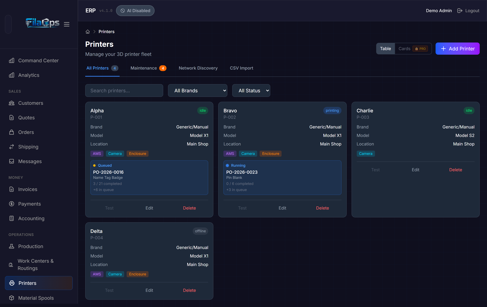
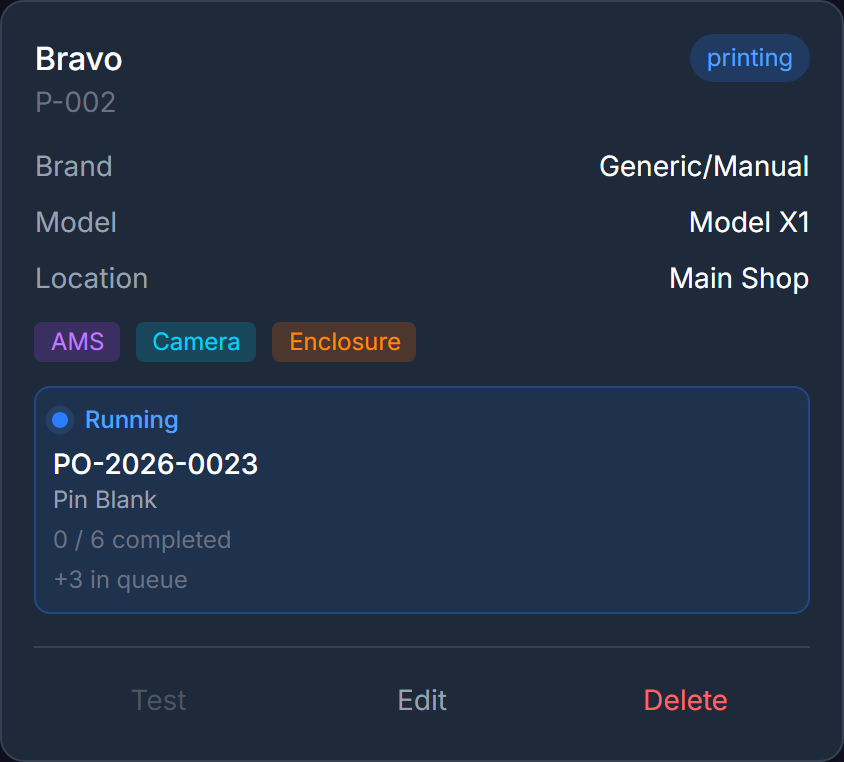
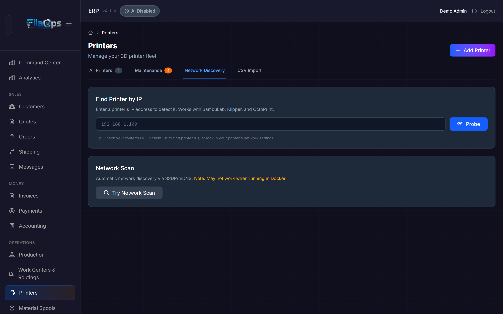
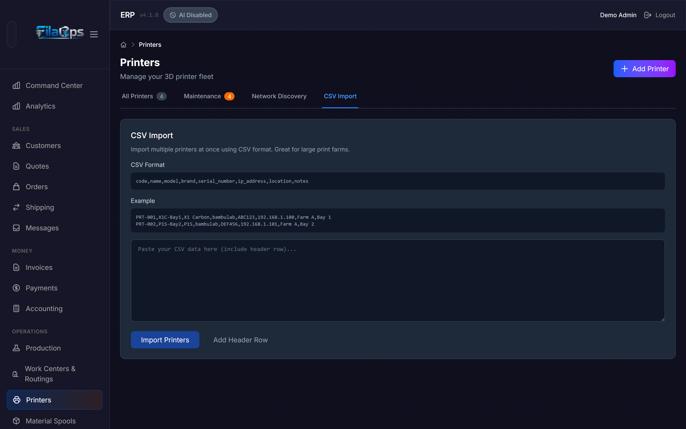
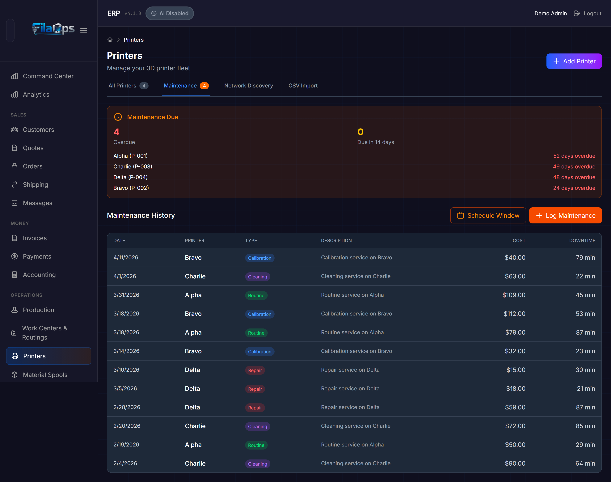
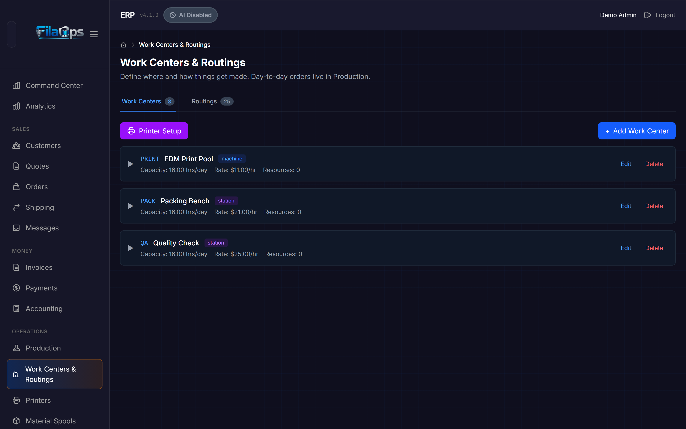

# Printers & Work Centers

> Manage your physical print fleet and the logical production areas that schedule work across it.

## What You'll Learn

- How the Printers page and Work Centers & Routings page relate to each other
- How to add, configure, and test printers in FilaOps
- How to discover networked printers automatically, including from a Docker-hosted install
- How to bulk-import a fleet from CSV
- How to track maintenance history and schedule planned downtime
- How to create work centers and assign printers to them for production scheduling

---

## Two Separate Pages

FilaOps keeps printer management and production scheduling in two dedicated screens:

| Screen | Sidebar label | What it does |
|--------|--------------|--------------|
| **Printers** | Operations > Printers | Manages your physical printer records — brand, model, IP address, maintenance logs |
| **Work Centers & Routings** | Operations > Work Centers & Routings | Defines logical production areas (pools, stations) and the operation sequences (routings) used to schedule and cost production orders |

Printers and work centers are connected: you can assign a printer to a **Machine Pool** work center. When you do, the printer appears in scheduling and the active-work view on each printer card.

---

## The Printers Page

Navigate to **Operations > Printers** in the sidebar.



The page has four tabs across the top:

- **All Printers** — Your complete fleet with a live count badge
- **Maintenance** — History table plus the orange overdue-count badge when service is past due
- **Network Discovery** — Find printers by IP probe or SSDP/mDNS scan
- **CSV Import** — Bulk-add printers from a CSV text block

### Reading a Printer Card

Each card in the **All Printers** tab displays:

- **Name** and **Code** (your internal identifier)
- **Status badge** — color-coded current state:

| Status | Meaning |
|--------|---------|
| **idle** | Online and ready for work |
| **printing** | Currently running a print job |
| **offline** | Not reachable or powered off |
| **error** | Reporting a problem |
| **maintenance** | Taken offline for service |
| **paused** | Print paused |

- **Brand** and **Model**
- **IP address** (when configured)
- **Location**
- **Capability badges** — **AMS** (multi-material slots detected), **Camera**, **Enclosure**
- **Active work panel** — shown when the printer's work center has a running or queued production order operation. Displays the production order code, product name, quantities completed vs. ordered, and queue depth.

!!! note "Active work vs. live progress"
    The active work panel reflects operations in **running** or **queued** status from FilaOps production orders — it is not a live MQTT telemetry feed from the printer itself. Actual print progress percentages and live temperatures are a PRO feature.

FilaOps polls for active work every 30 seconds and updates cards automatically — no manual refresh needed.

### Filtering the Fleet

Above the card grid, three controls narrow which printers appear:

- **Search field** — matches name, code, model, or location (press Enter to apply)
- **All Brands dropdown** — filter to a specific brand
- **All Status dropdown** — filter to offline, idle, printing, or error

### Adding a Printer

**Step 1.** Click **Add Printer** (top-right of the page).

**Step 2.** Fill in the form:

| Field | Required | Notes |
|-------|----------|-------|
| **Brand** | Yes | Bambu Lab or Generic in Core |
| **Model** | Yes | Dropdown when a known brand is selected; free text for Generic |
| **Code** | Yes | Short unique identifier, e.g. `PRT-001`. Click **Auto** to generate the next code in sequence |
| **Name** | Yes | Human-readable name, e.g. `X1C Bay 1` |
| **IP Address** | No | Required for connection testing |
| **LAN Access Code** | No | Bambu Lab only — the 8-digit code from the printer's network settings |
| **Serial Number** | No | Manufacturer serial |
| **Location** | No | Physical location label, e.g. `Farm A, Bay 1` |
| **Machine Pool** | No | Assigns this printer to a work center of type Machine Pool |
| **Supported Diameters** | No | Check 1.75 mm and/or 2.85 mm |
| **Notes** | No | Free-text operator notes |

**Step 3.** Click **Add Printer** to save.

!!! note "Community tier printer limit"
    The Community tier supports up to 4 active printers. Upgrade to Professional or Enterprise for unlimited printers.

!!! tip "Bambu Lab brand"
    Core ships with native support for Bambu Lab (X1 Carbon, P1S, A1, and similar) and Generic brands. Klipper/Moonraker, OctoPrint, Prusa, and Creality require a PRO license.

### Testing a Connection

Click **Test** on any printer card to verify FilaOps can reach that printer's IP address. The button is grayed out when no IP address is configured.

To test every printer with an IP address at once, click **Test All** in the top-right header area. A successful test updates the printer's status to `idle` and reports the response time.



---

## Network Discovery

The **Network Discovery** tab provides two complementary tools for finding printers without typing IP addresses manually.



### Find Printer by IP (Recommended for Docker)

The **Find Printer by IP** section probes a single IP address directly. It checks common printer ports — 8883 (Bambu Lab MQTT), 7125 (Klipper/Moonraker), 5000 (OctoPrint), 80/443 (HTTP/HTTPS) — and reports what it finds.

**Step 1.** Enter the printer's IP address in the field.

**Step 2.** Click **Probe** (or press Enter).

**Step 3.** If a printer is detected and not yet registered, it is added to the discovered list below. Click **Add to Fleet** to register it.

!!! tip "Docker installs"
    If FilaOps runs inside Docker, use the IP probe instead of the network scan. SSDP/mDNS broadcasts do not reliably cross Docker network boundaries, so the network scan may return no results from a containerized install. The IP probe always works because it makes a direct TCP connection to the address you specify.

### Network Scan (SSDP/mDNS)

The **Network Scan** section triggers an automatic discovery sweep using SSDP on port 1990 (Bambu Lab) and mDNS. It finds printers that broadcast their presence on the local network.

**Step 1.** Click **Try Network Scan**.

**Step 2.** Wait up to 10 seconds for the scan to complete.

**Step 3.** Review the discovered printer cards. Each shows brand, model, IP address, and serial number. Click **Add to Fleet** to register any printer not already registered (printers already in your fleet show a green "Already registered" indicator instead of the Add button).

!!! warning "Network scan limitations"
    The scan may not find printers when FilaOps is running in Docker, on a different network segment, or separated by a VLAN. Use the IP probe in those environments.

---

## CSV Import

To add a large fleet at once, use the **CSV Import** tab. Paste your CSV data directly into the text area rather than uploading a file.



### Format

Your CSV must include a header row. The required columns are **code**, **name**, and **model**. All other columns are optional:

```
code,name,model,brand,serial_number,ip_address,location,notes
```

Example rows:

```
PRT-001,X1C-Bay1,X1 Carbon,bambulab,ABC123,192.168.1.100,Farm A,Bay 1
PRT-002,P1S-Bay2,P1S,bambulab,DEF456,192.168.1.101,Farm A,Bay 2
PRT-003,Generic-01,Ender 3 V2,generic,,192.168.1.102,Farm B,
```

Valid values for **brand**: `bambulab`, `generic`. Other values are accepted but silently converted to `generic` on a Core install.

Duplicate codes are skipped by default — rows where the code already exists in FilaOps are counted as "Skipped" and do not produce errors.

### Running an Import

**Step 1.** Click **Add Header Row** to seed the text area with a header line, then paste your printer rows below it — or paste your complete CSV (including the header) directly.

**Step 2.** Click **Import Printers**.

**Step 3.** Review the result panel: **Imported** (green), **Skipped** (yellow), and **Errors** (red). Error entries show the row number and the reason.

---

## Maintenance Tracking

The **Maintenance** tab consolidates all maintenance history and lets you log completed work or schedule future downtime windows.



When any printer is overdue for maintenance, the **Maintenance** tab shows an orange badge with the count.

### Maintenance Due Summary

If maintenance is overdue or due within the next 14 days, an orange alert panel appears at the top of the tab showing:

- **Overdue** count (red number)
- **Due in 14 days** count (yellow number)
- Up to 5 printers listed by name and code, with days overdue or days remaining

### Logging Completed Maintenance

**Step 1.** Click **Log Maintenance** (the orange button, top-right of the Maintenance tab).

**Step 2.** On the **Log Maintenance** tab of the modal, fill in:

| Field | Required | Notes |
|-------|----------|-------|
| **Printer** | Yes | Select from your active fleet |
| **Type** | Yes | Routine Maintenance, Repair, Calibration, or Cleaning |
| **Description** | No | What was done, e.g. `Replaced nozzle, cleaned bed` |
| **Performed By** | No | Technician name |
| **Performed At** | Yes | Date and time of service (defaults to now) |
| **Next Due** | No | When this type of service is due again |
| **Cost ($)** | No | Parts and labor cost |
| **Downtime (minutes)** | No | How long the printer was offline |
| **Parts Used** | No | Part numbers or descriptions |
| **Notes** | No | Any additional detail |

**Step 3.** Click **Log Maintenance**.

The history table below shows all logged events with columns: **Date**, **Printer**, **Type** (color-coded badge), **Description**, **Cost**, and **Downtime**.

!!! tip "Track next-due dates"
    Filling in **Next Due** when logging feeds the overdue alert. FilaOps checks all next-due dates and surfaces the orange badge when a printer is within 14 days of or past its due date.

### Scheduling a Maintenance Window

A maintenance window blocks the scheduler from assigning new operations to a printer's work center during planned downtime.

**Step 1.** Click **Schedule Window** (the outlined orange button) on the Maintenance tab, or switch to the **Schedule Window** tab inside the maintenance modal.

**Step 2.** Select the printer, enter **Start** and **End** date/times, and optionally add a reason.

**Step 3.** Click **Schedule Window**.

Upcoming windows are listed below the form. Use **Cancel** to remove a future window, or **Complete** to mark it done — completing a window automatically writes a maintenance log entry.

!!! note "Scheduler integration"
    The scheduler treats active maintenance windows as busy time and will not assign operations to that printer's work center during the window period.

---

## Work Centers & Routings

Navigate to **Operations > Work Centers & Routings** in the sidebar.

This page has two tabs: **Work Centers** and **Routings**.


### What Is a Work Center?

A work center is a logical production area. Production order operations are scheduled to a work center, not to individual machines. Within a work center of type **Machine Pool**, individual machines are tracked as **resources**.

Common examples for a 3D print farm:

- `FDM-POOL` — Machine Pool containing all FDM printers
- `POST-PRINT` — Work Station for support removal and finishing
- `QC` — Work Station for quality inspection
- `SHIP` — Work Station for packing and shipping

### Work Center Types

| Type value | Label in UI | Use case |
|-----------|------------|---------|
| `machine` | Machine Pool | A group of interchangeable machines (e.g., FDM printers) |
| `station` | Work Station | A single fixed station (e.g., QC bench) |
| `labor` | Labor Pool | People rather than machines |

### Adding a Work Center

**Step 1.** Click **Add Work Center**.

**Step 2.** Fill in the form:

**Identity**

- **Code** (required) — short uppercase identifier, e.g. `FDM-POOL`
- **Type** — Machine Pool, Work Station, or Labor Pool
- **Name** (required) — descriptive name, e.g. `FDM Printer Pool`
- **Description** — optional notes

**Capacity**

- **Hours/Day** — hours per day this work center is available
- **Units/Hour** — throughput rate used in capacity planning

**Hourly Rates ($)**

Three rate components combine into the total rate used for job costing on production orders:

- **Machine** — machine depreciation or lease cost per hour
- **Labor** — operator labor rate per hour
- **Overhead** — utilities, facility costs per hour

Click **Calculate** next to the Overhead field to open the built-in overhead rate calculator. Enter printer purchase cost, expected lifespan, hours/day, days/year, electricity rate, wattage, and annual maintenance budget. The calculator derives a suggested overhead rate; click **Apply Rate** to transfer it to the field.

**Scheduling**

- **Priority (0–100)** — lower numbers are scheduled first when multiple work centers could fulfill an operation
- **Bottleneck** checkbox — marks this work center as the throughput constraint
- **Active** checkbox — inactive work centers are hidden from scheduling dropdowns

**Step 3.** Click **Create Work Center**.

!!! note "Deactivating a work center"
    The delete action performs a soft delete — the work center is marked inactive and hidden from scheduling, but its historical data is preserved.

### Adding Resources (Individual Machines)

For **Machine Pool** work centers, you can track individual machines as resources so the scheduler can record which specific printer handled each operation.

**Step 1.** Expand a Machine Pool card and click **+ Add Resource**.

**Step 2.** If printers have already been assigned to this work center (via the **Machine Pool** field in the printer form), a **Quick Add from Assigned Printer** dropdown appears. Selecting a printer auto-fills the resource form with the printer's code, name, model, serial number, and IP address.

Otherwise, fill in the fields manually:

| Field | Notes |
|-------|-------|
| **Code** | Short uppercase identifier, e.g. `PRINTER-01` |
| **Status** | Available, Busy, Maintenance, or Offline |
| **Name** | Friendly name, e.g. `Donatello` |
| **Machine Type** | Model string, e.g. `X1C`, `P1S`, `A1` |
| **Serial Number** | Optional |
| **Bambu — Device ID** | Bambu device ID (from Bambu Studio) |
| **Bambu — IP Address** | Bambu printer IP address |
| **Capacity Hours/Day** | Per-machine override; inherits from the work center if left blank |
| **Active** | Uncheck to remove from scheduling without deleting |

**Step 3.** Click **Add Resource**.

!!! tip "Printer Setup wizard"
    On the Work Centers tab, click **Printer Setup** (the purple button) to open a guided wizard that links your Bambu printers to work centers and creates resources automatically.

### Routings

The **Routings** tab lists all production routings — ordered sequences of operations that define how a product is made and how long it takes.



Each row shows:

| Column | What it shows |
|--------|--------------|
| **Code** | Unique routing identifier; templates show a green "Template" badge |
| **Product** | SKU/name this routing is tied to, or template name |
| **Version** | Version number and revision label |
| **Operations** | Number of steps |
| **Total Time** | Sum of run times in minutes |
| **Cost** | Calculated total from time-based rates and material costs |
| **Status** | Active or Inactive |

Click **Edit** to open the routing editor where you can add, reorder, and configure individual operations, their work centers, time values, and required materials.

Click **Create Routing** to start a new routing from scratch.

!!! note "Routing templates"
    A routing marked **Template** has no product assigned. Templates let you define a standard operation sequence once and apply it to multiple products, saving repetitive setup.

---

## Tips & Best Practices

- **Use meaningful names and locations** — `X1C Bay 3 - Left Rack` is far more useful than `Printer 3` when troubleshooting across a large farm.
- **Set static IPs or DHCP reservations** — changing DHCP addresses break connection testing and active-work polling. Reserve IPs at your router or configure static addresses on the printers.
- **Assign printers to a Machine Pool** — this enables the active-work panel on each printer card and makes printers visible to the scheduler.
- **Set hourly rates on work centers** — accurate machine, labor, and overhead rates are the foundation of reliable job costing in production orders.
- **Mark your bottleneck work center** — the Bottleneck flag signals which station limits your throughput and should be prioritized in scheduling.
- **Log every maintenance event** — even quick fixes. The history table reveals which printers cost the most to maintain over time.
- **Always fill in Next Due when logging** — this drives the overdue badge so problems surface before a failure occurs mid-print.
- **Schedule maintenance windows before taking a printer offline** — this prevents the scheduler from assigning work during the downtime.
- **Use the IP probe on Docker installs** — the SSDP network scan does not cross Docker network boundaries; the IP probe always works.

---

## What's Next?

With printers configured and linked to work centers, put them to work:

- [Running Production](production.md) — create and release production orders that schedule operations to your work centers
- [Bill of Materials](bom.md) — define product BOMs and attach routings for accurate job costing
- [Material Planning (MRP)](mrp.md) — plan material needs based on your production schedule
- [Tracking Inventory](inventory.md) — track filament spools and raw material stock

---

## Quick Reference

| Task | Where to find it |
|------|-----------------|
| View all printers | Operations > Printers > All Printers tab |
| Add a printer | Operations > Printers > **Add Printer** button |
| Edit or delete a printer | Operations > Printers > **Edit** / **Delete** on a printer card |
| Test a printer connection | Operations > Printers > **Test** on a card, or **Test All** |
| Find a printer by IP | Operations > Printers > Network Discovery > Find Printer by IP > **Probe** |
| Run a network scan | Operations > Printers > Network Discovery > **Try Network Scan** |
| Import printers from CSV | Operations > Printers > CSV Import tab > paste data > **Import Printers** |
| Log maintenance | Operations > Printers > Maintenance tab > **Log Maintenance** |
| Schedule a maintenance window | Operations > Printers > Maintenance tab > **Schedule Window** |
| Check overdue maintenance | Operations > Printers > Maintenance tab (orange badge on tab) |
| Add a work center | Operations > Work Centers & Routings > **Add Work Center** |
| Add a resource to a work center | Operations > Work Centers & Routings > expand a Machine Pool card > **+ Add Resource** |
| Create or edit a routing | Operations > Work Centers & Routings > Routings tab |
