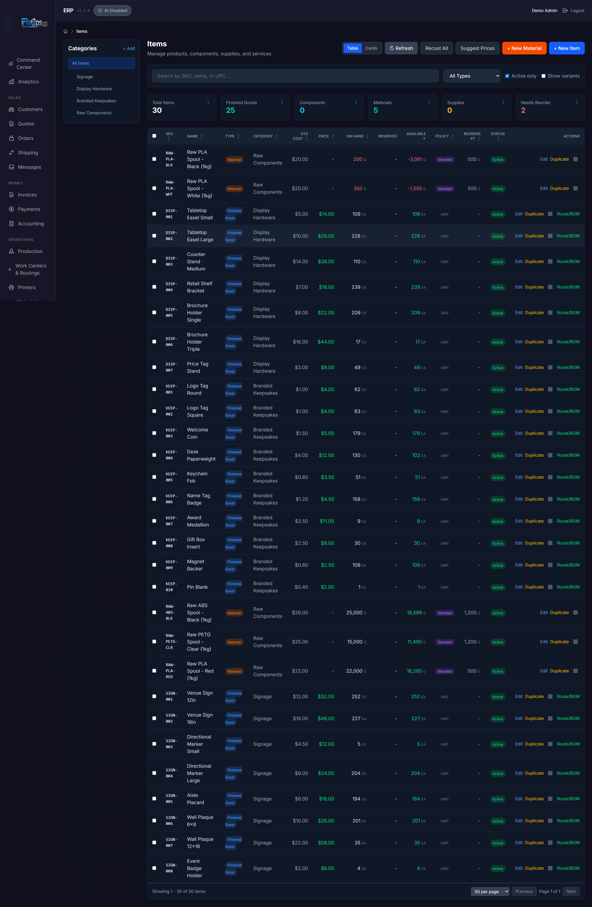
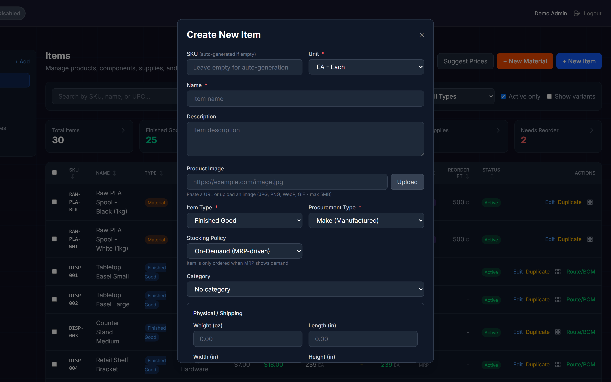
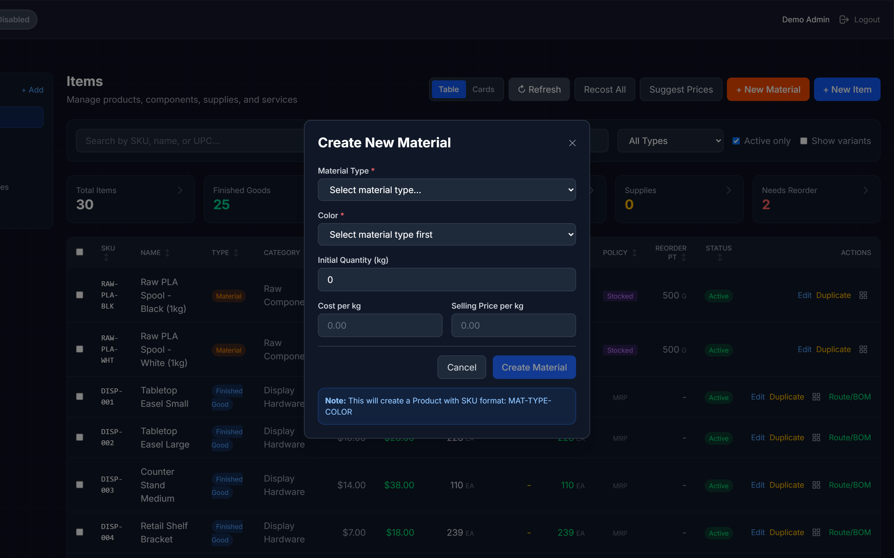
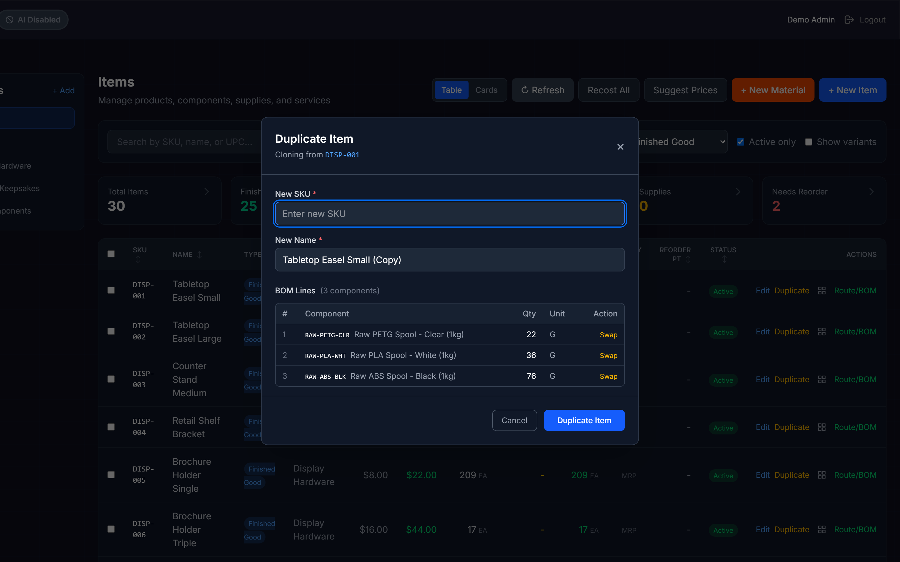
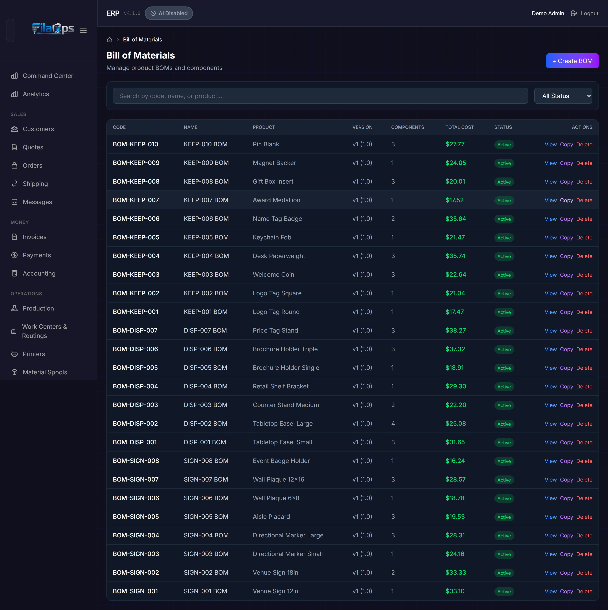
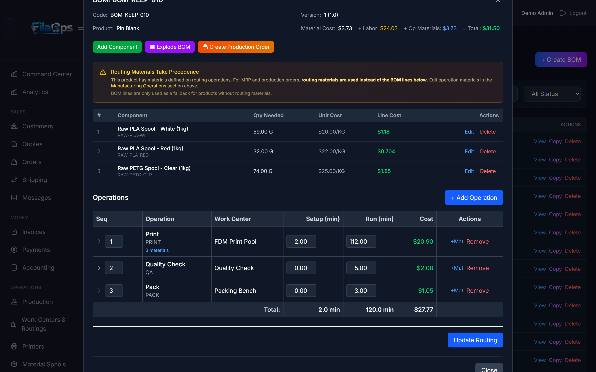

# Product Catalog

Your product catalog is the foundation of FilaOps — every order, production run, and inventory count ties back to items defined here.

## What You'll Learn

- How to create and organize items (finished goods, components, materials, packaging, supplies, and services)
- How to use categories to keep your catalog tidy
- How to build Bills of Materials (BOMs) for manufactured products
- How to set up manufacturing routings on the Work Centers & Routings page
- How to recost your catalog when material prices change
- How to duplicate items and manage product variants

## Prerequisites

- Admin access to FilaOps
- At least one inventory location configured (see [System Settings](system-settings.md))

---

## Understanding Item Types

Every item in FilaOps has a **type** that controls how the system treats it.

| Type | What It Is | Example |
|------|-----------|---------|
| **Finished Good** | A sellable product | Dragon figurine, Phone case |
| **Component** | A part used in a BOM but not sold directly | Insert nut, Printed bracket |
| **Material** | Raw material consumed during production | PLA Black 1 kg, PETG Natural |
| **Packaging** | Boxes, mailers, cartons, and shipping supplies | 6×6×4 mailer box, Bubble wrap roll |
| **Supply** | General consumables and shop supplies | Glue stick, Masking tape |
| **Service** | Non-physical items such as machine time or labor | Print-and-ship service fee |

!!! tip "Choosing the right type"
    If a customer can order it directly, choose **Finished Good**. If it gets consumed building a finished good, choose **Component** or **Material**. Packaging and Supplies are for operational consumables; Services are for non-physical line items.

---

## The Items Page

Navigate to **Inventory > Items** in the sidebar. This is your main catalog management page.

### Page Layout

| Area | What It Does |
|------|-------------|
| **Left sidebar** | Category tree — click a category to filter the list |
| **Top header** | View toggle (Table / Cards), Refresh, Recost All, Suggest Prices, + New Material, + New Item |
| **Filter bar** | Search by SKU, name, or UPC; item type dropdown; Active only and Show variants checkboxes |
| **Stat cards** | Clickable counts: Total Items, Finished Goods, Components, Materials, Supplies, Needs Reorder |
| **Main area** | Item list in table or card view |

### View Modes

Toggle between two views using the **Table** / **Cards** buttons in the top-right:

- **Table view** — Sortable spreadsheet with columns for SKU, Name, Type, Category, Std Cost, Price, On Hand, Reserved, Available, Policy, Reorder Pt, Status, and Actions. Best for managing many items at once.
- **Card view** — Visual cards sorted automatically by stock health (shortages shown first). Best for a quick visual scan.

### Stock Status Colors

Items are color-coded in card view by inventory health:

| Status | Condition |
|--------|-----------|
| **Red — Shortage** | Available quantity is negative |
| **Orange — Out of Stock** | Available quantity is zero |
| **Yellow — Low Stock** | Available quantity is less than 20% of on-hand quantity |
| **Green — In Stock** | Healthy inventory |

!!! note "Available vs. On-Hand"
    **On-hand** is the physical quantity in your warehouse. **Available** is on-hand minus any quantity already reserved (allocated) for open production or sales orders. The stock status color is based on **available** quantity.

### Clickable Stat Cards

The six stat cards above the item list act as quick filters. Click **Needs Reorder** to instantly see every stocked item that has dropped below its reorder point. Click the same card again to clear the filter.

---

## Creating an Item

### Standard Items (Products, Components, Packaging, Supplies, Services)

**Step 1.** Click **+ New Item** in the page header.

**Step 2.** Fill in the details in the modal that opens:

| Field | Required | Notes |
|-------|----------|-------|
| **SKU** | No | Auto-generated if left blank. Entered text is converted to uppercase. |
| **Name** | Yes | Descriptive name shown throughout the app. |
| **Description** | No | Free-text notes about the item. |
| **Unit** | Yes | Storage/inventory unit (EA, G, KG, LB, M, FT, HR, etc.). For materials, G (gram) is common. |
| **Item Type** | Yes | See the type table above. |
| **Procurement Type** | Yes | **Make** (manufactured in-house), **Buy** (purchased), or **Make or Buy** (flexible). |
| **Stocking Policy** | Yes | **Stocked** — reorder when stock falls below Reorder Point. **On-Demand** — MRP-driven; no proactive reorder. |
| **Reorder Point** | Stocked only | Quantity at which the "Needs Reorder" alert triggers. Shown only when Stocking Policy is Stocked. |
| **Category** | No | Assign to an existing category. |
| **Standard Cost** | No | Your internal cost per unit. |
| **Selling Price** | No | What you charge customers. |
| **Weight / Dimensions** | Packaging only | Weight (oz), Length, Width, Height in inches. |
| **Product Image** | No | Paste a URL or upload a JPG/PNG/WebP/GIF (max 5 MB). |

**Step 3.** Click **Save**.

!!! tip "SKU auto-generation"
    Leave the SKU field blank and FilaOps will generate one automatically. You can always edit it later.

### Material Items (Filament and Raw Materials)

Material items have an extra flow because they link to a material type and color, which powers traceability and spool tracking.

**Step 1.** Click **+ New Material** in the page header. This opens the Material form.

**Step 2.** Select the **Material Type** (e.g., PLA_BASIC, PETG, ABS).

**Step 3.** Select the **Color**. If the color does not exist for that material type yet, click the create option, enter the name and hex value, and save it.

**Step 4.** Enter **Cost per kg** and optionally a **Selling Price** and **Initial Quantity (kg)**.

**Step 5.** Click **Add Material**.

!!! note "SKU and unit for materials"
    Material items get an auto-generated SKU in the form `MAT-{MATERIAL_TYPE_CODE}-{COLOR_CODE}` (e.g., `MAT-PLA_BASIC-BLK`). The storage unit is set to **G (gram)** automatically; costs are entered per kg and converted internally.

---

## Editing an Item

Click **Edit** in the Actions column of any table row to open the **Edit Item** modal. Make your changes and click **Save**.

---

## Deactivating an Item

Instead of deleting items (which would break historical records), deactivate them.

**Step 1.** Click **Edit** on the item.

**Step 2.** Uncheck the **Active** toggle and click **Save**.

Inactive items are hidden from the main list by default. To see them, uncheck **Active only** in the filter bar.

!!! note "Bulk deactivation"
    To deactivate multiple items at once, select them with the row checkboxes and use the **Bulk Update** toolbar that appears. See [Bulk Operations](#bulk-operations) below.

---

## Duplicating an Item

Duplicating copies an item's settings and, if it has an active BOM, offers to copy that BOM with optional component swaps — useful when creating color or material variants of an existing product.

**Step 1.** In table view, locate the item and click the **Duplicate** button in the Actions column.

**Step 2.** In the **Duplicate Item** modal, enter a **New SKU** (required) and **New Name** (required).

**Step 3.** If the source item has an active BOM, the modal displays each BOM line. For each line you can click **Swap** to replace the component with a different item before saving.

**Step 4.** Click **Duplicate Item**.

!!! tip "Component swaps during duplication"
    If the original product uses Black PLA and the duplicate will use Blue PLA, swap the filament line in the duplication modal — no need to rebuild the BOM from scratch.

---

## Organizing with Categories

Categories group related items into a browsable tree (e.g., **Filament > PLA > Silk PLA**).

### Creating a Category

**Step 1.** In the **Category** sidebar on the left side of the Items page, click the **+** button.

**Step 2.** Enter a **Code** (unique, uppercase, e.g., `PLA`) and a **Name** (e.g., "PLA Filament").

**Step 3.** Optionally select a **Parent Category** to nest this category inside an existing one.

**Step 4.** Click **Save**.

### Editing and Deleting Categories

Hover over any category in the sidebar to reveal **edit** (pencil) and **delete** (trash) icons. Deleting a category removes it from the tree — items in that category remain and just lose their category assignment.

### Filtering by Category

Click any category name in the sidebar to show only items in that category and its sub-categories. Click the active category again to clear the filter.

!!! tip "Scoped recosting"
    The **Recost All** button respects the active category filter and only recalculates items in the selected category (and its children).

---

## Bills of Materials (BOMs)

A BOM defines what goes into making a product — the list of components and materials, their quantities, and optional scrap factors. Each BOM belongs to exactly one product.

Navigate to **Inventory > Bill of Materials** in the sidebar.

### BOM List

The BOM list shows each BOM's **Code**, **Name**, **Product**, **Version**, number of **Components**, and **Total Cost**. Search by code, name, or product name. Use the **All Status / Active Only / Inactive Only** dropdown to filter by BOM status.

### Creating a BOM

**Step 1.** Click **+ Create BOM**.

**Step 2.** In the **Create BOM** modal, select the **Product** this BOM will produce.

**Step 3.** Optionally fill in a **BOM Code**, **Name**, **Version**, and **Assembly Time (minutes)**.

**Step 4.** Click **Create BOM**.

**Step 5.** With the BOM created and open in the detail view, add **Lines** using the line editor. Each line requires:

| Field | Required | Notes |
|-------|----------|-------|
| **Component** | Yes | The item to be consumed |
| **Quantity** | Yes | Amount consumed per unit produced (must be > 0) |
| **Unit** | No | Defaults to the component's own unit |
| **Scrap Factor (%)** | No | Expected waste percentage added to the consumed quantity |
| **Consume Stage** | No | **Production** (default) or **Shipping** (consumed at pack/ship time) |
| **Cost Only** | No | Check to include in cost calculation but not trigger inventory allocation |
| **Notes** | No | Free text for this line |

!!! note "BOM upsert behavior"
    If an active BOM already exists for a product, creating another BOM for the same product adds the new lines to the existing BOM by default. To force a new version (which deactivates the old one), use the **Force New Version** option when creating.

### BOM Detail View

Click any BOM in the list to open the detail panel. You will see:

- All component lines with quantities, per-unit costs, and current inventory availability
- **Material cost** (from BOM component lines) and **Process cost** (from the routing, if one exists)
- **Total cost** combining both

From the detail view you can:

| Action | How |
|--------|-----|
| Add a line | Click **Add Line** in the lines section |
| Edit a line | Click the pencil icon on a line |
| Delete a line | Click the trash icon on a line |
| Recalculate cost | Click **Recalculate** to refresh costs from current component prices |
| Copy this BOM to another product | Click **Copy BOM** |
| Launch a production order | Click **Create Production Order** — the order is pre-filled with this BOM and product |
| Edit the routing | The routing editor is embedded in the detail view; see [Manufacturing Routings](#manufacturing-routings) |

!!! tip "Quote-to-BOM workflow"
    When you accept a quote in FilaOps, the system links directly to the BOM page for the quoted product with the quoted quantity pre-filled in the Create Production Order modal.

### Sub-Assembly (Multi-Level) BOMs

If a BOM line's component itself has a BOM, it is treated as a **sub-assembly**. FilaOps supports automatic BOM explosion (expanding all levels recursively) and cost roll-up through nested assemblies. You can see the full exploded tree and a detailed cost breakdown from the BOM detail view.

To find every BOM that uses a particular component, use the **Where Used** lookup available from the BOM detail view.

### Copying a BOM

To copy an existing BOM to a different product without rebuilding it:

**Step 1.** Open the BOM in the detail view.

**Step 2.** Click **Copy BOM**.

**Step 3.** In the **Copy BOM** modal, select the **target product** and choose whether to include the BOM lines.

**Step 4.** Click **Copy**. The new BOM is created and linked to the target product.

### Validating a BOM

BOM validation checks for common problems — circular references, lines with missing standard costs, and zero-quantity lines. Run it from the BOM detail view to get a list of warnings and errors before creating production orders.

---

## Manufacturing Routings

A routing defines the sequence of operations needed to produce an item — which work center handles each step, how long each step takes, and the materials consumed per operation step.

Routings are managed from **Operations > Work Centers & Routings** in the sidebar. They can also be created and edited directly inside the **BOM detail view**, where the routing editor is embedded alongside the BOM lines.

For Make and Make-or-Buy items you can also open the routing editor directly from the Items page using the **Route/BOM** button in the Actions column of the item table row.

### Setting Up a Routing

**Step 1.** From the BOM detail view for the product, scroll to the **Routing** section and click **Edit Routing** (or **Create Routing** if none exists yet).

**Step 2.** Optionally select a **Template Routing** from the dropdown to start from a standard operation sequence.

**Step 3.** Add **Operations** in sequence. Each operation has:

| Field | Notes |
|-------|-------|
| **Work Center** | Which printer or workstation handles this step |
| **Operation Code / Name** | Short identifier and display name (e.g., `PRINT` / "FDM Print") |
| **Setup Time (min)** | Time to prepare the machine before the run starts |
| **Run Time (min)** | Cycle time per unit produced |
| **Wait Time / Move Time (min)** | Optional non-productive time between steps |
| **Units per Cycle** | How many units the work center produces per cycle (default: 1) |
| **Scrap Rate (%)** | Expected loss at this operation |

**Step 4.** For operations that consume specific materials during the operation (e.g., filament consumed during printing), expand the operation row and add **Operation Materials**. Each material line links a component item with a quantity and a consumption type (per unit, per batch, or per order).

**Step 5.** The routing saves automatically. The total run time and routing cost are reflected in the BOM detail view's cost summary.

!!! note "Routing cost vs. BOM cost — no double-counting"
    If a component appears in both a BOM line and an operation's material list, FilaOps attributes that component's cost to the routing and excludes it from the BOM material cost. The item's standard cost correctly reflects the combined total.

---

## Bulk Operations

### Bulk Update

Use Bulk Update to change the category, item type, procurement type, or active status on multiple items simultaneously.

**Step 1.** In table view, check the boxes next to the items you want to update. A toolbar appears showing the selection count.

**Step 2.** Click **Bulk Update** in the toolbar.

**Step 3.** In the **Bulk Update Items** modal, set only the fields you want to change. Fields left at "-- No change --" are not modified.

| Field | Options |
|-------|---------|
| **Category** | Any active category |
| **Item Type** | Finished Good, Component, Material, Packaging, Supply, Service |
| **Procurement Type** | Buy, Make, Make or Buy |
| **Status** | Active / Inactive |

**Step 4.** Click **Update Items**.

### Recost All Items

When material prices change, recalculate standard costs across your entire catalog (or a filtered subset).

**Step 1.** (Optional) Select a category in the sidebar or apply an item type filter to limit scope.

**Step 2.** Click **Recost All** in the page header.

**Step 3.** Confirm the action in the dialog.

FilaOps iterates through every active item in scope. For **manufactured** items (those with a BOM or routing), it recalculates cost from current component standard costs. For **purchased** items, the existing standard cost is retained. Items whose calculated cost is zero are skipped.

**Step 4.** A green result banner appears showing how many items were updated and how many were skipped. Up to 10 changed items are listed with their old and new costs.

!!! warning "Recost affects new orders and quotes"
    Recosting updates the `standard_cost` on each item record. Existing orders and invoices are not changed, but new quotes and production orders created after the recost will use the updated costs. Review the result carefully, especially if costs changed significantly.

### Suggest Prices

**Suggest Prices** calculates selling prices for finished goods at a target gross margin, lets you review item-by-item, then applies them in bulk.

**Step 1.** Click **Suggest Prices** in the page header.

**Step 2.** In the modal, adjust the **Target Margin** slider. Suggested prices update in real time as you drag.

**Step 3.** Deselect any items you do not want to change.

**Step 4.** Click **Apply Prices**. A purple result banner shows how many items were updated.

!!! note "Default margin"
    The default margin percentage is read from **Company Settings** (`default_margin_percent`). Update it there to make Suggest Prices open at your preferred target.

---

## Product Variants

For products that come in multiple material/color combinations (e.g., a figurine printed in PLA Black, PLA White, and PETG Blue), FilaOps supports a **Variant Matrix**.

### Template Items and Variants

A **template** is a product that acts as the parent for a family of variants. Each variant is a full item record (with its own SKU, cost, and inventory) linked back to the template. An item automatically becomes a template when you create its first variant.

**Step 1.** In table view, locate the product you want to use as a template and click the **Manage Variants** icon (grid icon) in the Actions column.

**Step 2.** The **Variant Matrix** modal displays a 2D grid of available material x color combinations. Cells with a checkmark already have a variant; unchecked cells are combinations you can create; dashes indicate unavailable combinations.

**Step 3.** Check one or more combinations and click **Create Variants**. FilaOps creates a new item record for each selected combination with an auto-generated SKU.

!!! note "Variants in the item list"
    Individual variant items are hidden from the Items list by default. Check **Show variants** in the filter bar to include them. Template rows show a rolled-up total of their variants' on-hand and available quantities.

!!! tip "Pushing routing changes to all variants"
    From the Variant Matrix modal, use the **Sync Routing** button to push template routing changes (times, work centers, operations) to all variants while preserving per-variant material substitutions.

---

## Importing Items

### Import Materials from CSV

Navigate to **Purchasing > Import Materials** in the sidebar.

!!! note "Admin only"
    Import Materials is only available to users with the **Admin** role.

**Step 1.** Click **Download Template** to get the expected CSV column format.

**Step 2.** Drag and drop your CSV onto the upload area, or click to browse.

**Step 3.** Check **Update existing** to overwrite items with a matching SKU; leave it unchecked to only create new records.

**Step 4.** Click **Import**.

The result shows rows created, updated, skipped, errors, and warnings. The importer recognizes column names from common marketplaces (Shopify, WooCommerce, Squarespace, Amazon) and maps them automatically.

---

## Tips and Best Practices

- **Set a stocking policy and reorder point** on every material and supply you actively stock — this powers the Needs Reorder count and Command Center alerts.
- **Use consistent naming conventions** — "PLA Black 1 kg Spool" is more searchable than "black pla".
- **Create your category hierarchy early** — organizing 20 items is far easier than organizing 500.
- **Review BOMs after recosting** — make sure updated costs look reasonable before creating new quotes or production orders.
- **Keep SKUs unique and meaningful** — FilaOps enforces uniqueness, but a clear scheme (e.g., `FG-`, `COMP-`, `MAT-`) prevents confusion.
- **Use Duplicate for product variants** — clone an item and swap the BOM's filament line instead of rebuilding from scratch.
- **Use On-Demand stocking policy for custom or made-to-order items** — switch to Stocked only for materials and supplies you proactively replenish.

---

## What's Next?

With your catalog set up, you're ready to start operating:

- [Taking and Fulfilling Orders](orders.md) — create quotes and sales orders
- [Tracking Inventory](inventory.md) — manage stock levels and transactions
- [Running Production](production.md) — manufacture items from your BOMs
- [Purchasing](purchasing.md) — create purchase orders and view the buy list

---

## Quick Reference

| Task | Where to Find It |
|------|-----------------|
| Create a product, component, supply, or service | **Inventory > Items** > **+ New Item** |
| Create a material item (filament) | **Inventory > Items** > **+ New Material** |
| Edit an item | **Inventory > Items** > click **Edit** in the Actions column |
| Duplicate an item (copy BOM with optional swaps) | **Inventory > Items** > **Duplicate** in the Actions column |
| Manage product variants | **Inventory > Items** > Manage Variants icon (grid) in the Actions column |
| Create or edit a BOM | **Inventory > Bill of Materials** > **+ Create BOM** |
| Copy a BOM to another product | **Inventory > Bill of Materials** > open BOM > **Copy BOM** |
| Add a routing to a product | **Inventory > Bill of Materials** > open BOM > Routing section |
| Edit routing from item list | **Inventory > Items** > **Route/BOM** in the Actions column (Make items only) |
| Manage work centers and routing templates | **Operations > Work Centers & Routings** |
| Import materials from CSV | **Purchasing > Import Materials** |
| Recost all items | **Inventory > Items** > **Recost All** |
| Suggest selling prices by margin | **Inventory > Items** > **Suggest Prices** |
| Bulk update items | Check item checkboxes > **Bulk Update** toolbar |
| Create or edit a category | **Inventory > Items** > category sidebar > **+** or pencil icon |
| Filter by category | Click a category in the left sidebar |
| Show inactive items | Uncheck **Active only** in the filter bar |
| Show variant products | Check **Show variants** in the filter bar |
