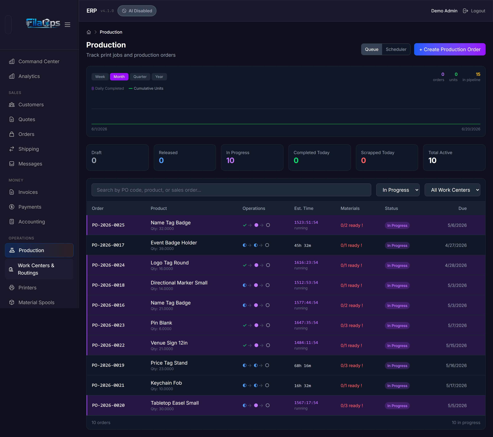
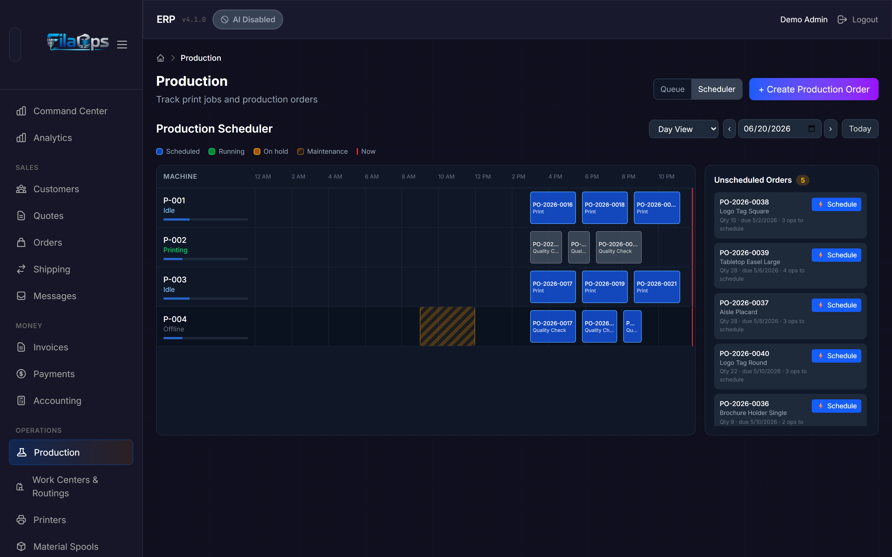
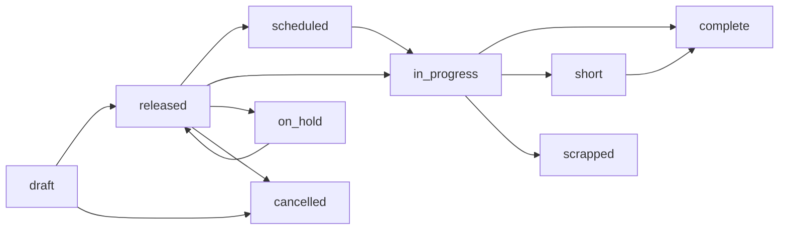
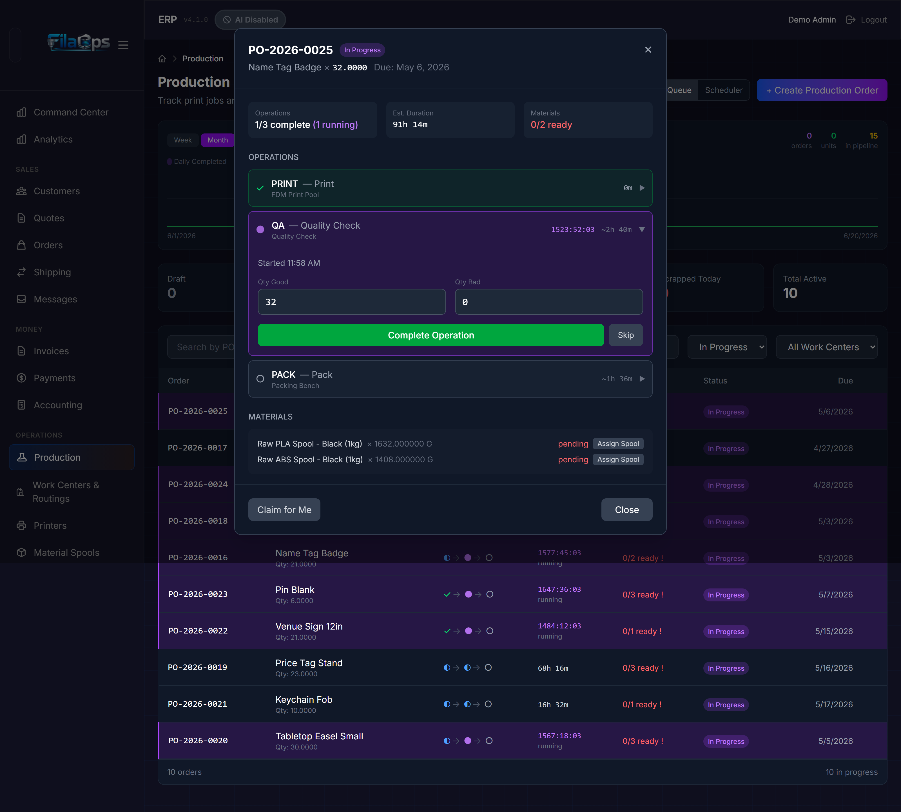
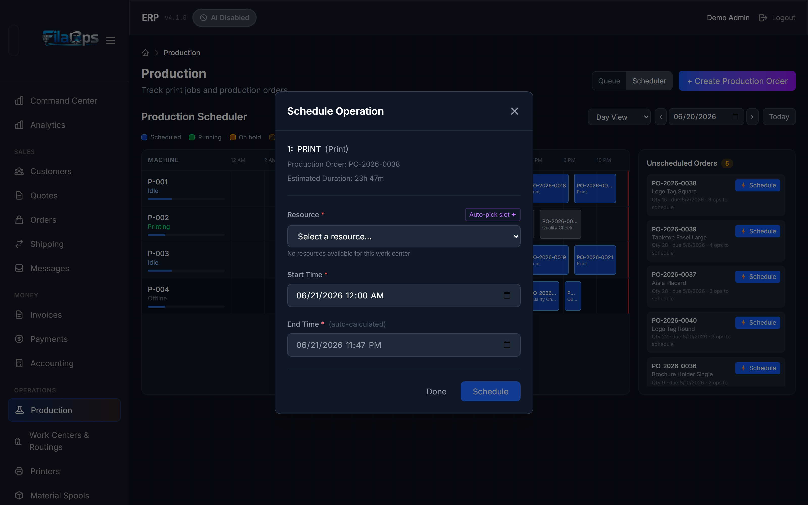

# Production & Scheduling

> Turn sales orders into finished goods — plan, schedule, execute, and track production runs across your print farm.

## What You'll Learn

- How to configure work centers and routings for your shop floor
- How to create and manage production orders through their full lifecycle
- How to use the Scheduler (Gantt) board to plan and dispatch operations
- How to handle scrap, splits, quality inspections, and partial completions
- How to read the production dashboard and trend chart

## Prerequisites

- Admin access to FilaOps
- At least one product with a Bill of Materials (see [Managing Your Product Catalog](product-catalog.md))
- At least one work center and resource configured (printers or stations)

---

## Setting Up Manufacturing

Before running production, tell FilaOps about your equipment and processes. Navigate to **Manufacturing** in the sidebar, then open the **Setup** tab.

### Work Centers

A work center is a logical area of your shop — for example, "FDM Print Farm," "Resin Station," or "Post-Processing Bench." Operations in routings are assigned to work centers, and then dispatched to specific resources within them.

#### Creating a Work Center

1. Click **+ Add Work Center**.
2. Fill in the details:

    | Field | Description |
    |-------|-------------|
    | **Code** | Short identifier used throughout the system (e.g., `FDM-POOL`) |
    | **Name** | Human-readable label (e.g., "FDM Print Farm") |
    | **Description** | What this work center handles |
    | **Type** | `machine` (has individual resources), `station` (single workstation), or `production` (generic) |
    | **Capacity (hours/day)** | Hours available per day for capacity planning |
    | **Machine Rate / Labor Rate / Overhead Rate** | Per-hour cost rates used to calculate job costing |

3. Click **Save**.

#### Adding Resources to a Work Center

Resources are the individual machines within a work center — each printer, curing station, and so on. Operations are scheduled to work centers and then dispatched to a specific resource within that center.

1. Open a work center card and click **Add Resource**.
2. Fill in:

    | Field | Description |
    |-------|-------------|
    | **Code** | Short identifier (e.g., `P1S-01`) |
    | **Name** | Machine name (e.g., "Bambu P1S #1") |
    | **Machine Type** | Model identifier such as `X1C`, `P1S`, or `A1` |
    | **Printer Class** | `open` (open-frame, e.g., A1 Mini) or `enclosed` (e.g., P1S, X1C) — used for material compatibility checking |
    | **Status** | `available`, `busy`, `maintenance`, or `offline` |

3. Click **Save**.

!!! tip "Quick printer setup"
    Use the **Printer Setup** button at the top of the Work Centers tab to launch a guided wizard. It creates a work center and adds your first printer resource in one flow — faster than the manual steps above.

#### Editing and Removing Resources

- Click **Edit** on any resource card to update its details or status.
- Click **Delete** to permanently remove a resource. Resources with active scheduled operations must have those operations rescheduled or completed first.

!!! warning "Resource status vs. maintenance windows"
    Setting a resource status to `offline` or `maintenance` manually blocks new scheduling on that resource. For planned downtime that should appear visibly on the Gantt board, use **Maintenance Windows** instead — those render as amber diagonal-stripe blocks on the scheduler and are factored into the next-available-slot calculation.

---

### Routings

A routing defines the step-by-step manufacturing process for a product — which operations to perform, in what order, on which work center, and how long each takes. When a production order is created, the active routing for that product is automatically copied onto the order as a snapshot.

Navigate to the **Routings** tab on the Manufacturing Setup page.

#### The Routings Table

| Column | What It Shows |
|--------|---------------|
| **Code** | Routing identifier. Template routings display a "Template" badge. |
| **Product** | Which product this routing manufactures |
| **Version** | Version number and revision string (e.g., v2 / 1.0) |
| **Operations** | Number of steps in the routing |
| **Total Time** | Combined setup + run + wait + move time across all operations (minutes) |
| **Cost** | Calculated manufacturing cost (labor + materials) |
| **Status** | Active or Inactive |

#### Creating a Routing

1. Click **+ New Routing** to open the Routing Editor.
2. Fill in the routing header:

    | Field | Description |
    |-------|-------------|
    | **Code** | Unique identifier for this routing |
    | **Product** | Which product this routing manufactures (leave blank for templates) |
    | **Version / Revision** | Numeric version and revision string for change tracking |
    | **Is Template** | Check to create a reusable starting point with no product assignment |

3. Add operations in sequence. Each operation specifies:

    | Field | Description |
    |-------|-------------|
    | **Operation Code** | Short code such as `PRINT`, `QC`, `PACK` |
    | **Operation Name** | Readable label (e.g., "Print Base Layer") |
    | **Work Center** | Which work center handles this step |
    | **Setup Time (min)** | Time to prepare the machine before running |
    | **Run Time (min)** | Time per unit produced |
    | **Wait / Move Time (min)** | Cure time, transport, or dwell — counted in total duration but not billed as labor run time |
    | **Can Overlap** | Allow this operation to start before its predecessor finishes |

4. Optionally add **materials** to each operation — the components consumed at that step (e.g., PLA filament for a print operation, boxes for a pack operation). Materials defined here are automatically copied to the production order when it is created, with quantities scaled to the order quantity.

5. Click **Save**.

#### Routing Templates

Set **Is Template** to create a routing with no product assignment. Templates appear with a "Template" badge in the list. When creating a new routing, you can base it on a template — useful for standard process patterns shared across many products (e.g., "FDM Print → Support Removal → QC → Pack").

!!! note "Which routing is used when creating an order?"
    When you create a production order, FilaOps automatically attaches the most recently created **active, non-template** routing for that product. If the routing changes after the order is created, use **Refresh Routing** on the order (see below).

---

## The Production Page

Navigate to **Manufacturing > Production** in the sidebar. The page has two views you can toggle between at the top right: **Queue** and **Scheduler**.

### Queue View

The Queue view is the day-to-day workspace for managing orders. It shows the trend chart, stat cards, and the full order list.

#### Production Trend Chart

At the top, a chart shows production throughput over time. Toggle between periods:

| Button | Period |
|--------|--------|
| **Week** | Week to date |
| **Month** | Month to date |
| **Quarter** | Quarter to date |
| **Year** | Year to date |

The chart shows:

- **Purple bars** — Orders completed each day
- **Green line** — Cumulative units produced over the period
- **In pipeline** count (top right of chart) — Orders currently released + in progress

Hover over any day to see a tooltip with that day's completed orders, units produced, and running cumulative totals.

#### Stats Cards

Six stat cards show the current state of production (counts reflect the loaded data, not the active filter):

| Card | Color | What It Shows |
|------|-------|---------------|
| **Draft** | Gray | Orders created but not yet released |
| **Released** | Blue | Orders approved and ready to start |
| **In Progress** | Purple | Orders currently being worked on |
| **Completed Today** | Green | Orders finished today |
| **Scrapped Today** | Red | Orders scrapped today |
| **Total Active** | White | Released + In Progress combined |

#### Filtering and Searching

Above the order table:

- **Search** — Filter by production order code (e.g., `PO-2026-0042`), product name, product SKU, or linked sales order code
- **Status filter** — Show only orders in a specific status (defaults to In Progress)

#### Make-to-Order vs. Make-to-Stock Badges

Each order shows a badge next to its code:

| Badge | Color | Meaning |
|-------|-------|---------|
| **SO-XXXX** | Blue | Make-to-order — linked to a specific sales order |
| **STOCK** | Purple | Make-to-stock — building inventory, not tied to a sales order |

#### Operations Chain

The order table shows a compact operations chain for each row — a series of status icons connected by arrows, one icon per routing operation. Hover an icon to see the operation name and any assigned resource.

| Icon | Color | Status |
|------|-------|--------|
| ○ | Gray | Pending — not yet scheduled or started |
| ◐ | Blue | Queued — scheduled on a resource, waiting to run |
| ● (pulsing) | Purple | Running |
| ✓ | Green | Complete |
| ⊘ | Yellow | Skipped |

---

### Scheduler View

Click **Scheduler** in the top-right toggle to open the Gantt board. This view shows your machine lanes on a time axis, making it easy to see what is scheduled where, spot capacity gaps, and dispatch unscheduled orders.

#### Gantt Controls

| Control | Purpose |
|---------|---------|
| **Day / Week / Month** dropdown | Change the time window |
| Date picker | Jump to a specific date |
| **‹ / ›** arrows | Navigate backward or forward one window |
| **Today** button | Return to the current date window |

#### Reading the Gantt

Each row is a machine lane corresponding to a resource or printer. Blocks represent scheduled operations:

| Block Style | Meaning |
|-------------|---------|
| Blue | Scheduled / queued |
| Green | Currently running |
| Amber | On hold |
| Amber diagonal stripes | Maintenance window — blocks scheduling on this lane |
| Red vertical line | Current time ("now" line) |

Below each machine name, a thin utilization bar shows the percentage of the window that is booked:

- Blue — below 60% utilized
- Amber — 60–85% utilized
- Red — over 85% utilized (approaching capacity)

Click any operation block to open the **Schedule Operation** (or **Edit Schedule**) modal for that operation.

#### Unscheduled Orders Panel

The right-hand panel lists released orders that have at least one unscheduled operation. Each card shows:

- Order code and product name
- Quantity and due date
- Number of operations still needing a time slot

Click **⚡ Schedule** on any card to open the scheduler modal for the first pending operation on that order.

!!! tip "Dispatch from Queue view without switching tabs"
    In the Queue view, released orders show a **Dispatch** button at the right end of their row. Clicking it opens the same scheduler modal for that order's first pending operation.

---

## Production Order Lifecycle

Production orders move through the following statuses:

| Status | Description |
|--------|-------------|
| **draft** | Created but not ready for the floor. Planning stage — editable. |
| **released** | Approved, materials reserved, ready to schedule or start. |
| **scheduled** | At least one operation has been assigned a time slot and resource. |
| **in_progress** | Work has started — at least one operation is running. |
| **complete** | All units produced (or accepted short). Inventory has been updated. |
| **short** | All operations finished but `quantity_completed` is less than `quantity_ordered`. Awaiting Accept Short action to update inventory. |
| **on_hold** | Production paused. Can be resumed (returns to released). |
| **scrapped** | Order abandoned. |
| **cancelled** | Order terminated before completion. Material reservations are released. |

Individual operation statuses follow: **pending → queued → running → complete** (or **skipped**).

!!! note "QC hold"
    If QC inspection is enabled for a product, completing the order transitions `qc_status` to `pending` before inventory is updated. QC status values: `not_required`, `pending`, `in_progress`, `passed`, `failed`, `waived`.

---

## Creating a Production Order

### Manually from the Production Page

1. Click **+ Create Production Order**.
2. Fill in the form:

    | Field | Required | Description |
    |-------|----------|-------------|
    | **Product** | Yes | Select from active products (shows SKU — name) |
    | **Quantity** | Yes | Units to produce (minimum 1) |
    | **Priority** | — | Urgency; defaults to 3 Normal |
    | **Due Date** | — | Target completion date (optional) |
    | **Notes** | — | Instructions for the production team |

    Priority levels:

    | Value | Label |
    |-------|-------|
    | 1 | Urgent |
    | 2 | High |
    | 3 | Normal (default) |
    | 4 | Low |
    | 5 | Lowest |

3. Click **Create Order**.

FilaOps automatically:
- Generates an order code in `PO-YYYY-NNNN` format
- Attaches the active BOM and routing for the product
- Copies routing operations onto the order (including their materials, scaled to the order quantity)
- Reserves materials from inventory
- Estimates costs from BOM materials and work center rates

The new order opens immediately in the detail view.

### From a Sales Order

1. Open a sales order in **Sales > Orders**.
2. Click **Generate Production Order**.
3. FilaOps creates production orders for each manufactured line item, pre-filled with the product, quantity, and a link back to the sales order line.

This is the recommended flow for make-to-order production. The linked sales order code appears as a blue badge on each production order.

---

## Working with a Production Order

Click any order in the production list to open its detail view.

### Releasing an Order

When a draft order is ready for the floor:

1. Open the production order.
2. Click **Release**.

FilaOps checks that materials are reserved and transitions the order to **released**. If materials are short, the response lists each shortage: component SKU, quantity needed, and quantity reserved. You can:

- Resolve the shortage (receive stock or transfer inventory), then release normally.
- Click **Force Release** to release despite shortages when you know stock is incoming.

!!! warning "Force Release does not conjure stock"
    Releasing with a shortage means operations may stall if physical material is absent. Use force release only when confirmed incoming supply covers the gap.

### Scheduling Operations

Once released, operations need a time slot and resource before work starts.

1. Switch to **Scheduler** view, or click **Dispatch** on the order's row in Queue view.
2. The **Schedule Operation** modal opens for the next pending operation.

    

3. Select a **Resource** from the dropdown. Resources are filtered to the operation's work center. The modal warns you if the selected resource is incompatible with the product's material requirements (e.g., an open-frame printer chosen for a part that requires an enclosed machine).

4. Set a **Start Time**. The **End Time** is auto-calculated from planned setup + run time. You may override it manually if the operation's routing has no duration set.

5. Click **Schedule**.

If the slot conflicts with another operation on the same resource, a red conflict alert appears with the name of the blocking operation and a suggestion for the next available slot. Click **Use suggested slot** to apply it instantly.

After scheduling one operation, the success banner offers a link to schedule the next operation in sequence — keeping you in the modal to chain operations without returning to the board.

To **reschedule** an already-queued operation: click its block on the Gantt board. The modal opens in **Edit Schedule** mode showing the current slot. Make changes and click **Reschedule**. To remove the slot entirely, click **Unschedule**.

!!! note "Operation sequence enforcement"
    FilaOps enforces routing order. You cannot schedule step 2 to start before step 1 finishes (unless the routing operation has **Can Overlap** enabled). If you try, an amber predecessor conflict alert shows the earliest valid start time. For reschedules that would push into a successor's slot, an orange successor conflict alert lists the affected operations.

### Starting Production

When work begins on a released or scheduled order:

1. Open the production order.
2. Click **Start**.

The order moves to **in_progress** and the first pending operation transitions to **running** automatically.

### Completing a Production Order

When all units are finished:

1. Open the production order.
2. Click **Complete**.
3. Enter **Quantity Good** (units that passed) and optionally **Quantity Scrapped**.
4. Confirm.

Finished goods are added to inventory. Actual costs are recalculated from consumed material quantities and actual operation times.

!!! note "Completing short at this step"
    If the quantity good is less than the quantity remaining, the system asks you to confirm a short close. This completes the order at the actual quantity.

### Accepting Short (Partial Completion)

When all operations finish but `quantity_completed` is less than `quantity_ordered`, the order automatically enters **short** status. Inventory has not been updated yet at this point.

1. Open the production order.
2. Click **Accept Short**.
3. Enter an optional note.
4. Confirm.

FilaOps:
- Releases all material reservations
- Consumes materials proportional to the completed quantity (BOM-proportional)
- Receipts the completed quantity as finished goods in inventory
- Closes the order as **complete**

After accepting short on a production order linked to a sales order, use [Close Short](orders.md#close-short-workflow) on the sales order to accept partial fulfillment.

### Putting an Order on Hold

To pause work without cancelling:

1. Open the production order (must be **released** or **in_progress**).
2. Click **Hold**.
3. Enter an optional reason.

The order moves to **on_hold**. Resume it by clicking **Release**.

### Splitting a Production Order

If you need to run part of an order on a different machine or a different timeline:

1. Open the production order (must be in **draft**, **scheduled**, or **released** status).
2. Click **Split Order**.
3. Enter the quantity to split into a new order.
4. Confirm.

FilaOps:
- Reduces the original order's quantity by the split amount
- Creates a new **draft** order for the split quantity with a fresh `PO-YYYY-NNNN` code
- Copies routing operations onto the new order (quantities scaled to the split amount)
- Reserves materials for the new order
- Appends a `[SPLIT]` note to both orders for traceability

Both orders retain any sales order link.

!!! tip "When to split"
    Split when a printer breaks mid-batch and you need to finish remaining units on a different machine, or when you want to expedite part of a large batch without holding up the rest.

### Scrapping a Production Order

If a run fails and cannot be recovered:

1. Open the production order.
2. Click **Scrap**.
3. Select a **Scrap Reason** from the list (configurable — common examples: Print failure, Layer shift, Material defect, Warping).
4. Enter optional notes.
5. Optionally check **Create Remake Order** to automatically generate a new draft order for the scrapped quantity at one priority level higher.
6. Confirm.

Scrap records include the reason code, quantity, and cost at the time of scrapping. These accumulate into production stats so you can identify recurring failure patterns.

### Cancelling an Order

To terminate an order entirely:

1. Open the production order (must be **draft** or **released** — completed orders cannot be cancelled).
2. Click **Cancel**.
3. Enter an optional reason.

Material reservations are released automatically. Cancelled orders are excluded from active stat counts.

### Running a QC Inspection

For products that require quality verification before inventory is updated:

1. Open the production order.
2. Click **QC Inspection** (available when `qc_status` is `pending` or `in_progress`).
3. Record:
   - **Inspector** name
   - **QC Result** — `passed`, `failed`, or `conditional`
   - **Quantity Passed** and **Quantity Failed**
   - **Failure Reason** and notes (if any units failed)
4. Save.

If QC passes, the order can proceed to closed/complete and inventory is updated. If QC fails, the order enters **qc_hold** — you can then scrap the failed units, request rework, or waive the failure with a documented reason (`waived` status).

### Refreshing Routing

If a routing was added or updated *after* a production order was created, the order does not pick up the new operations automatically. Use **Refresh Routing** to re-apply the current active routing.

1. Open the production order (must be **draft**, **released**, or **on_hold**).
2. Click **Refresh Routing** in the order footer.
3. Confirm.

All pending operations and their materials are replaced with the current routing's operations. Refresh is blocked if any operation is already **running** or **complete** — you cannot rewrite history for work already in progress.

If the order has no operations at all (routing was missing when the order was created), an **Apply Routing Now** button appears in the operations section instead.

### Swapping a Material Variant

If a routing operation specifies a parent/template product but available inventory is in a specific variant (e.g., the BOM calls for "PLA Black" but your stock is "Bambu PLA Black 1kg"):

1. Open the production order detail.
2. Find the pending material line on the relevant operation.
3. Click **Swap Variant**.
4. Select the active variant to consume.
5. Confirm.

The swap is only allowed while the material is in **pending** status (before allocation or consumption). FilaOps validates that the selected product is an active variant of the original component (i.e., shares the same parent product).

---

## Tips & Best Practices

- **Configure work centers and resources before creating orders** — operations can only be scheduled to resources that exist in the system
- **Build routings for every repeatable product** — they eliminate manual operation entry, drive consistent time estimates, and enable the Scheduler board
- **Use routing templates for shared process patterns** — define a "FDM Print → Support Removal → QC → Pack" template once and base individual product routings on it
- **Generate production orders from sales orders** — this maintains the MTO link so you always know which customer an order is for
- **Check the Scheduler board at the start of each shift** — the Unscheduled Orders panel shows what needs dispatching before printers can start
- **Set priorities accurately** — priority 1–2 for hard customer deadlines, 4–5 for stock replenishment, 3 for everything else. The order list and work center queues sort by priority then due date.
- **Record scrap reasons consistently** — the data accumulates over time and reveals which printers, materials, or products fail most
- **Use On Hold rather than Cancel for temporary stoppages** — on hold preserves the order and its material reservations; cancel releases them permanently
- **Split rather than cancel when a printer fails mid-batch** — the original order continues for remaining units while the split handles the diversion

---

## What's Next?

- [Tracking Inventory](inventory.md) — monitor stock levels and record transactions
- [Ordering Supplies](purchasing.md) — purchase materials before you run out
- [Material Planning (MRP)](mrp.md) — let FilaOps calculate what you need and when
- [Managing Sales Orders](orders.md) — link production back to customer demand

---

## Quick Reference

| Task | Where to Find It |
|------|-----------------|
| Create a work center | **Manufacturing > Setup** > Work Centers tab > **+ Add Work Center** |
| Quick-add a printer | **Manufacturing > Setup** > **Printer Setup** button |
| Add a resource to a work center | Work center card > **Add Resource** |
| Create a routing | **Manufacturing > Setup** > Routings tab > **+ New Routing** |
| Create a production order | **Manufacturing > Production** > **+ Create Production Order** |
| Generate PO from a sales order | **Sales > Orders** > order detail > **Generate Production Order** |
| Release an order | Production order detail > **Release** |
| Dispatch / schedule an operation | Queue view row > **Dispatch**, or Scheduler board > **⚡ Schedule** in Unscheduled panel |
| Reschedule a scheduled operation | Scheduler board > click the operation block > **Edit Schedule** |
| Start production | Production order detail > **Start** |
| Complete an order | Production order detail > **Complete** |
| Accept short (partial completion) | Production order detail > **Accept Short** |
| Put an order on hold | Production order detail > **Hold** |
| Cancel an order | Production order detail > **Cancel** |
| Split a production order | Production order detail > **Split Order** |
| Scrap a production order | Production order detail > **Scrap** |
| Run a QC inspection | Production order detail > **QC Inspection** |
| Refresh routing on a PO | Production order detail footer > **Refresh Routing** |
| View the Gantt board | **Manufacturing > Production** > **Scheduler** toggle |
| View production trends | **Manufacturing > Production** > **Queue** toggle > chart at top |
