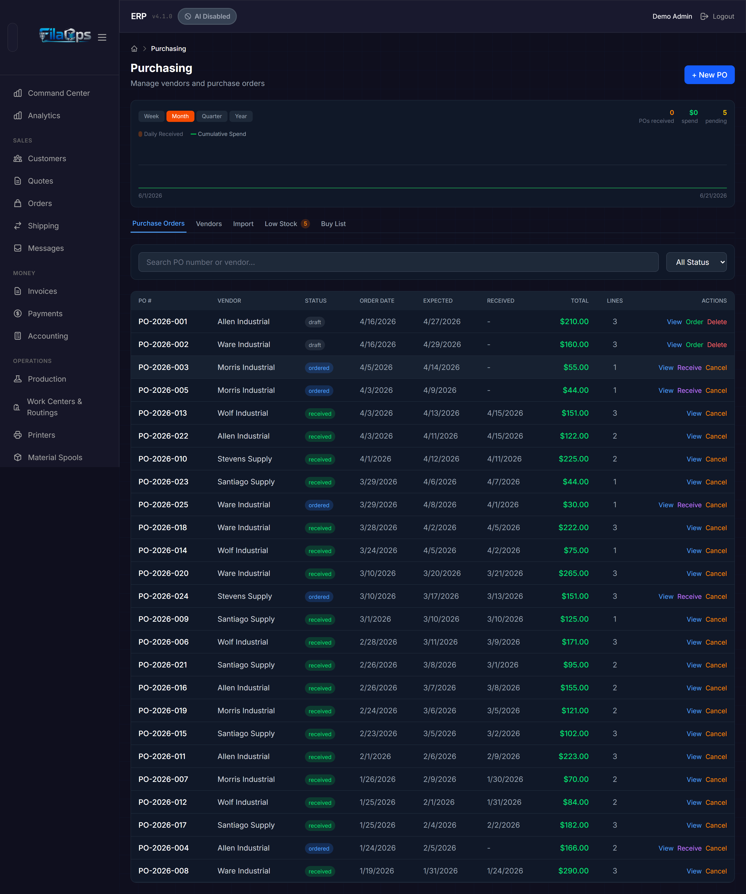
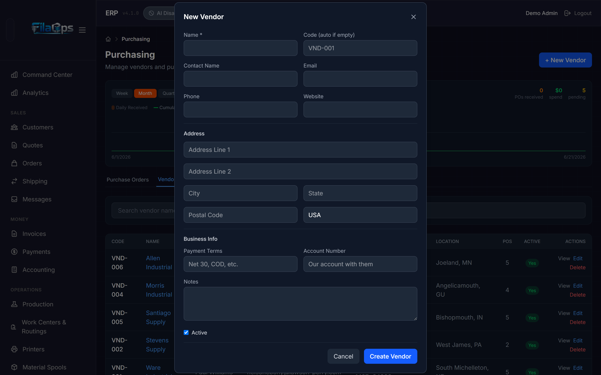
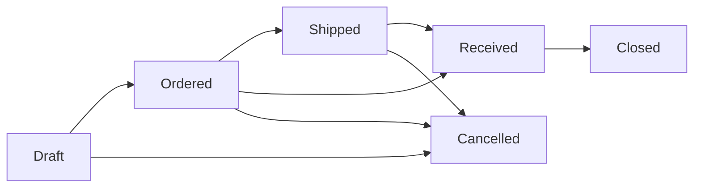
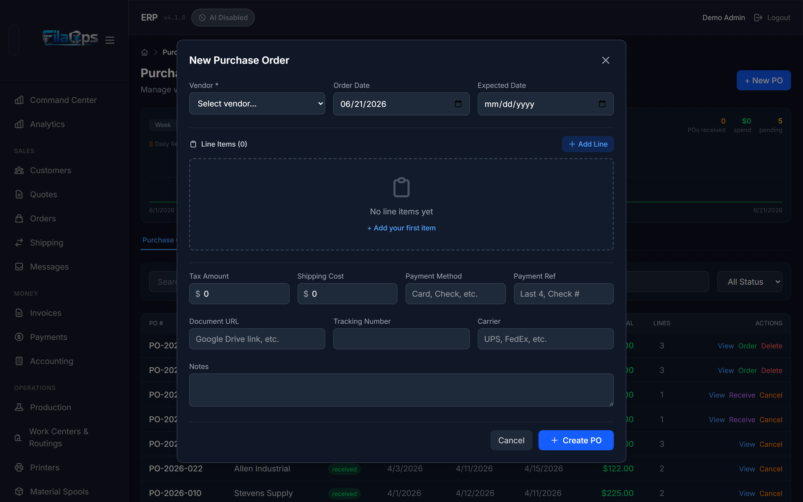
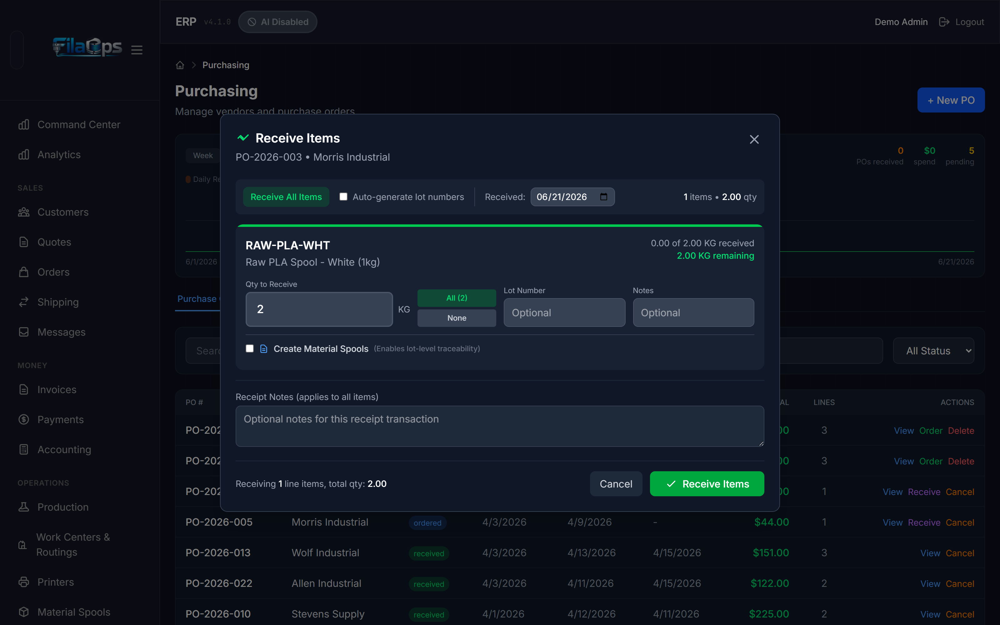
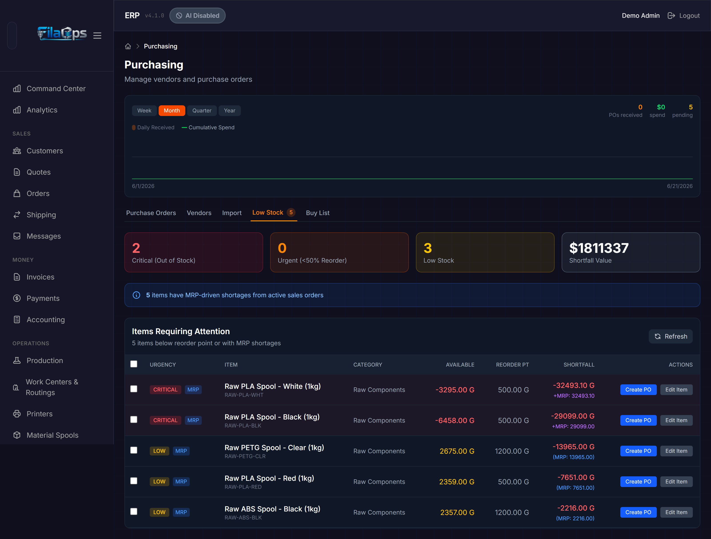

# Ordering Supplies

> Keep your shelves stocked — manage vendors, create purchase orders, receive deliveries, and stay on top of shortages without losing track of a single spool.

## What You'll Learn

- How to set up and manage vendors
- How to create purchase orders manually and from low-stock alerts
- How to track a PO from draft to closed
- How to receive deliveries and update inventory automatically
- How to use the Low Stock and Buy List tabs to stay ahead of shortages

## Prerequisites

- Admin access to FilaOps
- At least one product in your catalog (see [Managing Your Product Catalog](product-catalog.md))
- At least one inventory location set up (see [System Settings](system-settings.md))

---

## The Purchasing Page

Navigate to **Purchasing** in the sidebar. The page header shows a **Purchasing Trend Chart** that plots daily receipts and spend. Use the period buttons — **Week**, **Month**, **Quarter**, or **Year** — to change the date range.

Below the chart are five tabs:

| Tab | Purpose |
|-----|---------|
| **Purchase Orders** | Create and manage POs |
| **Vendors** | Your supplier directory |
| **Import** | Amazon Business CSV import (FilaOps Pro) |
| **Low Stock** | Items below reorder point or flagged by MRP |
| **Buy List** | Consolidated netting view across all open demand |

!!! note "Import tab is a Pro feature"
    The **Import** tab (Amazon Business CSV import) is part of FilaOps Pro and is not available in FilaOps Core. The tab is visible but shows a Pro upgrade prompt.

---

## Managing Vendors

Set up your suppliers before creating purchase orders. Click the **Vendors** tab.

### Creating a Vendor

1. Click **+ New Vendor** (top-right button, visible when the Vendors tab is active).
2. Fill in the vendor details:

    **Required**

    - **Name** — The company name.

    **Contact**

    - **Code** — Your internal shorthand (e.g., `POLY`). Leave blank and FilaOps auto-assigns one.
    - **Contact Name** — Primary contact person.
    - **Email** — Contact email.
    - **Phone** — Contact phone.
    - **Website** — Vendor's website URL.

    **Address** — Address Line 1, Address Line 2, City, State, Postal Code, Country.

    **Business Info**

    - **Payment Terms** — e.g., `Net 30`, `COD`.
    - **Account Number** — Your account number with this vendor.

    **Notes** — Free-text for anything else (minimum order quantities, lead times, etc.).

    **Active** — Uncheck to hide a vendor from the PO creation dropdown without deleting their history.

3. Click **Create Vendor**.

### Viewing and Editing Vendors

Click any vendor row to open the **Vendor Detail Panel**. This shows the vendor's full contact information. From the detail panel you can:

- **Edit** — Open the edit form.
- **Create PO** — Start a new purchase order pre-filled with this vendor.

The vendor list shows the vendor's code, name, contact, email, phone, city/state, PO count, and active status. Use the **search bar** above the list to find vendors by name or code.

---

## Purchase Order Lifecycle

Purchase orders move through a fixed set of statuses:

| Status | Meaning |
|--------|---------|
| **Draft** | Created but not yet sent to the vendor. Still editable. |
| **Ordered** | Sent to the vendor — order is committed. |
| **Shipped** | Vendor has shipped. You can log a tracking number and carrier. |
| **Received** | Goods arrived and checked in. Inventory updated automatically. |
| **Closed** | All items accounted for — PO complete. |
| **Cancelled** | PO abandoned before completion. |

!!! warning "Received status can only be set through the Receive workflow"
    You cannot manually flip a PO to **Received** by clicking a status button. You must use the **Receive Items** workflow so that inventory transactions and material lots are created correctly. Skipping this would change the status without ever adding stock.

---

## Creating a Purchase Order

### From the Purchase Orders Tab

1. Click the **Purchase Orders** tab, then click **+ New PO**.
2. Fill in the PO header:

    - **Vendor** (required) — Select from your active vendors.
    - **Order Date** — Defaults to today.
    - **Expected Date** — When you expect delivery.

3. Add line items. Click **Add Line** for each item you are ordering:

    - **Product** — Search your catalog by SKU or name. If the item does not exist yet, click **+ Create New Item** in the search dropdown to add it without leaving the form.
    - **Qty** — Quantity to order.
    - **UOM** — Purchase unit of measure: `EA`, `G`, `KG`, `LB`, `OZ`, `PK`, `BOX`, or `ROLL`. Switching the UOM converts the quantity automatically.
    - **Unit Cost** — Price per purchase unit. Auto-populates from the product's last recorded cost if one exists.

    The running subtotal appears at the bottom as you add lines.

4. Fill in the optional financial details:

    - **Tax Amount** — Auto-calculated from your company tax rate (if configured in Settings). You can override it; a yellow border indicates a manual override. Click **Reset to N%** to revert to the calculated value.
    - **Shipping Cost** — Shipping and handling charges.
    - **Payment Method** — e.g., `Card`, `Check`.
    - **Payment Ref** — Last four digits, check number, etc.

5. Fill in optional logistics details:

    - **Document URL** — Link to a Google Drive file, vendor quote, or similar external document.
    - **Tracking Number** — Can be entered now or added later when the vendor ships.
    - **Carrier** — e.g., `UPS`, `FedEx`.

6. Add **Notes** if needed, then click **Create PO**.

The PO is saved in **Draft** status with an auto-generated number in the format `PO-YYYY-NNNN`.

!!! tip "Purchasing in a different unit than you stock"
    You can purchase filament in kilograms (`KG`) even if your product catalog tracks it in grams (`G`). FilaOps converts the quantity and unit cost automatically when you receive the order, so your inventory always shows grams and your cost is always expressed per gram.

### Other Ways to Start a PO

| Starting point | How |
|----------------|-----|
| **Vendor Detail Panel** | Open a vendor, click **Create PO** — vendor pre-selected |
| **Low Stock tab** | Click **Create PO** on any row, or check multiple items and use the bulk **Create PO** dropdown |
| **Buy List tab** | Click **Create PO** on any row — product and suggested quantity pre-filled |
| **MRP results** | MRP links to Purchasing with product and quantity pre-filled |

---

## Working with Purchase Orders

### Filtering and Searching

On the **Purchase Orders** tab:

- **Search bar** — Finds POs by PO number or vendor name.
- **Status dropdown** — Filters by: All Status, Draft, Ordered, Shipped, Received, Closed, or Cancelled.

### Viewing a PO

Click **View** on any PO row to open the PO Detail panel. This shows:

- Dates: Order Date, Expected, Shipped, Received
- Tracking number and carrier (if entered)
- Line item table with ordered quantity, received quantity, unit cost, and line total
- Subtotal, tax, shipping, and grand total
- Attached documents
- Notes
- **Activity timeline** — a chronological log of every status change, receipt event, and manual note

### Updating PO Status

From the PO list, quick-action buttons appear inline on each row:

- **Order** — Advances a Draft PO to Ordered (requires at least one line item).
- **Receive** — Opens the Receive Items workflow (available on Ordered and Shipped POs).
- **Delete** — Permanently removes a Draft PO. Only available on Draft status.
- **Cancel** — Marks the PO as Cancelled. Available on Draft, Ordered, and Shipped POs.

From the PO Detail view, these additional buttons are available depending on the current status:

| Button | Available when |
|--------|---------------|
| **Edit** | Draft |
| **Place Order** | Draft |
| **Mark Shipped** | Ordered |
| **Receive Items** | Ordered or Shipped |
| **Close PO** | Received |
| **Cancel** | Draft, Ordered, or Shipped |
| **Download PDF** | Any status |

!!! note "Editing is limited after ordering"
    You can edit a PO's header (dates, shipping cost, tax, notes) and add or modify lines while the PO is in **Draft** or **Ordered** status. Once the PO reaches **Shipped**, **Received**, or **Closed**, edits are blocked to preserve the audit trail. You cannot reduce a line's quantity below the amount already received.

---

## Receiving a Delivery

When goods arrive, use the **Receive Items** workflow to check them in and update inventory.

### Step-by-Step

1. Open the PO (click **View**, then **Receive Items**; or click **Receive** directly from the PO list row).
2. In the **Receive Items** modal:

    a. Set the **Received** date — defaults to today. Change it if the shipment physically arrived on an earlier date (useful if you are catching up on paperwork).

    b. For each line, enter the **Qty to Receive**. The quantity cannot exceed what remains on the line. Use the shortcuts:
       - **All (N)** — fills in the full remaining quantity for that line.
       - **None** — zeros the quantity for that line.
       - **Receive All Items** (top bar) — fills in the full remaining quantity for every line at once.

    A progress bar on each line shows how much of the total ordered quantity has been received, including previous partial receipts.

    c. Optionally enter a **Lot Number** per line for traceability. Check **Auto-generate lot numbers** to have FilaOps create them automatically.

    d. For material products (filament, resin, etc.) a **Create Material Spools** checkbox appears per line. Enable it to register individual physical spools with their weight, supplier lot number, and expiry date. The sum of spool weights must equal the received quantity (within 0.1 g tolerance).

    e. Optionally add **Receipt Notes** that apply to all items in this receipt.

3. Click **Receive Items**.

### What Happens on Receive

FilaOps performs all of the following in a single database transaction:

- Creates **inventory receipt transactions** — stock levels update immediately at the receiving location.
- **Weighted-average cost** is recalculated for each received product using on-hand quantity and the new receipt cost.
- **Shipping cost and tax** (if any on the PO) are distributed pro-rata across lines by line value and folded into each line's per-unit cost (landed cost capitalization).
- For purchased items without a Bill of Materials or Routing, **standard cost is synced** to the new weighted-average cost automatically.
- A **Material Lot** record is created for each material, supply, or component line — enabling traceability back to this PO and vendor.
- If **Create Material Spools** was selected, individual spool records are created.
- If all lines are fully received, the PO status advances to **Received** automatically.

!!! tip "Partial receipts"
    Receive each shipment batch as it arrives. The PO tracks cumulative received quantities per line so you always know what is still outstanding. Partial receipts leave the PO in Ordered or Shipped status until all lines are fully received.

!!! warning "Landed cost is allocated exactly once"
    Shipping cost and tax are distributed proportionally across all partial receipts. The final receipt absorbs any rounding remainder to ensure the total allocated freight equals the PO totals exactly — never more, never less.

---

## Attaching Documents

From the PO Detail view, the **Documents** panel lets you attach files to a PO.

Supported file types: **PDF, JPEG, PNG, WEBP, XLSX, CSV** (maximum 10 MB per file).

Document categories you can assign to each file:

- Invoice
- Packing Slip
- Receipt
- Quote
- Shipping Label
- Other

Drag and drop files onto the upload area or click to browse. Uploaded files can be previewed and downloaded from the same panel.

---

## The Low Stock Tab

The **Low Stock** tab is your early warning system. It shows every item whose available quantity has fallen below its reorder point, plus any items flagged by MRP as short against open sales orders. A count badge on the tab label shows the total number of flagged items.

### Summary Cards

At the top of the tab, four summary cards show:

- **Critical (Out of Stock)** — Available qty is zero or negative.
- **Urgent (<50% Reorder)** — Available qty is less than half the reorder point.
- **Low Stock** — Below reorder point but at or above 50% of it.
- **Shortfall Value** — Estimated dollar value of all shortfalls (shortfall qty × last cost).

If MRP has flagged any items, a blue alert banner shows how many have MRP-driven shortages from active sales orders.

### Reading the Items Table

Each row shows:

| Column | What it means |
|--------|--------------|
| Checkbox | Select for bulk PO creation |
| **Urgency** | CRITICAL / URGENT / LOW badge, plus an MRP badge if MRP also flags this item |
| **Item** | Product name and SKU |
| **Category** | Product category |
| **Available** | Current available quantity |
| **Reorder Pt** | The item's configured reorder point |
| **Shortfall** | How much you are short (negative means you have less than the reorder point requires) |
| **Actions** | Create PO / Edit Item |

### Creating POs from Low Stock

**For a single item:**

Click **Create PO** on that row. The PO creation modal opens with the product and shortfall quantity pre-filled.

**For multiple items from the same vendor:**

1. Check the boxes next to the items you want to order. Use the header checkbox to select all.
2. The **Create PO (N)** dropdown button appears at the top right showing how many items are selected.
3. Hover or click the button to see vendor groups.
4. Click a vendor group to open the PO creation modal pre-filled with all selected items for that vendor — one PO per vendor, not one per item.

!!! tip "Bulk ordering saves time"
    Instead of creating five separate POs for five filament colors from the same supplier, check all five and use the bulk Create PO dropdown. Fewer purchase orders means less receiving overhead and may qualify for volume discounts.

!!! note "Preferred vendor required for bulk PO creation"
    Items without a preferred vendor cannot be included in bulk PO creation. Set preferred vendors on each item in **Items** > Edit Item > Preferred Vendor. Items without a preferred vendor still appear in the list and can be ordered individually.

Click **Refresh** to re-fetch the low stock list at any time.

### Keeping Low Stock Accurate

The Low Stock tab is only as useful as the data behind it. Make sure:

- Every material and supply has a **reorder point** set (see [Managing Your Product Catalog](product-catalog.md)).
- Inventory transactions are recorded promptly (see [Tracking Inventory](inventory.md)).
- MRP is run regularly if you want MRP-driven shortage alerts (see [Material Planning (MRP)](mrp.md)).

---

## The Buy List Tab

The **Buy List** tab answers: "Across all open demand right now, what do I need to buy, and how much?"

Unlike the Low Stock tab (which compares on-hand against reorder points), the Buy List performs a full demand-netting calculation:

**Demand in:** open sales orders + open work orders (production orders)
**Supply in:** current on-hand inventory + incoming supply from Ordered/Shipped POs

The result is a list of items that are genuinely short against committed demand.

### Summary Cards

- **Components Short** — Number of distinct items you are short.
- **Est. Buy Value** — Estimated cost to cover all shortfalls at last cost.
- **Open Sales Orders** — Number of open sales orders included in the calculation.
- **Open Work Orders** — Number of open production orders included.

!!! note "Draft POs do not count as supply"
    The Buy List counts only Ordered and Shipped POs as incoming supply. Draft POs are excluded because they have not been committed to the vendor. Place (approve) your draft POs to have their quantities counted as supply.

### Creating POs from the Buy List

Click **Create PO** on any row to open the PO creation modal with the product and suggested quantity pre-filled. Review and confirm the order before saving.

---

## Tips and Best Practices

- **Set reorder points on every material** — Without a reorder point, an item never appears in the Low Stock tab, even when you run out.
- **Use the Low Stock tab as a weekly ordering checklist** — Check it every Monday, create POs for everything flagged, and you will rarely run out of anything critical.
- **Enter expected delivery dates** — This helps you plan production around incoming materials and makes late shipments easy to spot.
- **Receive deliveries promptly** — Every hour a box sits on the dock is an hour your inventory count is wrong, which affects MRP, order fulfillment, and Dashboard alerts.
- **Use the Buy List for demand-driven purchasing** — If you have open sales orders, the Buy List shows the net quantity you need to buy, not just the reorder-point shortfall.
- **Log tracking numbers when the vendor ships** — Click **Mark Shipped** and enter the tracking number. This gives you a Shipped-date timestamp and keeps the activity timeline accurate.
- **Download the PDF before sending a PO to a vendor** — The PDF is formatted for vendor communication and includes your company header, vendor address, and all line details.
- **Keep vendor notes current** — Record payment terms, minimum order quantities, and lead times in the vendor Notes field. This information helps you make better ordering decisions.

---

## What's Next?

- [Material Planning (MRP)](mrp.md) — let FilaOps calculate what to buy and when
- [Tracking Inventory](inventory.md) — keep stock levels accurate as deliveries arrive
- [Running Production](production.md) — consume materials in production orders

---

## Quick Reference

| Task | Where to Find It |
|------|------------------|
| Create a vendor | **Purchasing** > **Vendors** tab > **+ New Vendor** |
| Edit a vendor | **Vendors** tab > Click a row > **Edit** (in detail panel) |
| Create a purchase order | **Purchasing** > **Purchase Orders** tab > **+ New PO** |
| Receive a delivery | Open a PO > **Receive Items** |
| Download a PO as PDF | Open a PO > **Download PDF** |
| Check what needs ordering | **Purchasing** > **Low Stock** tab |
| Bulk-create POs by vendor | **Low Stock** tab > Check items > **Create PO (N)** dropdown |
| See full demand netting | **Purchasing** > **Buy List** tab |
| Find a specific PO | **Purchase Orders** tab > Search by PO number or vendor |
| View PO history/activity | Open a PO > scroll to **Activity** timeline |
| Attach a document to a PO | Open a PO > **Documents** panel > drag and drop |
| Cancel a PO | Open a PO > **Cancel** button |
| Delete a draft PO | **Purchase Orders** list > **Delete** (Draft only) |
