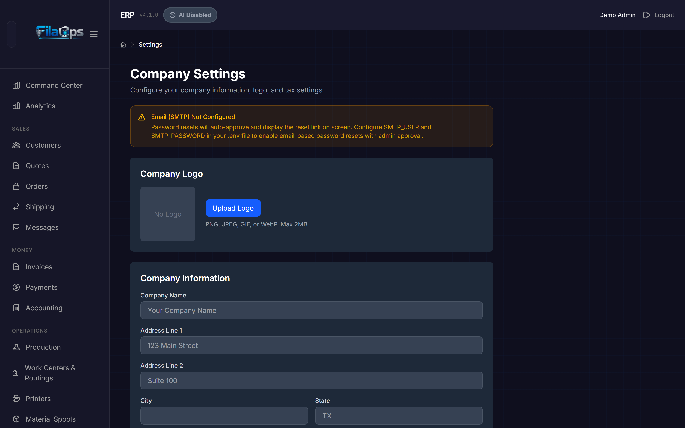
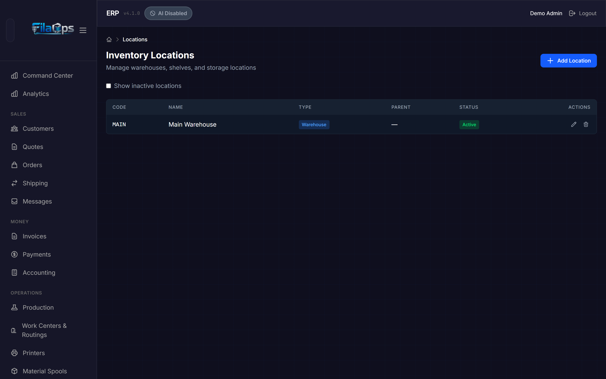
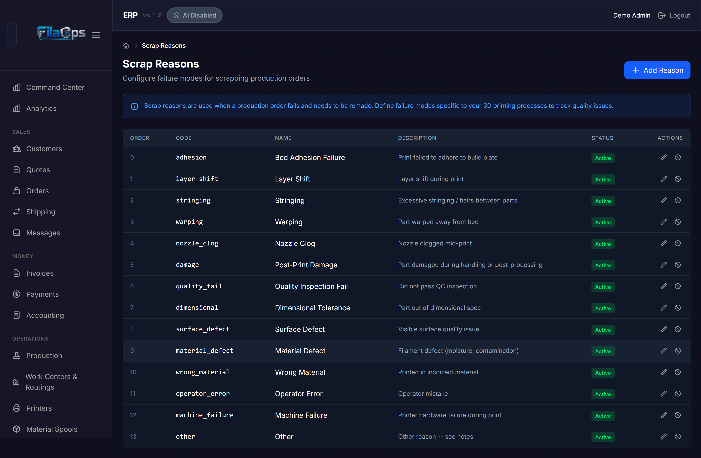
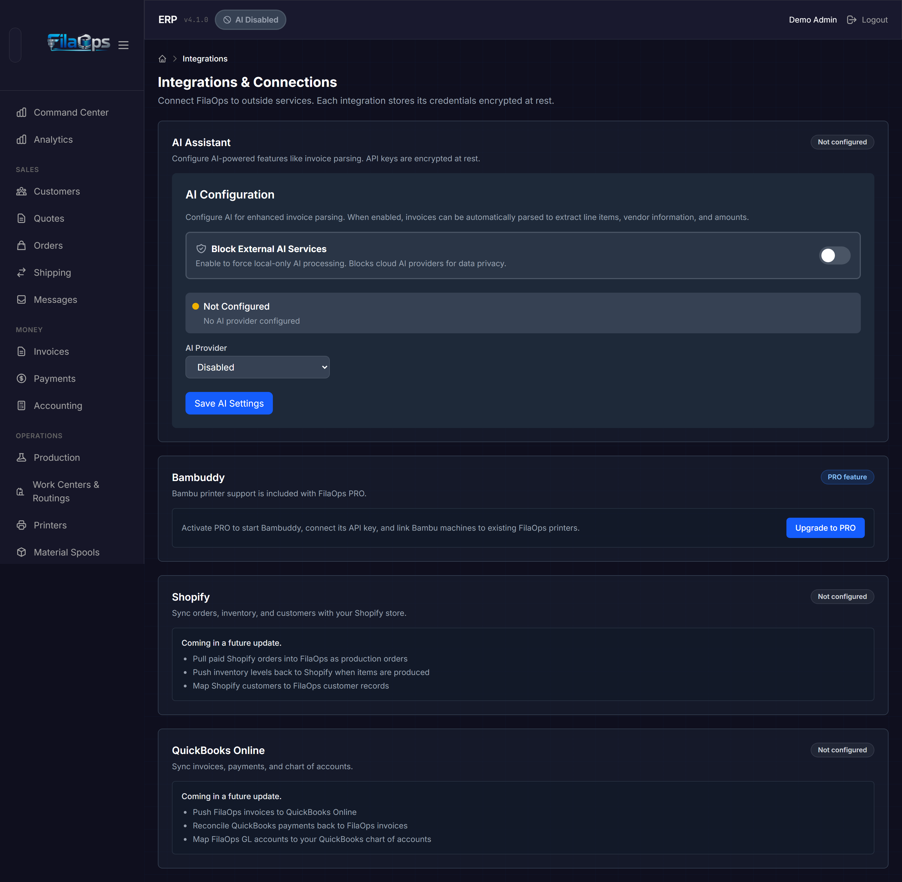

# System Settings

> Configure your company profile, regional formats, tax rules, pricing, inventory locations, production settings, and integrations.

## What You'll Learn

- How to set up your company information and logo
- How to configure regional and currency settings
- How to set up sales tax (flat rate and named multi-rate)
- How to customize quote defaults
- How to set business hours for production planning
- How to configure dispatch behavior for the Command Center
- How to organize inventory with locations
- How to define scrap reasons for production tracking
- Where to find AI and integration settings

## Prerequisites

- Admin access to FilaOps

---

## Company Settings

Navigate to **Admin > Settings** in the sidebar to reach the central configuration page for your business profile.



!!! note "Admin-only"
    All settings pages described here require the Admin role. Regular users cannot view or change these settings.

### Company Logo

Your logo appears on quote PDFs and invoices.

**To upload a logo:**

1. Click **Upload Logo** (or **Change Logo** if one is already set).
2. Select an image file. Supported formats: PNG, JPEG, GIF, or WebP. Maximum file size: 2 MB.
3. The logo appears immediately in the preview area once uploaded.

**To remove a logo:** Click the red **×** button overlaid on the logo preview. A confirmation prompt will appear.

### Company Information

Fill in your business details. These appear on customer-facing documents like quotes and invoices.

| Field | Notes |
|-------|-------|
| **Company Name** | Your business name as it appears on documents |
| **Address Line 1** | Street address |
| **Address Line 2** | Suite, unit, or building (optional) |
| **City** | City name |
| **State** | State or province abbreviation |
| **ZIP Code** | Postal code |
| **Country** | Country name (defaults to `USA`) |
| **Timezone** | Selected from a dropdown of IANA timezone names — controls date/time display in reports and charts (defaults to `America/New_York`) |
| **Phone** | Business phone number — automatically formatted as `(555) 123-4567` as you type |
| **Email** | Business contact email |
| **Website** | Your website address (optional) |

### Regional Settings

The **Regional Settings** section controls how currency amounts, numbers, and dates are formatted across the entire application. Changes take effect immediately after saving — no page reload required.

| Field | Notes |
|-------|-------|
| **Currency** | ISO 4217 currency code selected from a dropdown (e.g., USD, CAD, EUR, GBP). Defaults to `USD`. |
| **Number & Date Format** | BCP-47 locale code selected from a dropdown (e.g., `en-US`, `fr-CA`, `de-DE`). Controls decimal separators, thousands separators, and date formats. Defaults to `en-US`. |

!!! tip "Multi-currency shops"
    FilaOps displays all monetary values in the currency you select. If you serve customers in multiple currencies, set this to your primary billing currency and note the exchange rate in your quote terms.

### Tax Settings

The **Tax Settings** section has two parts: a global switch that adds a default tax rate to new quotes, and a named **Tax Rates** list for multi-rate environments (GST + QST, multiple VAT bands, etc.).

#### Default Tax Toggle

1. Check **Enable sales tax on quotes** to turn on tax calculation for new quotes.
2. When enabled, three additional fields appear:

| Field | Notes |
|-------|-------|
| **Tax Rate (%)** | Percentage from 0 to 100, supports two decimal places (e.g., `8.25` for 8.25%) |
| **Tax Name** | Label shown on documents (defaults to `Sales Tax`; also accepts `VAT`, `GST`, etc.) |
| **Tax Registration Number** | Your sales tax permit or VAT registration number (optional, shown on quote PDFs) |

!!! warning "Tax on existing quotes and orders"
    Changing the default tax rate only affects new documents. Existing quotes and sales orders retain the tax rate that was in effect when they were created.

#### Named Tax Rates

The **Tax Rates** card lets you define multiple named rates (for example, `GST` at 5% and `QST` at 9.975%). When two or more active rates exist, the quote form shows a dropdown so the operator can choose the applicable rate for each quote.

**To add a named tax rate:**

1. Enter a **Name** (e.g., `GST`) and a **Rate (%)** (e.g., `5.0`) in the inline form at the bottom of the Tax Rates card.
2. Optionally check **Default** to make this rate pre-selected on new quotes.
3. Click **Add Rate**.

**To manage existing rates:**

- Click **Set default** on any non-default rate to make it the pre-selected choice.
- Click **Remove** to deactivate a rate. Deactivated rates no longer appear in the quote dropdown but are preserved for historical reference.

!!! note "Single-rate shops"
    If you only need one tax rate, leave the Tax Rates list empty and use the global **Tax Rate (%)** field in the Default Tax Toggle above. The two mechanisms are independent — you can use either or both.


### Quote Settings

Customize the default values applied to every new quote.

| Field | Notes |
|-------|-------|
| **Default Quote Validity (days)** | How many days a quote remains valid — 1 to 365 (defaults to `30`) |
| **Quote Terms & Conditions** | Text printed on all quote PDFs — payment terms, delivery policy, revision policy, etc. (up to 2,000 characters) |
| **Quote Footer Message** | Short text at the bottom of quote PDFs — thank-you message, disclaimers, contact info (up to 1,000 characters) |

### Pricing

The **Pricing** section sets the default target margin used by the **Suggest Prices** tool on the Items page.

| Field | Notes |
|-------|-------|
| **Default Target Margin (%)** | Target gross margin percentage — 0 to 99.99. The tool back-calculates price as `cost ÷ (1 − margin% ÷ 100)`. For example, `71.43%` margin equals a 3.5× markup. Leave blank to disable the suggestion tool. |

### Business Hours (Production Operations)

These hours apply to non-printer work centers (post-processing, packing, quality inspection). They drive lead-time estimates in production planning.

!!! note "Printer pools are separate"
    Printer pools run on their own fixed schedule (4 AM – midnight, daily) and are not affected by these settings.

| Field | Notes |
|-------|-------|
| **Start Time (Hour)** | Hour the workday begins, in 24-hour format — 0 to 23 (defaults to `8` for 8:00 AM) |
| **End Time (Hour)** | Hour the workday ends, in 24-hour format — 0 to 23 (defaults to `16` for 4:00 PM) |
| **Days Per Week** | Number of working days per week — 1 to 7 (defaults to `5`) |
| **Work Days (comma-separated)** | Which days are work days, where `0` = Monday through `6` = Sunday. Example: `0,1,2,3,4` for Monday–Friday |

!!! tip "Extended production windows"
    If your non-printer operations run beyond standard hours, update Start and End Time to match. For example, a shop processing parts from 6 AM to 8 PM would use Start = `6`, End = `20`.

### Dispatch Settings

The **Dispatch Settings** section controls how the **Command Center** assigns work to idle printers.

| Control | Notes |
|---------|-------|
| **Auto-dispatch suggestions** (toggle) | When ON, the Command Center automatically confirms the top-ranked job suggestion for each idle printer on every refresh cycle. When OFF (default), operators confirm each assignment manually. |

!!! warning "Maintenance warnings always require manual review"
    Even with auto-dispatch enabled, any suggestion that carries a maintenance warning is **never** auto-confirmed. Those jobs always require an operator to review and confirm manually.

### AI Configuration

The AI provider setup (Anthropic Claude, Ollama) has moved to **Admin > Integrations**. The Company Settings page shows a signpost with a direct link to the new location. See [Integrations](#integrations) below.

### Version and Updates

The **Version & Updates** card shows your current FilaOps version and lets you check for newer releases.

=== "Web / Docker install"

    - **Current Version** — The version of FilaOps you are running
    - **Latest Version** and update badge — fetched live from GitHub releases
    - **Check for Updates** button — polls GitHub and shows a toast notification
    - **View Release Notes** link — opens the GitHub release page for the latest version (visible only when an update is available)

=== "Desktop (Tauri) install"

    Updates download and install automatically through the FilaOps desktop app. Open the system tray icon and choose **Check for Updates** to upgrade immediately. The Version & Updates card shows an explanation pointing you to the tray icon instead of the GitHub poll flow.

### Saving

Click **Save Settings** at the bottom of the page to apply all changes in the form. The changes take effect immediately — no page reload required.

---

## Inventory Locations

Navigate to **Inventory > Locations** in the sidebar to organize your physical storage spaces.



### Why Use Locations?

Locations let you track exactly where inventory is physically stored. When you receive materials or adjust stock, you can record the specific location. This is especially useful for farms with multiple storage areas, shelves, or staging zones.

### Location Types

| Type | Badge color | Typical use |
|------|------------|-------------|
| **Warehouse** | Blue | A main storage building or room |
| **Shelf** | Green | A shelf or rack within a warehouse |
| **Bin** | Orange | A specific bin or container on a shelf |
| **Staging Area** | Purple | A temporary holding area for WIP |
| **Quality/QC** | Orange | An inspection or quarantine area |

### Viewing Locations

The table shows all locations with their **Code** (monospace), **Name**, **Type** (color-coded badge), **Parent** location code (if nested), and **Status** (Active or Inactive).

Check **Show inactive locations** to include deactivated locations in the list.

### Creating a Location

1. Click **Add Location**.
2. Fill in the fields:

| Field | Required | Notes |
|-------|----------|-------|
| **Code** | Yes | Short identifier — automatically converted to uppercase as you type (e.g., `SHELF-A1`). |
| **Name** | Yes | Descriptive name (e.g., `Shelf A — Filament Storage`) |
| **Type** | Yes | Select from the location types listed above (defaults to `Warehouse`) |
| **Parent Location** | No | Nest this location under another (e.g., a shelf under a warehouse). Select `None (Top Level)` for top-level locations. |

3. Click **Create Location**.

### Organizing with Parent Locations

Locations can be nested to reflect your physical layout:

```
Warehouse: MAIN
├── Shelf: SHELF-A
│   ├── Bin: BIN-A1
│   └── Bin: BIN-A2
├── Shelf: SHELF-B
└── Staging Area: STAGING
```

The parent's code is shown in the **Parent** column for easy reference.

### Editing and Deactivating

- Click the **pencil** icon to update a location's name, type, or parent.
- Click the **trash** icon on an active location to deactivate it. A confirmation prompt appears. Deactivated locations are hidden by default but preserved for historical records.
- The **MAIN** location cannot be deactivated — it is the system default warehouse.
- Click the **refresh** icon on an inactive location to reactivate it.

---

## Scrap Reasons

Navigate to **Admin > Scrap Reasons** in the sidebar to define the failure modes tracked when scrapping production orders.



### What Are Scrap Reasons?

When a production order fails and material must be scrapped, FilaOps asks for a reason. Capturing this data consistently lets you identify recurring problems and improve your processes over time.

Common examples: `Nozzle Clog`, `Warping / Bed Adhesion`, `Material Defect`, `Wrong Settings`, `Equipment Fault`.

### Viewing Scrap Reasons

The table shows each reason with its **Order** (sort sequence), **Code** (monospace), **Name**, **Description**, and **Status** (Active or Inactive).

### Creating a Scrap Reason

1. Click **Add Reason**.
2. Fill in the fields:

| Field | Required | Notes |
|-------|----------|-------|
| **Code** | Yes | Unique identifier — automatically converted to lowercase with underscores as you type (e.g., `nozzle_clog`). Cannot be changed after creation. |
| **Name** | Yes | Display name shown in the scrap dropdown (e.g., `Nozzle Clog`) |
| **Description** | No | Longer explanation of when to use this reason, shown when the operator selects it |
| **Sort Order** | No | Lower numbers appear first in the dropdown (defaults to `0`) |

3. Click **Create Reason**.

### Editing and Toggling

- Click the **pencil** icon to update the name, description, or sort order. The code cannot be changed after creation.
- Click the **circle-slash** icon on an active reason to deactivate it (it will no longer appear in the scrap dropdown).
- Click the **checkmark** icon on an inactive reason to reactivate it.

---

## Integrations

Navigate to **Admin > Integrations** in the sidebar to configure third-party connections.



### AI Assistant

The **AI Assistant** card configures the AI provider used for features like invoice parsing. API keys are encrypted at rest. Two providers are supported:

=== "Anthropic (Claude)"

    1. Select **Anthropic** as the provider.
    2. Paste your Anthropic API key (from [console.anthropic.com/account/keys](https://console.anthropic.com/account/keys)).
    3. Optionally choose a **Claude model** from the dropdown (defaults to `claude-sonnet-4-20250514`).
    4. Click **Test Connection** to verify the connection.
    5. Save.

    !!! note "Key display"
        The UI only ever displays the first 3 and last 4 characters of a saved key. The full key is never shown again after saving.

    !!! warning "External AI Blocked"
        If the **Block external AI services** toggle is on, Anthropic cannot be selected. Disable the block first, or use Ollama instead.

=== "Ollama (local)"

    Use Ollama to run AI features entirely on your local network without sending data to external services.

    1. Select **Ollama** as the provider.
    2. Set the **Ollama URL** (defaults to `http://localhost:11434`).
    3. Set the **Ollama model** (defaults to `llama3.2`).
    4. Click **Test Connection**. If Ollama is not running, a **Start Ollama** button appears to attempt to launch it in the background.
    5. Save.

---

## Tips and Best Practices

- **Complete company info first** — This information appears on quotes and invoices. Fill it in before sending your first quote.
- **Set up locations before receiving inventory** — Define at least your main storage areas so you can track where materials land from day one.
- **Use descriptive location codes** — Codes like `WH-A-SHELF-3` are easier to work with than `LOC001`. Keep them short but meaningful.
- **Start with a few scrap reasons** — You can add more as you identify new failure modes. A common starting set: `nozzle_clog`, `warping`, `material_defect`, `wrong_settings`, `equipment_fault`.
- **Keep auto-dispatch OFF until you trust the ranking** — Run the Command Center in manual mode for a while to confirm that job suggestions match your expectations before enabling auto-dispatch.
- **Review settings after upgrades** — New FilaOps versions may add settings. Check the Company Settings page after each update.

---

## What's Next?

- [Your First Day](first-day.md) — initial setup walkthrough that references these settings
- [Managing Your Product Catalog](product-catalog.md) — products and BOMs that reference locations
- [Tracking Inventory](inventory.md) — using locations for stock management
- [Running Production](production.md) — scrap reasons in the production workflow
- [Basic Accounting](accounting.md) — tax settings affect accounting reports

---

## Quick Reference

| Task | Where to Find It |
|------|-------------------|
| Edit company name and address | **Admin** > **Settings** > Company Information |
| Upload or remove company logo | **Admin** > **Settings** > Company Logo |
| Set currency and number format | **Admin** > **Settings** > Regional Settings |
| Enable default sales tax | **Admin** > **Settings** > Tax Settings |
| Manage named tax rates (GST, VAT, etc.) | **Admin** > **Settings** > Tax Rates |
| Set quote defaults and terms | **Admin** > **Settings** > Quote Settings |
| Set default margin for price suggestions | **Admin** > **Settings** > Pricing |
| Set business hours for production | **Admin** > **Settings** > Business Hours (Production Operations) |
| Configure auto-dispatch | **Admin** > **Settings** > Dispatch Settings |
| Configure AI provider | **Admin** > **Integrations** > AI Assistant |
| Check for updates | **Admin** > **Settings** > Version & Updates |
| Manage inventory locations | **Inventory** > **Locations** |
| Add a storage location | **Inventory** > **Locations** > **Add Location** |
| Configure scrap reasons | **Admin** > **Scrap Reasons** |
| Add a scrap reason | **Admin** > **Scrap Reasons** > **Add Reason** |
