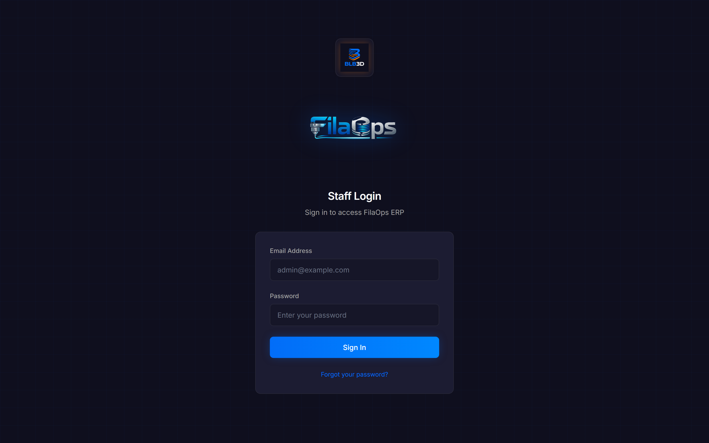
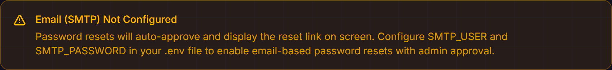
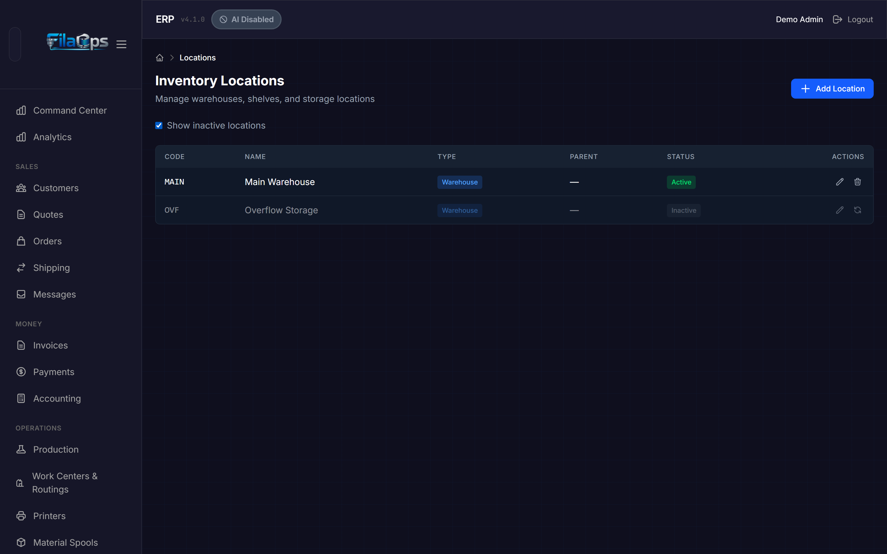
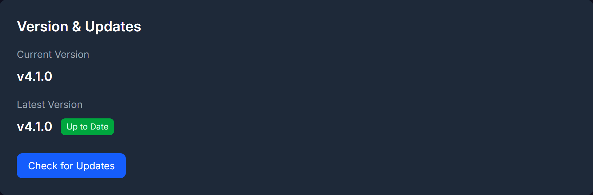

# Troubleshooting

Common problems and how to fix them.

This page covers the issues operators encounter most often in FilaOps Core. If you do not find your answer here, search open issues at [github.com/BLB3DPrinting/filaops/issues](https://github.com/BLB3DPrinting/filaops/issues).

---

## Installation & Startup

### Backend won't start

**Symptom:** Errors when running `uvicorn app.main:app` or `docker compose up`.

| Check | Fix |
|-------|-----|
| Python version | FilaOps requires Python 3.11 or newer. Run `python --version` to confirm. |
| Virtual environment | Activate your venv first — you should see `(venv)` in your prompt. |
| Missing dependencies | Run `pip install -r requirements.txt` inside the activated venv. |
| Database not running | Confirm PostgreSQL is up with `pg_isready`. |
| Wrong `DATABASE_URL` | Open `backend/.env` and verify the URL points to the correct host, port, database name, and credentials. |
| Port already in use | Another process holds port 8000. Stop it or start FilaOps on a different port: `uvicorn app.main:app --port 8001`. |

### Frontend won't start

**Symptom:** `npm run dev` fails, or the browser shows a blank page or network error.

| Check | Fix |
|-------|-----|
| Node.js version | FilaOps requires Node.js 18 or newer. Run `node --version`. |
| Missing packages | Run `npm install` in the `frontend/` directory. |
| Backend not running | The frontend proxies all `/api/v1/…` calls to the backend. Start the backend first. |
| Port in use | Vite defaults to port 5173 but picks another if that is taken. Check the terminal output for the actual URL. |

### Database migration errors

**Symptom:** The backend starts but returns 500 errors, or you see `column does not exist` / `table does not exist` messages in the logs.

1. Confirm the database exists: `createdb filaops` (or the name in your `.env`).
2. From the `backend/` directory, run: `alembic upgrade head`
3. If the command fails, verify that `DATABASE_URL` in `.env` is correct and that PostgreSQL is reachable.

!!! warning "Never use `alembic stamp` to skip migrations"
    Stamping the revision without running the DDL leaves the schema out of sync with the code. This causes silent data loss and hard-to-diagnose errors. Always run `alembic upgrade head` and resolve any errors properly.

### Checking system health

FilaOps exposes an unauthenticated health endpoint you can probe from a browser, `curl`, or a monitoring tool:

```
GET /api/v1/system/health
```

A healthy response looks like:

```json
{
  "status": "healthy",
  "version": "4.1.0",
  "timestamp": "2024-01-15T10:30:45Z",
  "database_connected": true,
  "services": {
    "database": "connected",
    "version_manager": "operational",
    "update_checker": "ready"
  }
}
```

If `status` is `"degraded"`, the database connection failed — `database_connected` will be `false`. If `status` is `"error"`, an unhandled exception occurred during the health check; the `error` field contains details. In both cases, check your `DATABASE_URL`, firewall rules, and that the PostgreSQL service is running.

---

## Login & Authentication

### Can't log in

| Check | Fix |
|-------|-----|
| Email, not username | FilaOps uses your **email address** as the login identifier, not a username. |
| Wrong password | Click **Forgot Password** on the login page, or ask an admin to reset it from **Admin > Team Members**. |
| Account inactive | Your account status may be `inactive` or `suspended`. Check with an administrator. |
| Cookies blocked | FilaOps stores session tokens in httpOnly cookies. Make sure your browser allows cookies from the FilaOps domain. |
| Rate limit hit | The login endpoint allows 5 attempts per minute per IP. Wait 60 seconds and try again. |



### Session expired unexpectedly

FilaOps uses rotating refresh tokens. When the app silently refreshes your session, the old token is revoked and a new one is issued automatically.

Common causes of unexpected logouts:

- **System clock skew** — JWT signatures include timestamps. A large time difference (more than a few minutes) between client and server invalidates tokens. Sync both clocks with NTP.
- **Multiple tabs sharing a cookie** — Logging out in one tab revokes the refresh token and logs out all other tabs that share the same cookie.
- **Admin password reset** — When an admin resets your password, all your existing refresh tokens are immediately revoked. Log in again with the new password.
- **Stale cookie** — Clear cookies for the FilaOps domain in your browser and log in again.

### Password reset says "submitted for review" but no email arrives

This is expected behavior. The reset form deliberately returns the same success message whether or not the email address exists in the system, to prevent account enumeration (OWASP A07:2021). If no account matches the email you entered, no email is sent and no error is shown.

To confirm the email address on the admin account, query the database directly:

```sql
SELECT email FROM users WHERE account_type = 'admin';
```

### Password reset shows "Request validation failed"

The `email-validator` library rejects `.local` domains (RFC 6762 reserved). If your account uses an address like `admin@myserver.local`, the reset form will reject it.

**Fix:** Use a standard TLD for all user accounts. For development, `admin@example.com` works.

### Forgot password when SMTP is not configured

When `SMTP_USER` and `SMTP_PASSWORD` are not set in your `.env`, the password reset flow auto-approves the request and displays the reset link directly on the Forgot Password page. No email is sent. Copy the link and open it in the same browser to set a new password.

!!! warning "Auto-approve is a development convenience only"
    Without SMTP, admin approval is bypassed. Anyone who can reach the Forgot Password page can reset any account without admin involvement. Configure SMTP before going to production.
    The Settings page shows an amber warning banner when SMTP is not configured.



### Locked out of the admin account on a dev database

If no users can log in and the setup wizard does not appear (because users already exist in the database), see the [First-Run Setup Guide](../FIRST-RUN-SETUP.md#dev-environment-resetting-admin-credentials) for recovery options including direct database credential reset.

---

## Command Center

### Command Center shows all zeros

The Command Center (the home screen at `/admin`) reflects real transactions. On a fresh install there is nothing to show until you create orders, run production, and record inventory activity.

- Complete [first-day setup](first-day.md) and create at least one order, one production order, and one inventory receipt to populate the summary cards and action items.
- The **Today's Summary** cards use today's activity (for example, Shipped Today). On a quiet day they may simply read zero.

### Command Center is unresponsive or returns no results

The Command Center (the default landing page at `/admin`) searches across customers, orders, quotes, items, and production orders.

- Searches require at least 2 characters.
- The backend must be running — the Command Center issues API requests on every keystroke.
- Open your browser's developer tools (**F12 → Network** or **Console**) and look for failed requests or 401 responses.

---

## Orders & Quotes

### Quote won't convert to a sales order

A quote must be in **Pending** or **Accepted** status to be converted. Quotes in **Draft**, **Rejected**, or **Cancelled** status cannot be converted.

Also verify:

- Every line item has a product name and a non-negative unit price.
- The customer record is saved (at minimum a customer name or email is required).

### Sales order stuck in "Confirmed" status

FilaOps does not advance order status automatically. The full status progression is:

```
Confirmed → In Production → Ready to Ship → Shipped → Delivered / Completed
```

From **Confirmed** you can transition to **In Production** (by linking a production order), **Ready to Ship** (if no production is needed), or **On Hold**.

If the order stays at Confirmed, either:

1. Create and complete a production order linked to this sales order, or
2. If no production is needed, manually advance the status to **Ready to Ship** on the order detail page.

See [Quote to Cash](workflows/quote-to-cash.md) for step-by-step guidance.

### Payment not appearing in Payments or Accounting

Payments are tied to specific sales orders. Check:

1. Open the order in **Admin > Orders** and look for the Payments section on the order detail page.
2. If no payment is recorded there, it will not appear in **Admin > Payments** or in accounting reports.
3. Verify the payment date falls within the date range filter you have applied.

!!! note
    Revenue is recognized when an order is marked **Shipped**, not when it is paid. An unshipped order with a recorded payment will appear in Payments but not yet in the Sales Journal.

---

## Inventory

### Item shows the wrong quantity

Inventory quantities are computed from the transaction ledger. If a quantity looks wrong:

1. Go to **Admin > Inventory > Transactions** and filter by the item.
2. Look for duplicate receipts, missing consumption records, or incorrect manual adjustments.
3. Use a cycle count (**Admin > Inventory > Cycle Count**) to post a reconciliation transaction that corrects the on-hand quantity.

### Inventory reconciliation report shows drift

If the Inventory Reconciliation report shows that `stored_on_hand` does not match the ledger sum for an item, the stored quantity has drifted from what the transaction ledger computes. Use a physical count via **Inventory > Cycle Count** to post a reconciliation transaction and bring them back in line.

!!! warning "Do not use 'Baseline to stored' in production"
    The **Baseline to stored** option on the reconciliation page stamps the epoch without writing ledger rows. It is intended for development and test environments only. Using it in production silently masks a real discrepancy without correcting it.

### Location not appearing in dropdowns

Locations must be **Active** to appear in dropdowns anywhere in the app. If a location is missing:

1. Go to **Admin > Inventory > Locations**.
2. Check the **Show inactive locations** checkbox.
3. Find the location and click the reactivate action.



### Spool tracking shows incorrect weight

Material spool quantities update when production orders consume filament. Common causes of discrepancy:

- **BOM quantity wrong** — If the Bill of Materials specifies the wrong filament amount per unit, every production order consumes the wrong amount. Edit the BOM at **Admin > Bill of Materials**.
- **UOM mismatch** — Filament BOMs should use grams. Verify the unit of measure on the BOM line.
- **Use outside FilaOps** — Test prints and waste are not tracked automatically. Create a manual adjustment in **Admin > Inventory > Transactions** to account for them.

---

## Production

### Can't start (release) a production order

Production orders follow a strict status flow. You must release a Draft order before it can move to In Progress:

```
Draft → Released → In Progress → Complete
                ↘          ↘
              On Hold    On Hold
```

If the release button is unavailable:

- Confirm the order is in **Draft** status.
- Confirm the product has a Bill of Materials or at least one routing operation.
- Material shortages are warnings, not blockers — you can release an order even when materials are short.

### Production order won't complete

To mark an order **Complete**, all routing operations must be in a terminal state (**Complete** or **Skipped**). If the Complete button is not available:

1. Open the production order detail page (**Admin > Production > [order number]**).
2. Review each operation in the Operations list.
3. Mark remaining operations as Complete or Skipped.

If the order has no routing operations, it can be completed directly.

### Production order is in "Short" status

**Short** means the order finished but produced fewer units than planned. You must make an explicit decision before FilaOps can close the order:

- Click **Accept Short** to finalize the order at the quantity actually produced.
- Create a follow-up production order for the remaining quantity if you need to fulfill the rest.

A Short order cannot transition to Complete until the accept-short action is taken.

### COGS not calculating correctly

Cost of Goods Sold is calculated from the BOM at the time of production. If COGS looks wrong:

- Verify the BOM has every material with the correct quantity at **Admin > Bill of Materials**.
- Check that each material's unit cost is current in **Admin > Items**.
- COGS captures costs **at the time of production**. Retroactive cost changes do not affect completed orders.

---

## Purchasing

### Purchase order won't save or submit

A purchase order requires at minimum:

- A vendor selected.
- At least one line item with a product and a `quantity_ordered` greater than zero.
- A `unit_cost` greater than zero on each line.

### Received quantities do not appear in inventory

When you receive a PO, FilaOps posts an inventory receipt transaction for the received quantity. If inventory did not update:

1. Open the PO in **Admin > Purchasing**.
2. Click **Receive** and confirm the quantity you entered is correct.
3. Verify the inventory location on the PO line — received goods are posted to that location, not necessarily the default warehouse.
4. Go to **Admin > Inventory > Transactions** and filter by the item to confirm the receipt transaction was posted.

---

## MRP

### MRP run shows no planned orders

MRP generates purchase and production suggestions only when there is unmet demand. Check:

- Are there **Confirmed** or **In Production** sales orders with products that have BOMs? MRP works from sales order demand.
- Is the **planning horizon** long enough? The default is 30 days. If all demand is more than 30 days out, increase the horizon in the Run MRP dialog.
- Is **Include Draft Orders** enabled if you want Draft production orders to also contribute to demand?

### MRP suggests materials I already have in stock

MRP nets demand against available supply. If it recommends something you already have:

- Go to **Admin > Items** and confirm the on-hand quantity for that item is correct.
- Check whether those materials are already allocated to another order — allocated stock is not available for netting against new demand.
- If the on-hand quantity is wrong, run a cycle count to correct it, then re-run MRP.

---

## Printers

### Printer shows "Offline"

| Check | Fix |
|-------|-----|
| Power | Is the printer switched on? |
| Network | Is the printer on the same network segment as FilaOps? Ping the printer's IP address to verify. |
| IP address changed | DHCP can reassign the IP after a reboot. Update the IP in **Admin > Printers** or assign a static IP on the printer. |
| API not enabled | Some firmware requires you to explicitly enable the API. Check the printer's web interface. |
| Firewall | Confirm no firewall is blocking traffic between the FilaOps server and the printer. |

!!! note "Core-supported printer brands"
    FilaOps Core supports **Bambu Lab** printers and any **generic** HTTP-accessible printer. Support for additional brands is available in FilaOps PRO.

### MQTT status not updating

If printer status is not updating in real time:

1. Confirm your MQTT broker is running and reachable from the FilaOps server.
2. Verify the MQTT topic configured in FilaOps matches what the printer actually publishes.
3. Check the MQTT broker logs for connection or authentication errors.
4. Use an external MQTT client (for example, MQTT Explorer) to confirm the printer is publishing messages on that topic.

---

## Accounting

### Revenue not appearing in reports

Revenue is recognized when a sales order transitions to **Shipped**, not when the order is created or when a payment is recorded.

1. Confirm the order's status is **Shipped**, **Delivered**, or **Completed**.
2. Check the date range in **Admin > Accounting** — the ship date must fall within the filter period.

### Tax calculations seem wrong

1. Go to **Admin > Settings** and scroll to the **Tax Settings** section.
2. Verify a tax rate exists and one is marked as the default. The default rate applies automatically when no rate is explicitly selected on a quote or order.
3. Tax is calculated on the line item total (quantity × unit price). Confirm your prices are correct.
4. Tax appears in accounting reports only for shipped orders.

### CSV export is empty

CSV exports respect the same date range filter that is active on screen. If the exported file is empty:

- Expand the date range — there may be no transactions in the currently selected period.
- Confirm the table is showing data before you export.

---

## Updates

### Finding your current version

Your FilaOps version is shown at the bottom of the sidebar and on **Admin > Settings** (scroll to the Version & Updates card). You can also query it without logging in:

```
GET /api/v1/system/version
```

This endpoint is unauthenticated and returns the version string, build date, and install method (`docker`, `tauri`, or `manual`).

### "Check for Updates" shows an error

The update checker polls the GitHub Releases API. Errors usually mean:

- The server has no outbound internet access. Check [github.com/BLB3DPrinting/filaops/releases](https://github.com/BLB3DPrinting/filaops/releases) manually.
- GitHub API rate limit reached (60 unauthenticated requests per hour per IP). The backend caches the result for one hour, so this should be rare. Set a `GITHUB_TOKEN` environment variable to raise the limit to 5,000 requests per hour.



---

## Performance

### Pages loading slowly

- **Large result sets** — Use filters and narrow date ranges. Server-side pagination is applied automatically, but a very wide date range can still return many rows.
- **Server resources** — PostgreSQL performance drops when it lacks RAM for its working set. Monitor memory on the host.
- **Network latency** — If FilaOps runs on a remote server, every API call incurs a round-trip. Move the server closer or use a local install.

### Browser tab using excessive memory

- Close FilaOps tabs you are not actively using.
- Refresh the tab — React keeps some accumulated state in memory during long sessions.
- If a specific page is consistently heavy, note the URL and open a report at the [issue tracker](https://github.com/BLB3DPrinting/filaops/issues).

---

## Getting More Help

If you cannot resolve your issue:

1. **Search existing issues** — [github.com/BLB3DPrinting/filaops/issues](https://github.com/BLB3DPrinting/filaops/issues)
2. **Open a bug report** and include:
   - What you were trying to do
   - What happened instead
   - Steps to reproduce
   - Your FilaOps version (from **Admin > Settings** or `GET /api/v1/system/version`)
   - Browser name/version and operating system
3. **Community discussions** — Use the Discussions tab on the GitHub repository for questions that are not bug reports.
