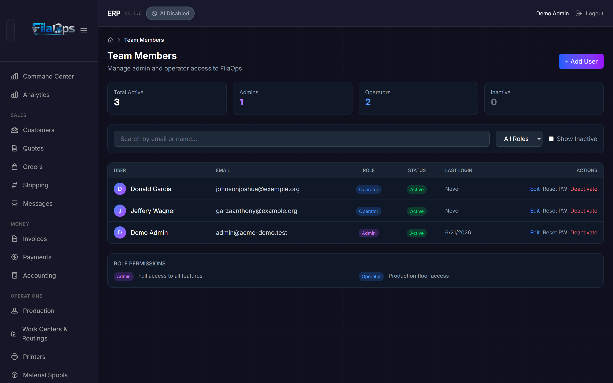
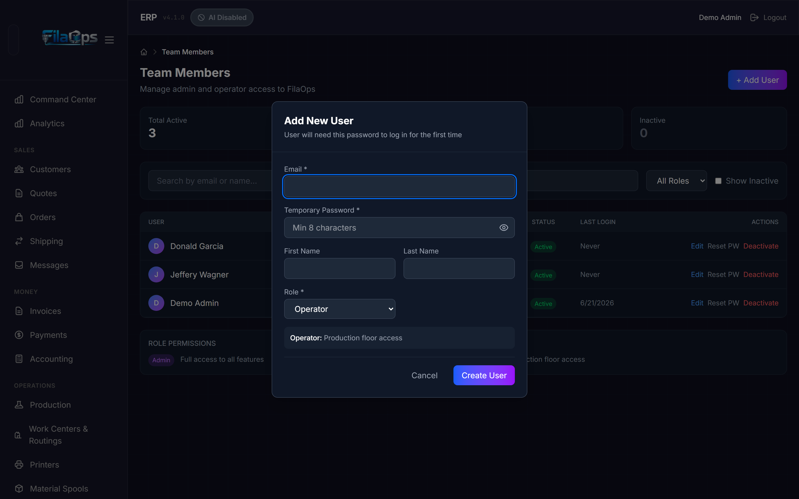
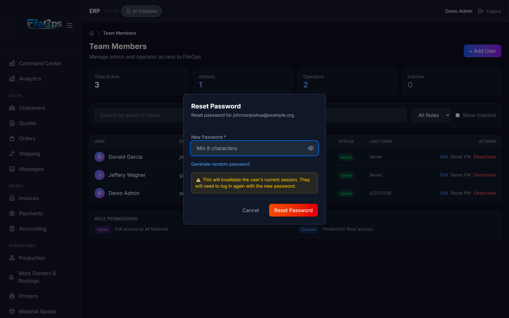
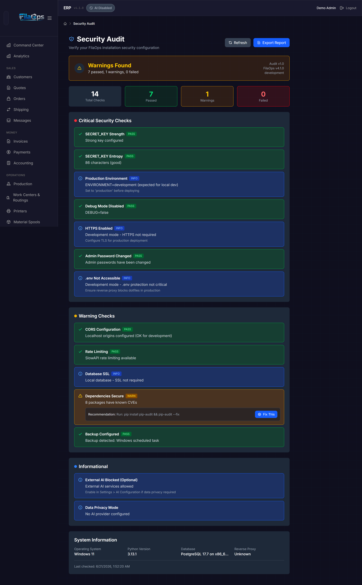

# Users & Permissions

> Control who can access FilaOps and what each person can do.

## What You'll Learn

- The two account types (Admin and Operator) and what each can access
- How to add, edit, and deactivate team members
- How to reset a password and what happens to the user's session
- How to run the built-in Security Audit and export the report

## Prerequisites

- You must be signed in as an **Admin**. Operators cannot access user management.

---

## Understanding Account Types

FilaOps has two account types for internal staff:

| Account Type | Access | Typical User |
|---|---|---|
| **Admin** | Full access — all modules, settings, user management, accounting, security audit | Business owner, office manager |
| **Operator** | Day-to-day operations — orders, production, inventory, printers, quality | Print technician, warehouse staff |

The sidebar automatically hides admin-only sections (ADMIN group, MONEY group) for Operator accounts. Operators cannot reach user management or the Security Audit page at all.

!!! note "Customers are separate"
    Customer portal accounts (B2B portal users) are managed under **Customers**, not **Team Members**. This page covers only Admin and Operator staff accounts.

!!! note "Community tier user limit"
    When licensing enforcement is enabled, the Community tier allows **one active staff user** (the initial admin). All other users require a Professional or Enterprise license. While licensing is currently unenforced in FilaOps Core, you may see a tier-limit error if it is turned on in a future release.

---

## Managing Team Members

Navigate to **Admin > Team Members** in the sidebar.

### Summary Cards

Four cards at the top of the page give a quick headcount:

| Card | What It Shows |
|---|---|
| **Total Active** | All currently active Admins + Operators |
| **Admins** | Active Admin accounts |
| **Operators** | Active Operator accounts |
| **Inactive** | Deactivated or suspended accounts |

### Filtering the List

Three controls sit above the user table:

- **Search field** — filters by email address or display name (first + last name) as you type
- **Role dropdown** — choose **All Roles**, **Admin**, or **Operator**
- **Show Inactive checkbox** — when checked, deactivated and suspended accounts appear in the table

### The User Table

| Column | What It Shows |
|---|---|
| **User** | Avatar initial and display name (or "–" if no name set) |
| **Email** | Login email address |
| **Role** | **Admin** (purple badge) or **Operator** (blue badge) |
| **Status** | **Active** (green), **Inactive** (gray), or **Suspended** (red) |
| **Last Login** | Date of last successful sign-in, or "Never" |
| **Actions** | **Edit**, **Reset PW**, and **Deactivate** / **Reactivate** |

---

## Adding a Team Member

1. Click **+ Add User** (top-right of the Team Members page).

2. Fill in the **Add New User** form:

    | Field | Required | Notes |
    |---|---|---|
    | **Email** | Yes | Must be unique across all accounts. This is the login username. |
    | **Temporary Password** | Yes | Minimum 8 characters. Share this with the new user so they can sign in for the first time. |
    | **First Name** | No | Shown in the user list and navigation bar |
    | **Last Name** | No | Shown in the user list |
    | **Role** | Yes | Select **Admin** or **Operator** |

3. Click **Create User**.

!!! tip "Choose the least-privilege role"
    Start new staff as **Operator** unless they specifically need access to settings, accounting, or user management. You can always promote them later.

!!! warning "Password complexity rules"
    The backend enforces: at least 8 characters, at least one uppercase letter, one lowercase letter, one digit, and one special character (e.g. `!@#$%^&*`). The form shows a minimum-length hint — make sure your temporary password meets all complexity rules or the request will be rejected with a validation error.

---

## Editing a Team Member

1. Find the user in the table and click **Edit**.

2. The **Edit User** form opens. You can update:
    - **Email** (must remain unique)
    - **First Name** / **Last Name**
    - **Role** (Admin or Operator)
    - **Status** (Active, Inactive, or Suspended) — this field appears only when editing an existing user, not when creating one

3. Click **Save Changes**.

!!! warning "Role demotion rules"
    - You cannot demote **yourself** from Admin to Operator. Ask another Admin to make that change.
    - FilaOps will refuse to demote the **last active Admin** account to Operator. Always keep at least two Admin accounts active.

!!! warning "Status changes take effect immediately"
    Setting Status to **Inactive** or **Suspended** via the Edit form has the same effect as clicking Deactivate — the user is signed out of every session immediately (all refresh tokens are revoked).

---

## Resetting a Password

Use this when a team member forgets their password or you need to force a credential change.

1. Find the user in the table and click **Reset PW**.

2. In the **Reset Password** dialog, enter a new password in the **New Password** field.

    

3. Optionally click **Generate random password** to let FilaOps create a secure 12-character password and fill the field automatically.

4. Click **Reset Password**.

5. Share the new password with the user through a secure channel.

!!! warning "All active sessions are revoked immediately"
    Resetting a password revokes all of that user's active refresh tokens. They are signed out of every browser and device and must log in again with the new password.

---

## Deactivating and Reactivating Users

### Deactivating

When a team member leaves or no longer needs access:

1. Find the user in the table.
2. Click **Deactivate**.
3. Confirm the browser prompt.

The account status changes to **Inactive** and all active sessions are revoked. The account and its full history are preserved — this is a soft deactivation, not a deletion.

### Reactivating

To restore a previously deactivated (or suspended) account:

1. Check **Show Inactive** to reveal inactive accounts in the table.
2. Find the user and click **Reactivate**.

The account returns to **Active** and the user can sign in again with their existing password.

!!! note "The Suspended status"
    **Suspended** is available as a data value in the Edit form's Status dropdown but there is no dedicated Suspend button in the UI. To suspend an account, open Edit and set Status to Suspended. Suspended accounts behave identically to Inactive — the user cannot sign in.

---

## Security Audit

Navigate to **Admin > Security Audit** in the sidebar.

The audit runs automatically when you open the page, scanning your FilaOps installation for configuration issues.

### Overall Status

A large status card at the top shows one of three states:

| Status | Color | Meaning |
|---|---|---|
| **All Clear** | Green | Every check passed |
| **Warnings Found** | Yellow | One or more warning-level checks did not pass |
| **Action Required** | Red | One or more critical checks failed |

Four count tiles below show **Total Checks**, **Passed**, **Warnings**, and **Failed**.

### Check Categories

Results are grouped into three sections:

- **Critical Security Checks** — issues to fix before exposing the installation to the internet
- **Warning Checks** — improvements that are recommended but not immediately urgent
- **Informational** — status notes that require no action

Each check shows its **name**, a **status badge** (pass / fail / warn / info), a **message** explaining the result, and — for non-passing checks — a **Fix / Recommendation** block describing what to do.

### "Fix This" — Guided Remediation

For checks that support it, a **Fix This** button appears in the fix block. Clicking it opens a step-by-step remediation modal that can:

- Generate a new `SECRET_KEY` and write it to `backend/.env` automatically
- Install the `slowapi` rate-limiting library via pip
- Scan and upgrade vulnerable Python packages using `pip-audit`
- Configure Caddy as a reverse proxy for HTTPS and create a desktop launcher

!!! warning "Remediation helpers are disabled in production environments"
    The automated Fix This actions are intentionally blocked when `ENVIRONMENT=production` is set in `backend/.env`. In production, apply fixes manually to maintain change control.

### Security Checks Reference

| Check | Category | What It Verifies |
|---|---|---|
| Secret key not default | Critical | `SECRET_KEY` has been changed from any known-weak default values |
| Secret key entropy | Critical | `SECRET_KEY` is long enough to be cryptographically safe |
| Environment is production | Critical | `ENVIRONMENT=production` (not `development`) |
| Debug mode disabled | Critical | `DEBUG` is off so stack traces are not exposed to browsers |
| HTTPS enabled | Critical | Traffic is served over HTTPS (detected via reverse-proxy headers) |
| Admin password changed | Critical | The initial admin password has been changed from the setup default |
| `.env` file not exposed | Critical | The web server blocks direct HTTP access to `.env` files |
| CORS not wildcard | Warning | `ALLOWED_ORIGINS` does not include `*` |
| Rate limiting enabled | Warning | The `slowapi` library is installed and rate limiting is active |
| Database SSL | Warning | The database connection uses SSL/TLS |
| Dependencies secure | Warning | Python packages have no known CVEs (checked via `pip-audit`) |
| Backup configured | Warning | Evidence of a database backup tool or scheduled job |
| External AI blocked | Informational | Whether outbound AI API calls are permitted by settings |
| Data privacy mode | Informational | Whether privacy mode is enabled to limit AI data exposure |

### Re-running the Audit

Click **Refresh** to re-run all checks without leaving the page.

### Exporting the Report

Click **Export Report** to download the full audit results as a timestamped JSON file (`filaops_security_audit_YYYY-MM-DD.json`). The file includes every check result, system information (OS, Python version, database, reverse proxy), and a generation timestamp. Use this for compliance documentation or to share with an IT team.

---

## Best Practices

- **Change the default admin password immediately after setup.** The Security Audit flags this as a critical failure.
- **Give each person their own account.** Shared credentials prevent meaningful audit trails.
- **Keep at least two active Admin accounts.** If the only admin is locked out, password reset requires direct database access.
- **Deactivate, do not delete.** Deactivating preserves all activity history. There is no delete button by design.
- **Run the Security Audit after any server change** — new deployment, updated configuration, certificate renewal — to catch regressions before they become incidents.

---

## Quick Reference

| Task | Where to Find It |
|---|---|
| View team members | **Admin** > **Team Members** |
| Add a new user | **Admin** > **Team Members** > **+ Add User** |
| Change a user's role or status | **Admin** > **Team Members** > **Edit** |
| Reset a password | **Admin** > **Team Members** > **Reset PW** |
| Deactivate an account | **Admin** > **Team Members** > **Deactivate** |
| Reactivate an account | Check **Show Inactive** then click **Reactivate** |
| Run security audit | **Admin** > **Security Audit** |
| Refresh security audit | **Admin** > **Security Audit** > **Refresh** |
| Export security report | **Admin** > **Security Audit** > **Export Report** |

---

## What's Next?

- [System Settings](system-settings.md) — company information, tax rates, and email configuration
- [Installation and Setup](installation.md) — server-level configuration that affects most security checks
- [Your First Day](first-day.md) — initial setup walkthrough including creating the first admin account
