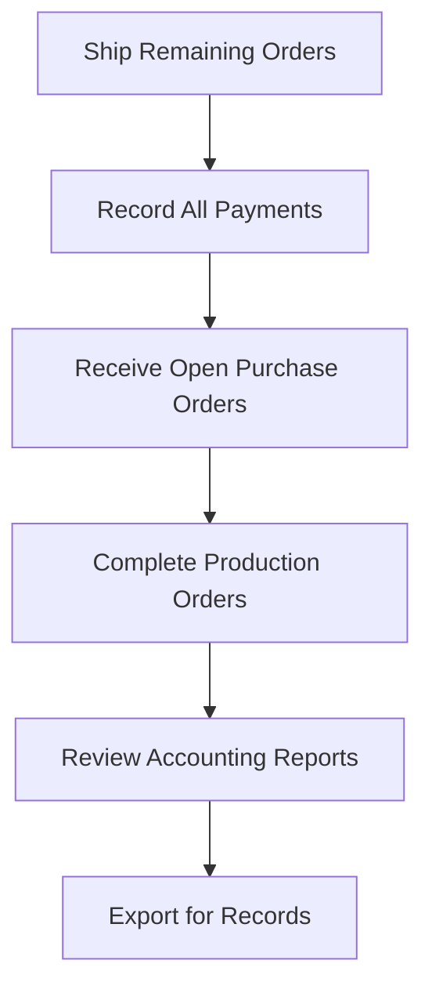

# Month-End Close

A step-by-step checklist for closing your books at the end of each accounting period.

This workflow ensures every transaction that belongs to the month is recorded before you move on.
Follow the steps in order — each step cleans up the data that the next one reviews.

!!! note "Admin-only pages"
    The MONEY group (Invoices, Payments, Accounting) and several pages referenced below are
    only visible to users with the **Admin** account type. Staff-level users will not see them
    in the sidebar.

!!! warning "GL Reports and Periods tabs require FilaOps Pro"
    The **GL Reports** tab (Trial Balance, Inventory Valuation, Transaction Ledger) and the
    **Periods** tab (fiscal period close/lock) are **Pro-tier features** and are not covered
    here. Core users export CSVs and close periods manually outside FilaOps.

---

## The Flow

---

## Step 1 — Ship Remaining Orders

Revenue is recognized at shipment (accrual accounting, per GAAP). Any order still in
**Confirmed** or **In Progress** status at month-end will not show up in your revenue
reports until it ships.

**Where:** Sidebar → SALES > **Orders**

1. Scan orders with status **Confirmed** or **In Progress**.
2. For any order physically delivered this month but not yet shipped in FilaOps, open the
   order and mark it shipped now.
3. The ship date is recorded at the moment you click **Ship**. If the delivery occurred
   earlier in the month, the revenue still falls in the correct calendar month as long as
   you mark it shipped before midnight on the last day.

!!! warning "Ship dates are immutable"
    FilaOps uses the timestamp at the time you click **Ship** for revenue recognition.
    You cannot change it afterwards. If a shipment genuinely occurred in a prior month,
    note it in the order's internal notes and flag it for your accountant.

!!! note "Orders vs. Invoices"
    The **Invoices** page (MONEY > Invoices) shows the same orders formatted as
    invoice documents. Shipping an order is the trigger for revenue recognition —
    not creating an invoice. Invoices are a separate document step.

**Details:** [Taking and Fulfilling Orders](../orders.md)

---

## Step 2 — Record All Payments

The Payments page only reflects cash you have explicitly recorded. If a bank transfer
cleared or a check was deposited this month, enter it now.

**Where:** Sidebar → MONEY > **Payments** (admin only) — or open an individual order
and click **Record Payment** from the order detail.

1. Go to **MONEY > Payments** and check the date range for the full month. Any gap
   between what you expect and what is listed points to payments you still need to record.
2. Alternatively, go to **SALES > Orders**, filter for **Payment Status = Unpaid** or
   **Partial**, open each order, and click **Record Payment**.
3. In the modal, enter the amount, payment method (Cash, Check, Credit Card, Wire, etc.),
   and any transaction reference.
4. For refunds, click **Record Refund** and enter the amount as a positive number — the
   type field marks it as a refund automatically.

**Details:** [Payments](../payments.md)

---

## Step 3 — Receive Open Purchase Orders

Material expenses are recorded when you receive a purchase order. Any PO not yet
received will understate your inventory and overstate your cash position for the month.

**Where:** Sidebar → PURCHASING > **Purchasing** → Purchase Orders tab

1. On the **Purchase Orders** tab, filter for POs with status **Ordered** or **Partial**.
2. For any deliveries received this month but not yet processed, open the PO and click
   **Receive**.
3. Enter the quantities actually received and confirm.
4. Receiving a PO updates on-hand quantities and records the material cost.

!!! note "Partial deliveries"
    If a vendor shipped only part of the order, receive what arrived. The remainder stays
    open and carries forward to next month — that is correct behavior.

**Details:** [Ordering Supplies](../purchasing.md)

---

## Step 4 — Complete Production Orders

Open production orders that are genuinely finished need to be closed so their costs
move from Work-in-Progress (WIP) to Finished Goods.

**Where:** Sidebar → OPERATIONS > **Production**

1. Filter the production queue for orders with status **In Progress**.
2. For any job that finished this month, open it and click **Complete**.
3. For any job that failed or was abandoned, click **Scrap** and select a scrap reason.
4. Leave jobs that are genuinely still running open — they carry forward correctly.

!!! warning "Only close orders that are physically done"
    Closing a production order finalizes all its material consumption and labor. Do not
    close prematurely.

**Details:** [Running Production](../production.md)

---

## Step 5 — Review Accounting Reports

With all transactions recorded, go to **MONEY > Accounting** and review each tab for the
month's activity.

**Where:** Sidebar → MONEY > **Accounting** (admin only)

The Accounting page has five tabs available in Core:

| Tab | Purpose |
| --- | --- |
| Dashboard | Month-to-date snapshot across seven KPI cards |
| Sales Journal | Line-by-line list of every shipped order in a date range |
| Payments | Cash collected, broken down by payment method |
| COGS & Materials | Direct material costs and gross margin for shipped orders |
| Tax Center | Tax collected by rate, with export for filing |

### Dashboard tab

The Dashboard gives a snapshot of the current month-to-date position:

| Card | What it shows |
| --- | --- |
| Revenue MTD | Revenue recognized at shipment (excludes tax), month-to-date |
| Revenue YTD | Year-to-date shipped revenue |
| Cash Received MTD | Actual payments collected this month (cash basis) |
| Accounts Receivable | Outstanding balance owed by customers |
| Sales Tax Liability MTD | Tax collected on shipped orders — a liability, not revenue |
| COGS MTD | Direct material costs of shipped goods |
| Gross Profit MTD | Revenue minus COGS, with gross margin percentage |

Check that Revenue MTD matches the orders you know shipped this month, and that the
gross margin percentage is consistent with prior months. A large swing usually means
a cost was mis-categorized or a shipment was recorded twice.

### Sales Journal tab

1. Set **Start Date** to the first of the month and **End Date** to the last day.
2. The summary row shows **Orders**, **Subtotal**, **Tax**, **Shipping**, and
   **Grand Total** for the period.
3. Scan the entry rows — each row is a shipped order. Verify the **Status** column
   (shipped/completed) and the **Payment Status** column (paid/partial/unpaid).
4. If an order appears that should not be in this period, its ship date is incorrect —
   investigate before closing.

### Payments tab

1. Set the date range to the full month.
2. The summary cards show total **Payments**, **Refunds**, and **Net** received, plus a
   **Transactions** count.
3. Expand the **By Payment Method** section and compare each method's total against
   your bank statement or payment processor report.
4. Each row in the table shows a **Payment #**, the linked order, **Method**, **Amount**,
   and **Type** (payment or refund).

### COGS & Materials tab

1. Use the **Period** dropdown to select **Last 30 days** (or the range that best aligns
   with the calendar month).
2. The summary cards show **Orders Shipped**, **Revenue**, **Total COGS**, and
   **Gross Profit** for the period.
3. The **COGS Breakdown** panel splits total COGS into **Materials**, **Labor**, and
   **Packaging**.
4. Shipping expense, if any, appears below the COGS total as an operating expense
   (not in COGS).

### Tax Center tab

1. Set the **Period** dropdown to **This Month**.
2. The **Tax Collected** card shows the amount you owe your tax authority for the period.
   Note this figure before you file.
3. If the **Pending Tax** card is visible, it shows tax on orders that have not yet
   shipped — these carry into next month when those orders ship.
4. The **By Tax Rate** table breaks down collections across each rate you charge.
5. Select **This Quarter** or **This Year** to see the **Monthly Breakdown** table,
   which gives a month-by-month history.

!!! note "Tax is recognized at shipment"
    FilaOps uses accrual accounting — tax liability is triggered when an order ships,
    not when payment is received. The Tax Center reflects shipped orders only.
    Pending tax on unshipped orders is shown separately.

**Details:** [Accounting](../accounting.md)

---

## Step 6 — Export for Records

Download your reports before closing the period. These files serve as your audit trail
and as source documents for your accountant or bookkeeper.

**Where:** Sidebar → MONEY > **Accounting** tabs — look for the export button on each tab

| Report | Tab | Button label | Saved filename pattern |
| --- | --- | --- | --- |
| Sales Journal | Sales Journal | **Export CSV** | `sales-journal-{start}-to-{end}.csv` |
| Payments Journal | Payments | **Export CSV** | `payments-journal-{start}-to-{end}.csv` |
| Tax Summary | Tax Center | **Export for Filing** | `tax-summary-{period}.csv` |

Each CSV starts with a disclaimer header reminding you that the file is for reference
only and should be verified with a qualified accountant before use in tax filings.

!!! tip "Share with your bookkeeper"
    These three files give a bookkeeper everything they need to reconcile the month
    without direct access to FilaOps. Save them to a folder organized by year and month,
    for example `2026/06-June/`.

---

## Month-End Checklist

Copy this checklist into your monthly close document:

- [ ] All orders delivered this month are marked **Shipped** in FilaOps
- [ ] All payments received this month are recorded via **Record Payment**
- [ ] All material deliveries processed via **Receive** on their purchase orders
- [ ] Completed production jobs marked **Complete**; failed jobs marked **Scrap** with a reason
- [ ] Accounting **Dashboard** reviewed — Revenue MTD and Gross Profit look reasonable
- [ ] **Sales Journal** reviewed for the full month — order count and totals match expectations
- [ ] **Payments** tab reconciled against bank statement by payment method
- [ ] **COGS & Materials** reviewed — gross margin percentage consistent with prior months
- [ ] **Tax Center** Tax Collected figure noted for remittance
- [ ] Sales Journal CSV exported and saved
- [ ] Payments Journal CSV exported and saved
- [ ] Tax Summary CSV exported and saved
