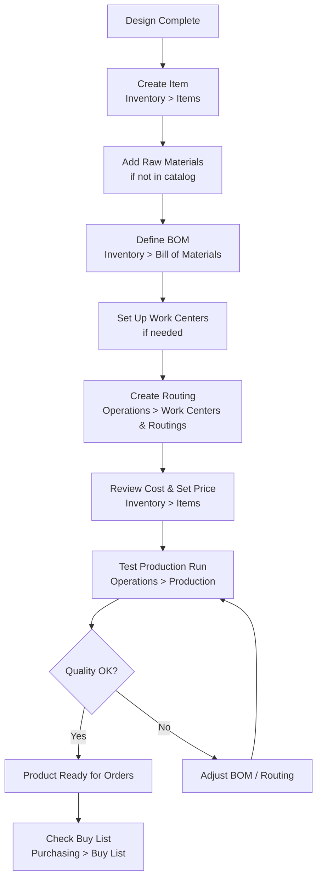

# New Product Launch

Everything you need to set up a new product in FilaOps Core — from item creation through the first production run.

---

## The Flow

!!! note "One-time vs. per-product setup"
    Work Centers (printers, assembly stations, etc.) are set up once per shop. If your shop is already configured, skip to [Step 3](#step-3-define-the-bill-of-materials).

---

## Step 1: Create the Item

Add the finished product to your item catalog.

**Where:** **Inventory > Items**, then click **+ New Item**

1. Enter a **Name** (required). Leave **SKU** blank to let FilaOps auto-generate one, or type your own.
2. Set **Item Type** to **Finished Good**.
3. Set **Procurement Type** to **Make (Manufactured)** — this tells MRP that this item is produced in-house.
4. Choose a **Unit of Measure** (e.g., `EA` for each, `G` for grams).
5. Optionally enter a **Category**, **Selling Price**, and **Standard Cost**.
6. Click **Save**.

!!! tip "Stocking policy"
    Under **Stocking Policy**, choose **On-Demand (MRP-driven)** if you only build to order, or **Stocked (Reorder Point)** if you keep finished inventory on the shelf. You can change this later.

!!! warning "Add materials to the catalog first"
    If any raw material your product uses does not yet exist in Items, add it now (Item Type = **Material**, Procurement Type = **Buy**). The BOM form will not let you add a line for an item that does not exist. Use **+ New Material** on the Items page for a faster material-only shortcut form.

---

## Step 2: Confirm Work Centers Exist

Routings reference work centers. If your shop's work centers are already defined you can skip this step.

**Where:** **Operations > Work Centers & Routings**, then the **Work Centers** tab

1. Click **+ Add Work Center**.
2. Enter a **Code** (e.g., `FDM-POOL`) and **Name** (e.g., `FDM Printer Pool`).
3. Set **Type** (`machine`, `station`, or `labor`), **Capacity Hours/Day**, and rate fields (**Machine Rate/Hr**, **Labor Rate/Hr**, **Overhead Rate/Hr**). These rates drive automatic cost calculation on routing operations.
4. Save. Optionally add individual **Resources** (specific printers or machines) under the work center card using **+ Add Resource**.

!!! tip "Printer setup shortcut"
    On the Work Centers tab, use the **Printer Setup** button to register Bambu Lab printers by serial number and IP address. FilaOps automatically adds them as resources in the FDM-POOL work center.

---

## Step 3: Define the Bill of Materials

The BOM lists every component and material consumed to produce one unit of the finished good. It drives cost roll-up and purchasing.

**Where:** **Inventory > Bill of Materials**, then click **+ New BOM**

1. In the **Create BOM** dialog, select your new product from the **Product** dropdown.
2. Optionally enter a **Name** and **Revision** (defaults to `1.0`).
3. Click **Create**. FilaOps opens the BOM detail view.
4. Click **Add Component**, search for and select the first material or sub-component.
5. Enter the **Quantity** needed per unit of finished product.
6. Repeat for each component.

!!! note "Sub-assemblies"
    If a component is itself a manufactured item with its own BOM, FilaOps rolls up its cost automatically. Use **Explode** in the BOM detail toolbar to inspect the full multi-level tree.

!!! tip "Recalculate cost after component price changes"
    The BOM detail page shows the rolled-up **Material Cost**. If you update a component's standard cost later, click **Recalculate** on the BOM to refresh the total.

!!! note "Copying an existing BOM"
    If your new product is similar to an existing one, use the **Copy BOM** action in the BOM detail to clone it to the new product, then adjust line quantities.

---

## Step 4: Create a Routing

A routing defines the production steps (operations) and the work center that performs each one. Operation times and work center rates combine to produce a labor cost that rolls into the product's standard cost.

**Where:** **Operations > Work Centers & Routings**, then the **Routings** tab, then click **+ Create Routing**

Alternatively, the **BOM detail view** contains an embedded **Routing** section. Click **Edit Routing** there to open the same editor without leaving the BOM page.

### Using a Template (Recommended)

FilaOps ships two built-in routing templates:

- **Standard Flow** — Print → QC → Pack → Ship
- **Assembly Flow** — Print → QC → Assemble → Pack → Ship

In the Routing Editor, pick a template from the **Apply Template** dropdown and select your product. FilaOps copies the template operations onto a product-specific routing. Adjust times on each copied operation to match your estimates.

### Building a Custom Routing

1. Select the **Product** for this routing.
2. Click **+ Add Operation** for each production step.
3. For each operation, fill in:
   - **Operation Code** and **Operation Name** (e.g., `PRINT` / `FDM Print`)
   - **Work Center** — links the operation to the work center's cost rates
   - **Sequence** — controls execution order
   - **Setup Time (min)** and **Run Time (min)** per unit
   - Optionally: **Wait Time**, **Move Time**, **Units per Cycle**, **Scrap Rate %**
4. Save the routing.

!!! note "Runtime source"
    For print operations, you can set **Runtime Source** to `slicer` and enter the slicer-estimated print time in **Run Time (min)**. This keeps estimates accurate and makes it easy to update them when the slicer file changes.

!!! tip "Operation materials"
    Each operation can list its own consumables (e.g., support resin used during post-processing). Click **Add Material** on an operation row to attach them. These appear as **Op Materials** cost in the BOM detail view and count toward the total standard cost.

---

## Step 5: Review Cost and Set the Selling Price

After BOM and routing are saved, FilaOps can compute the product's full standard cost.

**Where:** **Inventory > Items**, toolbar button **Recost All**; then edit the item for **Selling Price**

1. On the Items page, click **Recost All** (top-right toolbar). FilaOps walks every manufactured item and rolls up BOM material cost + routing labor cost + operation material cost into **Standard Cost**.
2. Open your new product. The BOM detail (**Inventory > Bill of Materials**) also shows the cost breakdown:
   - **Material Cost** — sum of BOM component costs
   - **Labor** — routing operations × work center rates
   - **Op Materials** — operation-level consumables (if any)
3. Edit the item and set **Selling Price** to your target price. Verify the margin is acceptable.

!!! tip "Suggest Prices"
    After recosting, click **Suggest Prices** on the Items toolbar to generate margin-based price suggestions across your catalog. Review and apply the ones that make sense.

---

## Step 6: Test Production Run

Before accepting customer orders, run a small test batch to validate BOM quantities and routing times.

**Where:** **Operations > Production**, then click **+ New Production Order**

1. Select your new product and enter a small **Quantity** (1–3 units).
2. Set a **Due Date** and click **Create**.
3. Open the order. FilaOps shows operations in sequence. For each operation:
   - Click **Start** when work begins.
   - Note actual material usage compared to BOM quantities.
   - Click **Complete** when finished (or follow the QC inspection flow if you have a QC step).
4. Complete the production order once all operations are done.

!!! note "Scheduling"
    From the Production page you can switch to the **Scheduler** (Gantt board) to assign operations to specific resources and time slots. For a quick test run you can skip formal scheduling and execute operations manually in the queue.

---

## Step 7: Adjust Based on Test Results

Compare actuals from the test run to your BOM and routing estimates:

| What to check | Where to adjust |
|---|---|
| Material quantities (used more or less than BOM) | **Inventory > Bill of Materials** — edit BOM line quantities |
| Operation times (took longer or shorter) | **Operations > Work Centers & Routings > Routings** — edit operation **Run Time** or **Setup Time** |
| Scrap higher than expected | Routing operation **Scrap Rate %** field |
| Selling price needs revision | **Inventory > Items** — edit **Selling Price**; run **Recost All** first |

After any BOM or routing change, run **Recost All** again to keep standard cost current.

---

## Step 8: Check the Buy List

With a new product ready for orders, confirm you have enough raw materials on hand to fulfill upcoming demand.

**Where:** **Purchasing > Buy List**

The Buy List nets all open demand (production orders and sales orders) against available inventory and tells you exactly what to buy, in what quantity, and by when. Any shortage row includes a **Create PO** button that opens the Purchase Order form pre-filled with the item and suggested quantity.

!!! note "Low Stock tab"
    The **Purchasing > Low Stock** tab separately surfaces items below their reorder point (independent of open orders). Check it too if any of your new product's materials use the **Stocked** reorder policy.

---

## Quick Checklist

- [ ] Finished good item created (Type = **Finished Good**, Procurement = **Make (Manufactured)**)
- [ ] All raw materials exist in the item catalog
- [ ] BOM created with accurate per-unit quantities
- [ ] Work centers configured with correct rate fields
- [ ] Routing created with operations, work center assignments, and time estimates
- [ ] **Recost All** run — standard cost reflects BOM + routing
- [ ] Selling price set and margin verified
- [ ] Test production order completed
- [ ] BOM and routing adjusted based on actual test results
- [ ] **Recost All** run again after adjustments
- [ ] Buy List checked — no unexpected material shortages
- [ ] Product ready for sales orders
