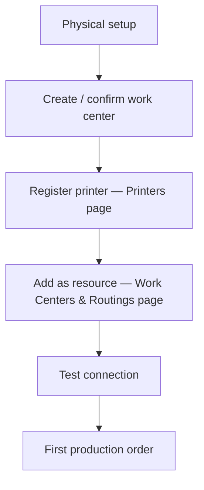

# Onboarding a Printer

> Add a new 3D printer to FilaOps — from physical installation through your first tracked production order.

This workflow walks you through every step, in order. By the end, the printer exists in FilaOps, belongs to a work center, and appears in production scheduling.

---

## Concepts: two registries, one printer

FilaOps keeps two separate records for each physical machine:

| Record | Where it lives | What it does |
|---|---|---|
| **Printer** | **Printers** page | Network identity, status polling, maintenance history |
| **Resource** | **Work Centers & Routings** page | Scheduling capacity — how many hours/day this machine contributes to a work center |

You must create both and link them for the printer to receive scheduled production orders. The Printer record is the "hardware identity"; the Resource record is the "scheduling slot."

!!! note "What is a work center?"
    A work center is a logical group of machines that share a capacity budget, hourly rate, and scheduling priority — for example, "FDM Printer Pool." Production routing operations are assigned to work centers, not individual printers. Machines inside the work center receive the actual jobs.

---

## The flow



---

## Step 1: Physical setup

Before touching FilaOps, verify the hardware is ready:

1. Assemble and level the printer per the manufacturer's instructions.
2. Run the manufacturer's test print to confirm the hardware is working.
3. Connect the printer to your facility network (Ethernet or Wi-Fi) and note the IP address.

!!! tip "Use a static IP address"
    Assign a static IP — either on the printer itself or via a DHCP reservation in your router. FilaOps identifies printers by IP address, so a changing address will break status polling after a power cycle.

---

## Step 2: Create (or confirm) a work center

Every printer must be placed inside a work center before it can receive scheduled work. If a suitable work center already exists, skip to Step 3.

**Where:** **Work Centers & Routings** in the sidebar.

1. Click **+ New Work Center**.
2. Fill in the form:

| Field | Notes |
|---|---|
| **Code** | Short all-caps identifier — e.g., `FDM-POOL` |
| **Name** | Human-readable — e.g., "FDM Printer Pool" |
| **Type** | Select **Machine Pool** for a group of printers |
| **Hours/Day** | Total capacity (can exceed 24 for multiple machines — e.g., 5 printers × 20 hrs = 100) |
| **Machine rate/hr** | Optional: depreciation cost per hour |
| **Labor rate/hr** | Optional: operator cost per hour |
| **Overhead rate/hr** | Optional: use **Calculate** to derive from printer cost, lifespan, electricity, and maintenance |

3. Click **Create Work Center**.


!!! tip "Overhead calculator"
    The **Calculate** link next to the Overhead field opens a built-in calculator. Enter printer cost, expected lifespan in years, hours/day, electricity rate ($/kWh), wattage, and annual maintenance cost — FilaOps computes the overhead rate and pre-fills the field.

---

## Step 3: Register the printer

**Where:** **Printers** in the sidebar, then click **Add Printer**.

=== "Manual entry"

    1. Click **Add Printer** (top-right of the page).
    2. Fill in the form:

    | Field | Required | Notes |
    |---|---|---|
    | **Brand** | Yes | **BambuLab** or **Generic/Manual** on Core tier. (Klipper, OctoPrint, Prusa, Creality require PRO.) |
    | **Model** | Yes | Select from the dropdown (BambuLab) or type a model name (Generic) |
    | **Code** | Yes | Unique identifier — e.g., `PRT-001`. Click **Auto** to generate the next sequential code. |
    | **Name** | Yes | Human-readable label — e.g., "X1C Bay 1" |
    | **IP Address** | Recommended | Required for connection testing and status polling |
    | **LAN Access Code** | BambuLab only | 8-digit code from the printer's network settings |
    | **Serial Number** | No | Helps deduplicate during network discovery |
    | **Location** | No | Physical description — e.g., "Farm A, Bay 3" |
    | **Machine Pool** | No | Assign to a work center now, or do it later from Work Centers & Routings |
    | **Supported Diameters** | No | Check 1.75 mm and/or 2.85 mm as applicable |
    | **Notes** | No | Firmware version, quirks, or other notes |

    3. Click **Add Printer**.

    

=== "IP probe (discover by address)"

    Use this when you know the IP address but do not want to type all details manually.

    **Where:** **Printers** > **Network Discovery** tab > **Find Printer by IP** section.

    1. Enter the printer's IP address and click **Probe**.
    2. FilaOps checks common ports (8883 for BambuLab MQTT, 7125 for Klipper/Moonraker, 5000 for OctoPrint, 80/443 for HTTP) and reports what it detects.
    3. If a printer is detected and not yet registered, the discovered details are passed to the **Add Printer** dialog, pre-filling the brand, suggested name, and IP address.
    4. Adjust any fields as needed and click **Add Printer**.

    !!! warning "Network scan vs. IP probe"
        The **Try Network Scan** button (also on the Network Discovery tab) uses SSDP/mDNS broadcast discovery. It does not work reliably when FilaOps is running inside Docker. Use **Find Printer by IP** instead — it works from any deployment.

=== "Bulk CSV import"

    For commissioning a large fleet at once, use the **CSV Import** tab.

    **Where:** **Printers** > **CSV Import** tab.

    Prepare a CSV with the following columns (header row required):

    ```
    code,name,model,brand,serial_number,ip_address,location,notes
    ```

    Example rows:

    ```
    PRT-001,X1C-Bay1,X1 Carbon,bambulab,ABC123,192.168.1.100,Farm A,Bay 1
    PRT-002,P1S-Bay2,P1S,bambulab,DEF456,192.168.1.101,Farm A,Bay 2
    PRT-003,Ender-01,Ender 3 V2,generic,,192.168.1.150,Farm B,
    ```

    Paste the CSV into the text area, then click **Import Printers**. Results show imported count, skipped duplicates, and per-row errors.

    !!! note "Brand values in CSV"
        Use `bambulab` or `generic` in the `brand` column on Core. Unknown values fall back to `generic`. Rows with a code that already exists are skipped automatically.

!!! note "Community tier printer limit"
    The Community tier supports up to 4 active printers when licensing is enabled. Licensing is off by default on self-hosted installs, giving unlimited printers. If you hit the limit, FilaOps shows an upgrade prompt.

---

## Step 4: Add the printer as a resource in the work center

Registering the printer on the **Printers** page creates its hardware identity. To make it schedulable, you must also add it as a **Resource** inside the work center.

**Where:** **Work Centers & Routings** in the sidebar > click the work center card > **Add Resource**.

1. Open your work center (e.g., "FDM Printer Pool").
2. Click **Add Resource**.
3. If the printer you registered in Step 3 has its **Machine Pool** field set to this work center, a **Quick Add from Assigned Printer** dropdown appears at the top of the form. Select the printer to auto-fill all fields.
4. Otherwise fill in manually:

| Field | Notes |
|---|---|
| **Code** | Unique within the work center — e.g., `PRINTER-01` |
| **Name** | Display name for this resource — e.g., "Donatello" |
| **Machine Type** | Model shorthand — e.g., `X1C`, `P1S`, `A1` |
| **Serial Number** | Optional; cross-references the hardware record |
| **Status** | Start at **Available** |
| **Capacity Hours/Day** | Leave blank to inherit from the work center, or set a per-machine override |

5. Click **Add Resource**.


!!! tip "Linking shortcut"
    You can link a printer to a work center from the **Add Printer** / **Edit Printer** form by setting the **Machine Pool** dropdown. Once linked, the resource Quick Add dropdown in the work center will offer it automatically.

---

## Step 5: Test the connection

Verifying connectivity confirms FilaOps can reach the printer for status polling.

**Where:** **Printers** > **All Printers** tab.

1. Find the printer card. Click **Test** at the bottom of the card.  
   — or —  
   Click **Test All** (top-right of the page) to ping every printer that has an IP address at once.
2. A successful test shows a toast such as `X1C Bay 1: Connected! (42ms)` and updates the printer's status to `idle`.
3. If the test fails, use this table to diagnose:

| Symptom | Likely cause |
|---|---|
| No response / timeout | Printer powered off, wrong IP address, or firewall blocking access |
| `Connection refused` | Correct IP but wrong port, or printer API not enabled |
| BambuLab fails despite correct IP | LAN-only mode not enabled on the printer, or LAN Access Code incorrect |

The printer's status remains `offline` until a successful test or until the printer itself sends a status update.


---

## Step 6: Run the first production order

The printer is now registered, placed in a work center, and confirmed reachable. It is ready to receive scheduled work.

1. Create a production order for a product whose routing includes at least one operation assigned to this work center. (**Production** > **+ New Order**)
2. Release the order. FilaOps generates the operation queue for the work center.
3. On the **Printers** page, the printer card shows the queued operation in an **Active Work** block at the bottom of the card:
    - Production order code and product name
    - Operation status: **Queued** (solid yellow dot) or **Running** (pulsing blue dot)
    - Completed / ordered quantity
    - Count of additional jobs waiting in queue
4. When the physical print finishes, mark the operation complete from the production order detail page (**Production** > click the order > complete the operation).

!!! note "Scheduling-based tracking, not live telemetry"
    The Active Work block reflects what is *scheduled* on the work center, polled every 30 seconds. It shows assigned jobs, not a live feed from the printer hardware. Manual operation completion is always accurate. MQTT-based live telemetry requires additional hardware integration beyond Core.

---

## Initial maintenance log

Log the installation as a maintenance event immediately. This establishes a baseline so future service intervals are calculated correctly.

**Where:** **Printers** > **Maintenance** tab > **Log Maintenance**.

- **Maintenance Type:** `routine`
- **Description:** "Initial install"
- **Date:** today

Future scheduled outages (e.g., a planned nozzle swap) can be booked with **Schedule Window** on the same tab.

---

## Onboarding checklist

- [ ] Printer assembled; manufacturer test print completed
- [ ] Static IP assigned; IP noted and recorded
- [ ] Work center exists with type **Machine Pool**
- [ ] Printer registered on the **Printers** page (Brand, Model, Code, Name, IP Address)
- [ ] For BambuLab: LAN Access Code entered
- [ ] Printer linked to the correct **Machine Pool** (in the Printer form)
- [ ] Resource added inside the work center (**Work Centers & Routings** > **Add Resource**)
- [ ] Connection test passed — printer shows `idle` status
- [ ] Installation logged on the **Maintenance** tab
- [ ] First production order created and visible in Active Work on the printer card

---

## What's next?

- [Monitoring Your Printers](../printers.md) — day-to-day status monitoring, maintenance tracking, and fleet-wide connection testing
- [Running Production](../production.md) — create production orders and advance them through the operation queue
- [MRP Planning](../mrp.md) — plan material needs across your scheduled production orders
