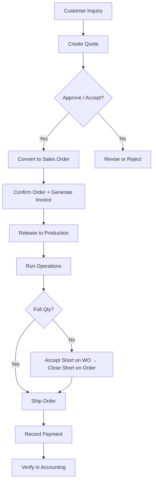

# Quote to Cash

> The complete lifecycle of a customer transaction — from initial inquiry to payment in the bank.

This page walks every step of converting a customer request into revenue. Each step refers to
the nav path you use inside FilaOps and notes what happens automatically so you can focus on
the decisions that require your attention.

---

## The Flow



---

## Step 1 — Create a Quote

Quotes are numbered automatically in the format **Q-YYYY-NNNNNN** (e.g. `Q-2026-000003`).

**Where:** Sales > Quotes > **+ New Quote**

1. Fill in the customer name and email (or select an existing customer from the **Customer** field).
2. Choose whether to add a **single-item** quote (product name + unit price) or a **multi-line** quote using the line-items grid.
3. Set material type and color if relevant — FilaOps validates the combination against your material inventory.
4. Toggle **Apply Tax** if sales tax applies. FilaOps picks up the default tax rate from your Tax Center automatically; you can override it with a specific rate.
5. Add a shipping cost and shipping address if known.
6. Set **Valid Days** — the quote expires automatically after this many days.
7. Click **Save**.

The quote starts in **Pending** status.


### Quote statuses

| Status | Meaning |
|--------|---------|
| **Pending** | Awaiting your internal review |
| **Approved** | You have reviewed and approved it internally |
| **Accepted** | Customer has agreed to the price |
| **Rejected** | Customer declined or you withdrew it |
| **Converted** | Converted to a sales order — locked |
| **Cancelled** | Withdrawn before conversion |

!!! tip "PDF download"
    Open any quote and click **Download PDF** to get a formatted quote document with your company branding, logo, line items, totals, validity date, and optional terms and footer text (configured in Settings > Company).

!!! note "Editing a quote"
    You can edit a quote freely while it is Pending or Approved. Once it reaches **Accepted** or **Converted** status the quote is locked and cannot be modified.

---

## Step 2 — Approve and Accept the Quote

**Where:** Sales > Quotes > open the quote

1. Click **Approve** to move it from Pending to **Approved** (internal sign-off).
2. When the customer agrees, click **Accept** to move it to **Accepted**.

If the customer declines, click **Reject** and optionally enter a rejection reason.

!!! note "Skip Approve if you don't need the two-step"
    You can convert directly from **Approved** status. The **Convert to Order** button is enabled on both Approved and Accepted quotes.

---

## Step 3 — Convert to a Sales Order

**Where:** Sales > Quotes > open the quote > **Convert to Order**

FilaOps creates a sales order pre-filled with all pricing, line items, customer details, and the
shipping address from the quote (falling back to the customer's saved address if the quote has none).

- The order number follows the format **SO-YYYY-NNN** (e.g. `SO-2026-012`).
- The new order starts in **Pending** status.
- The quote is marked **Converted** and cannot be changed.
- FilaOps navigates you directly to the new order.


!!! note "Manual orders"
    You can also create a sales order directly at Sales > Orders > **+ New Order** without going through a quote. The workflow from Step 4 onward is identical.

---

## Step 4 — Confirm the Order and Generate an Invoice

Before production can be released, the order must be **Confirmed** and a billing action taken.

**Where:** Sales > Orders > open the order

### Confirm the order

Click **Confirm** (or use the status dropdown to set it to **Confirmed**). This signals that both
sides have agreed to proceed.

### Generate an invoice

FilaOps blocks production release until either:

- An invoice exists for the order (draft, sent, or paid), **or**
- A payment has been recorded directly against the order.

Click **Generate Invoice** on the order detail page. FilaOps creates an invoice numbered
**INV-YYYY-NNN** (prefix configurable in Settings > Company). The invoice snapshots the customer
information, line items, tax, and shipping from the sales order.

Invoice statuses:

| Status | Meaning |
|--------|---------|
| **Draft** | Created but not yet sent to customer |
| **Sent** | Emailed or shared with customer |
| **Partially Paid** | Some amount received, balance outstanding |
| **Paid** | Full amount received |
| **Overdue** | Past due date, not yet fully paid |

You can download the invoice as a PDF from the order detail page or from Money > Invoices.


---

## Step 5 — Release to Production

**Where:** Sales > Orders > open the order > **Release to Production**

Once the order is Confirmed and the billing requirement is satisfied, the **Release to Production**
button becomes active.

Clicking it triggers work order generation, which:

1. Creates a **Work Order (WO)** in **Draft** status for each product line.
2. Assigns the active BOM and active routing to each WO automatically.
3. Reserves the required materials from inventory.
4. Estimates the production cost.

After creation, a **Schedule Wizard** opens automatically so you can set start/end times and
assign resources to the new work orders before the floor sees them.

!!! tip "Check materials before releasing"
    On the order detail page, the **Material Requirements** panel shows what is needed and whether
    you have it on hand. If there are shortages, use the **Create PO** or **Create Work Order**
    buttons in that panel to procure or produce the sub-components before releasing the main WO.

---

## Step 6 — Run Production

**Where:** Operations > Production > open the work order

Work orders follow this status progression:

```
Draft → Released → Scheduled → In Progress → Completed → Closed
                                           → QC Hold → (Closed | Rework | Scrapped)
```

### Release the work order to the floor

Open the WO and click **Release to Floor**. Status moves from **Draft** to **Released**.

### Start production

Click **Start Production** on the WO. Status moves to **In Progress**.
For each routing operation listed under the **Operations** panel:

1. Start the operation when the operator begins work.
2. Record actual time at the end of each operation.
3. Mark the operation complete.

### Complete the work order

When all operations are done, click **Complete**. FilaOps:

- Sets the WO to **Completed** and records actual end time.
- If QC inspection is configured, routes the WO to **QC Hold** for disposition.
- Triggers a status sync: when all WOs for a sales order are complete, the sales order
  automatically advances to **Ready to Ship**.

### Handling a short production run

If you cannot produce the full ordered quantity:

1. On the **work order**, click **Accept Short** — completes the WO with the quantity
   actually produced rather than the ordered quantity.
2. On the **sales order**, click **Close Short** — a preview shows the achievable quantity
   per line based on completed WO output. Enter a reason and confirm.
3. The order moves to **Ready to Ship** with adjusted line quantities.

!!! warning "Accept Short first, then Close Short"
    All work orders linked to the sales order must be in a resolved state (Completed, Closed,
    Accepted Short, or Cancelled) before Close Short is available on the sales order.


---

## Step 7 — Ship the Order

**Where:** Sales > Orders > open the order > **Ship**

When the order is in **Ready to Ship** status, the **Ship** action is available.

1. Enter the carrier, service level, and optionally a tracking number. FilaOps generates a tracking number automatically if you leave it blank.
2. Confirm the shipping address (editable on the order if it needs correcting).
3. Click **Ship**.

FilaOps then:

- Sets the order status to **Shipped** and records `shipped_at`.
- Deducts finished goods inventory (and packaging inventory, if applicable).
- Posts a GL journal entry: DR Cost of Goods Sold (5000), CR Finished Goods Inventory (1220).

The shipping timeline on the order detail page shows all shipping events.

!!! note "Revenue recognition"
    Revenue is recognized when the invoice is generated and posted — FilaOps debits Accounts
    Receivable (1100) and credits Sales Revenue (4000) at that point, not at shipment. The
    shipment GL entry covers COGS only. Both entries appear in Money > Accounting > Sales Journal.


---

## Step 8 — Record Payment

Payment can be recorded at any point after the invoice is created — you do not need to wait
until after shipment.

=== "From the order"

    **Where:** Sales > Orders > open the order > **Payments** section > **Record Payment**

    1. Enter the payment amount.
    2. Select the payment method.
    3. Optionally enter a reference number (check number, transaction ID).
    4. Click **Save**.

=== "From the invoice"

    **Where:** Money > Invoices > open the invoice > **Record Payment**

    Same fields as above. Both paths create identical Payment records and GL entries.

FilaOps:

- Creates a Payment record and posts a GL entry: DR Cash (1000), CR Accounts Receivable (1100).
- Updates the invoice status to **Paid** or **Partially Paid**.
- Updates the order's payment status field.

To record a refund, open the Payments section on the order and click **Record Refund**.


---

## Step 9 — Verify in Accounting

**Where:** Money > Accounting

Confirm the full transaction flowed through correctly across these tabs:

| Tab | What to check |
|-----|--------------|
| **Dashboard** | Revenue MTD and Cash Received reflect the order |
| **Sales Journal** | The invoice appears with AR and Revenue entries |
| **Payments** | The payment appears with method, amount, and reference |
| **COGS & Materials** | The shipment COGS entry is present |
| **Tax Center** | If tax was charged, it appears in the tax summary |

---

## Quick Checklist

- [ ] Quote created and set to Approved or Accepted
- [ ] Quote converted to sales order
- [ ] Sales order confirmed
- [ ] Invoice generated (or payment recorded directly)
- [ ] Production order(s) created and released to the floor
- [ ] Work order(s) completed (or accepted short if partial)
- [ ] Sales order closed short if partial fulfillment (optional)
- [ ] Sales order shipped
- [ ] Payment recorded against the invoice
- [ ] Revenue and payment verified in Accounting

---

## Reference: Key Document Numbers

| Document | Format | Example |
|----------|--------|---------|
| Quote | `Q-YYYY-NNNNNN` | `Q-2026-000012` |
| Sales Order | `SO-YYYY-NNN` | `SO-2026-042` |
| Work Order | `PO-YYYY-NNNN` | `PO-2026-0007` |
| Invoice | `INV-YYYY-NNN` (prefix configurable) | `INV-2026-008` |
