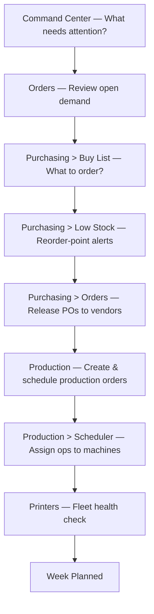

# Weekly Planning Cycle

> A repeatable Monday-morning routine to keep your print farm running smoothly all week.

Follow these steps at the start of each week to review demand, cover material shortages, and schedule production. High-volume farms may find it useful to repeat key steps daily — the cadence is yours to adjust.

---

## The Flow



---

## Step 1: Start at the Command Center

The **Command Center** (`/admin`) is FilaOps's "what do I need to do right now?" view. It opens automatically when you log in and auto-refreshes every 60 seconds.

**Where:** Sidebar top entry — **Command Center** (or navigate to `/admin`)

!!! note "Command Center is your planning home base"
    The **Command Center** (`/admin`) is the operational home screen: action items, machine status, and today's counts. (A separate **Analytics** trend page at `/admin/dashboard` is a PRO feature and is not covered in this Core guide.)

### Today's Summary cards

Four cards appear at the top of the Command Center:

| Card | What it shows |
| --- | --- |
| **Orders Due Today** | How many orders must ship today; sub-label shows how many are ready to ship |
| **Shipped Today** | Orders that have already been shipped today |
| **In Production** | Active production orders; sub-label shows operations currently running |
| **Blocked** | Production orders blocked on materials plus overdue sales orders |

A warning variant (amber) on **Orders Due Today** means some due-today orders are not yet ready to ship. A danger variant (red) on **Blocked** means immediate attention is required.

### Action Items

Below the summary cards, the **Action Items** section lists issues requiring operator attention. Each alert card shows a title, description, priority badge, and a direct link to the affected entity — order, production order, or resource. When there are no issues, the section shows an **All Clear** confirmation.

### Machines

The **Machines** section shows a status grid for every registered printer and work-center resource. Each card displays the current status (running, idle, offline). For **idle** machines, FilaOps may surface a **dispatch suggestion** — a recommended next operation pulled from the released work queue. You can:

- **Confirm** the suggestion to immediately assign the operation to that machine.
- **Pick different** to open the Operation Scheduler modal and choose an alternative.

Clicking a running machine card navigates to the active production order detail page.


!!! tip "Quick links from action items"
    Each action item links directly to the affected order or production job. Click through to take action instead of navigating manually.

---

## Step 2: Review Open Orders

Check what orders are waiting to be produced or shipped this week.

**Where:** **Orders** in the sidebar (`/admin/orders`)

1. Use the **Filter** dropdown to select **Confirmed** — these orders are approved and ready for production to start.
2. Use the **Sort** control to sort by **Fulfillment Priority** (default) or by due date.
3. Look for orders whose due date falls within the current week.
4. Note any orders still in **Pending Confirmation** — these need admin review before they can enter production.

**Order status reference:**

| Status | Meaning |
| --- | --- |
| `pending_confirmation` | Received externally; needs admin review |
| `confirmed` | Approved; ready to link to a production order |
| `in_production` | At least one linked production order is active |
| `ready_to_ship` | Production complete; awaiting shipment |

!!! note "Quote-based vs. line-item orders"
    FilaOps supports two order types. **Quote-based** orders are tied to a single product from a quote. **Line-item** orders have multiple product lines. The Buy List and MRP engine handle both — BOMs are exploded for each product line automatically.

**Details:** [Taking and Fulfilling Orders](../orders.md)

---

## Step 3: Check the Buy List

The **Buy List** is the fastest way to see what you need to purchase across all open demand. It is computed on demand and is always current — no need to trigger a full MRP run first.

**Where:** **Purchasing** > **Buy List** tab (`/admin/purchasing?tab=buy-list`)

The Buy List answers: "Across every open sales order and every open production order, what components are short right now?"

For each short component it shows:

- **SKU / Name** — the material or sub-assembly needed
- **Gross demand** — total quantity required across all open orders
- **On hand** — current inventory
- **Incoming** — quantity already on open purchase orders (with status labels so you can see whether supply is a draft or a committed order)
- **Net shortage** — the gap to cover (gross demand minus on-hand minus incoming plus safety stock)
- **Suggested qty** — quantity to order, rounded up to the product's minimum order quantity
- **Preferred vendor** — vendor set on the item record
- **Earliest need** — the soonest due date among the orders driving demand

**To create a purchase order from a Buy List row:**

1. Click **Create PO** on the row.
2. FilaOps opens the **Purchasing > Orders** tab with the PO modal pre-filled with the vendor and suggested quantity.
3. Review and adjust quantities and costs if needed, then **Save** the PO.


!!! note "Buy List vs. full MRP"
    The Buy List uses the same BOM-explosion and netting logic as the MRP engine but skips time-phasing and planned order management. It is ideal for day-to-day purchasing decisions. The full MRP run adds time-phased planned orders, sub-assembly cascading, and supply/demand timelines for more complex planning scenarios.

**Details:** [Material Planning (MRP)](../mrp.md)

---

## Step 4: Review Low Stock Alerts

The Low Stock tab flags materials that are below their **reorder point** — even if no open orders are driving the shortage. Run this step alongside the Buy List to catch safety-stock replenishments the demand-driven view would miss.

**Where:** **Purchasing** > **Low Stock** tab (`/admin/purchasing?tab=low-stock`)

The summary cards group alerts by severity:

| Card | Condition |
| --- | --- |
| **Critical** | On-hand = 0 (out of stock) |
| **Urgent** | On-hand is less than 50% of the reorder point |
| **Low Stock** | On-hand is below the reorder point |
| **Shortfall Value** | Estimated cost to replenish all shortages |

A blue banner appears when **MRP-driven shortages** (items short because of active sales orders) are also present in the list.

**To create purchase orders from the Low Stock tab:**

1. Check the boxes next to the items you want to order.
2. Use the **Create PO** dropdown (appears when items are selected) to group by vendor and open one PO modal per vendor.
3. Or click **Create PO** on an individual row to open a pre-filled modal for that item alone.


---

## Step 5: Release Purchase Orders to Vendors

Review the draft POs you created in steps 3 and 4, then mark them as ordered once you have confirmed with your vendors.

**Where:** **Purchasing** > **Orders** tab (`/admin/purchasing`)

1. Filter by **Status: Draft** to see POs not yet sent.
2. Open each PO and verify:
   - Correct vendor
   - Correct quantities and unit costs
   - A realistic **Expected Date** (this is the date the Buy List uses to calculate incoming supply)
3. Optionally upload a vendor confirmation document with the **Upload Document** button on the PO detail panel.
4. Change the status to **Ordered** once the vendor has confirmed.

**PO status lifecycle:**

```text
draft  →  ordered  →  [shipped]  →  partially_received  →  received  →  closed
```

!!! warning "Draft POs count as incoming supply in the Buy List"
    The Buy List counts draft PO quantities as "incoming" and labels them accordingly. If you delete a draft PO, the shortage will reappear on the next Buy List refresh. Make sure draft POs reflect real intent, not placeholders.

**Details:** [Ordering Supplies](../purchasing.md)

---

## Step 6: Create Production Orders

For each confirmed sales order that needs manufacturing this week, create a production order.

**Where:** **Production** (`/admin/production`)

1. Click **+ Create Production Order**.
2. Fill in the form:
   - **Product** — select the item to produce
   - **Quantity** — how many units to make
   - **Due Date** — use the linked sales order's due date as a guide
   - **Priority** — numeric priority; lower numbers appear first in the work queue and scheduler
   - **Notes** — optional context for your team
3. Click **Create**. FilaOps navigates to the production order detail page.
4. On the detail page, check the **material availability** indicator. If materials are short, resolve the shortage before releasing.
5. Click **Release** to move the order from `draft` to `released`. Released orders become visible in the work queue and scheduler.

**Production order status reference:**

| Status | Meaning |
| --- | --- |
| `draft` | Created but not yet released to the shop floor |
| `released` | Ready to schedule; appears in the work queue |
| `in_progress` | At least one routing operation has started |
| `complete` | All operations finished and output recorded |
| `scrapped` | Order abandoned; units were scrapped |

!!! tip "Don't overcommit"
    Only release production orders for products where materials are in stock or arriving before the job needs to start. Starting production without materials creates bottlenecks and blocks other orders.

**Details:** [Running Production](../production.md)

---

## Step 7: Schedule Operations on the Gantt

After releasing production orders, assign their individual routing operations to machines.

**Where:** **Production** > **Scheduler** view — click the **Scheduler** button in the top-right of the Production page (`/admin/production?view=scheduler`)

The Scheduler shows a **Gantt-style board**:

- **Lanes** — one row per active machine resource and one per registered printer
- **Operation blocks** — scheduled operations displayed as bars; hover for product name, quantity, and timing
- **Utilization %** — shown per lane for the current view window
- **Maintenance windows** — blocking maintenance periods appear as shaded blocks so you can see true available time
- **Unscheduled queue** — the right panel lists released orders with no scheduled operations yet, sorted by priority then due date

**To schedule an operation:**

1. Find the order in the unscheduled queue (right panel).
2. Click the operation block to open the **Operation Scheduler** modal.
3. Select a machine lane and set a start time.
4. The conflict checker warns if the slot overlaps an existing operation or a maintenance window.
5. Click **Schedule** to place the block on the Gantt.


!!! note "Scheduling is operation-level, not order-level"
    FilaOps schedules individual routing **operations** (e.g., "Print," "Post-Process," "Pack") rather than whole orders. Each operation can be assigned to a different machine lane, which lets you manage multi-step workflows across different work centers.

**Details:** [Running Production](../production.md)

---

## Step 8: Check Printer Fleet Health

Make sure your equipment is ready for the week's production before jobs start hitting the queue.

**Where:** **Printers** (`/admin/printers`)

The Printers page shows a card or table for each registered printer with its current status.

1. Look for printers marked **offline** or **error** — investigate and resolve before scheduling jobs to them.
2. Check for printers with **overdue maintenance** or maintenance windows scheduled this week.
3. Use **Schedule Maintenance** on a printer card to block time on the Gantt for upcoming downtime — this prevents the scheduler from placing jobs into that window.
4. Use **Log Maintenance** to record completed maintenance work.


!!! warning "Add maintenance windows before scheduling jobs"
    Maintenance windows appear as blocked time on the Production Scheduler Gantt. If you add a window after jobs are already scheduled into that slot, the Gantt will flag the conflict.

**Details:** [Monitoring Your Printers](../printers.md)

---

## Weekly Planning Checklist

- [ ] Command Center reviewed — summary cards checked, action items noted or resolved
- [ ] Machine dispatch suggestions reviewed — idle machines assigned or deferred
- [ ] Open orders reviewed — confirmed orders identified for the week
- [ ] Buy List checked — shortage rows turned into draft POs
- [ ] Low Stock tab reviewed — reorder-point alerts addressed
- [ ] Purchase orders reviewed and status set to **Ordered** with vendors
- [ ] Production orders created for this week's confirmed sales orders
- [ ] Production orders released and routing operations scheduled on the Gantt
- [ ] Printer fleet checked — no offline or maintenance-overdue machines blocking jobs

---

## Related Pages

- [Taking and Fulfilling Orders](../orders.md)
- [Ordering Supplies](../purchasing.md)
- [Material Planning (MRP)](../mrp.md)
- [Running Production](../production.md)
- [Monitoring Your Printers](../printers.md)
- [Command Center](../dashboard.md)
